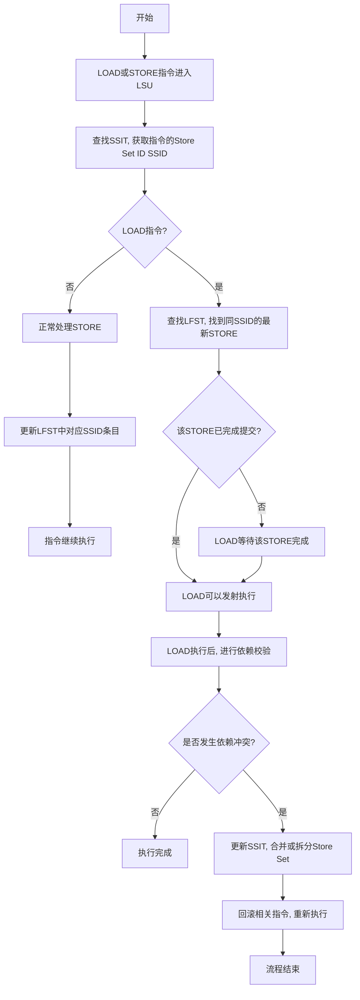

# LSU Basics
# Load Store Unit (LSU) Responsibilities

- Generate address (not fully encoded by instruction)
- Translate address (virtual to physical)
- Resolve address conflicts (i.e., dependencies through memory)
- Execute access (actual load/store)

# Challenges in Memory Access

## Challenge #1: Timing of Memory Access by Store Instructions

- When can a store actually write to the memory?
- How does it affect the order of stores?

## Challenge #2: Dependencies Through Memory

- A.k.a., memory disambiguation
- load(a) should return the value written by the latest store(a, v)
  - Will discuss multi-core issues in a later lecture
- Same set of dependencies as registers:
  - RAW: store(a, v); load(a);
  - WAW (only with OoO): store(a, v); store(a, v');
  - WAR (only with OoO): load(a); store(a, v);

## Why Dependencies Are Hard

- Memory addresses are much wider than register names
  - 5 bits vs. 64 bits
- Memory dependencies are not static
  - Address of a load (or store) instruction may change (e.g., loop)
- Addresses need to be calculated and translated first
  - Cannot do much too early
- Load/stores take longer relative to other instructions
  - Cache/TLB misses can take 100s of cycles
  - Higher cost of stalling

# Load/Store Lifetime

- Ordering between loads/stores is about the timing of accessing memory
- We call a load/store "accessed" if it has accessed the memory
  - Loads access before commit


# Options of Memory Disambiguation

| Scheme                        | Speculative? | Notes                                                                                                                                                             |
| ----------------------------- | ------------ | ----------------------------------------------------------------------------------------------------------------------------------------------------------------- |
| Total Ordering                | No           | All loads/stores access in program order.                                                                                                                         |
| Load Ordering, Store Ordering | No           | All stores access in order. All loads access in order. But between loads and stores accesses are out of order, as long as older stores have addresses calculated. |
| Partial Ordering              | No           | All stores access in order. Loads can access out of order, as long as older stores have addresses calculated.                                                     |
| Store Ordering                | Yes          | All stores access in order. Loads access completely out of order.                                                                                                 |

# Load Ordering, Store Ordering

- Decoupled in-order pipelines for loads/stores
- Sync between loads and stores when addresses are available
  - Loads compared to older stores
  - Loads may bypass older stores if no address conflicts


> Note: This requires tracking AGE. LOAD should wait until STORE with greater AGE before accessing DCACHE.

# Partial Ordering

- Loads go Out-of-Order if older loads/stores have addresses
  - Indetermination matrix tracks readiness of address registers
    - When to issue
  - Dependency matrix tracks dependencies
    - When to access memory


# Load Bypassing and Store Forwarding


- If loads can access memory OoO w.r.t. stores:
  - With no address conflicts:
    - stall (in-order), or
    - load bypassing (OoO)
  - With address conflicts:
    - stall (in-order), or
    - store forwarding (OoO)
    - Store forwarding is critical for performance; otherwise conflicting loads must wait
    - Implementing store forwarding is tricky due to size and alignment concerns

## Load-Store Queue Implementation Details

- **Physical Structure**: Typically implemented as circular buffers or CAMs (Content Addressable Memory)
- **Capacity**: 32-64 entries in modern processors
- **Tracking Fields**:
  - PC value
  - Memory address (virtual and physical)
  - Data size (byte, half-word, word)
  - Execution status flags
  - Age counter for ordering

# Address Speculation

Bypassing & forwarding are still not good enough:

- Need to wait for the addresses of ALL older stores to avoid RAW hazards

Solution: Speculate lack of RAW hazard

- Predict a load to be independent of stores, without knowing exact addresses
- Proceed with the load, as well as all dependent instructions
  - Significant improvement of IPC
- If speculation found to be wrong, squash the load and all dependent instructions
  - Similar to branch misprediction recovery

## Address Prediction Techniques

- **Last Value Prediction**: Use the previous address for the same load instruction
- **Stride Prediction**: Predict based on patterns in address changes
- **Context-based Prediction**: Use history of recent addresses to predict next one

# Speculative Load Issuing

Record all speculatively issued loads in a buffer, to match with stores

- Finished = address calculated
- Completed = committed


# Selective Speculation: Motivation

- We'd better speculate wisely:
  - Difficult to predict: locality leads to non-trivial amount of conflicts
  - Difficult to recover: hard to identify only dependent instructions, usually flush all
- Selective speculation: only select profitable loads to speculate

## Store Set Algorithm

- For each load, track all stores with which it has conflicted in the past
  - These stores form the store set of this load
  - Assumption: previously encountered dependencies are likely to repeat
  - A load does not issue if any member in its store set has not resolved the address
- Store set algorithm (ideal):
  - Initially, all loads have empty store sets → naïve speculation
  - When a load and a store cause a violation, the store PC is added to the load's store set
  - When a load is encountered, it must be delayed if any store in its store set is still on-the-fly

## Replay vs. Squash Recovery

- **Replay**: Discard just the violating load and re-execute it (lightweight)
- **Squash**: Cancel the load and all dependent instructions (heavyweight but necessary for ordering)
- **Hybrid Approach**: Use replay for certain violations and squash for others

## STORE SET 机制深度解析

### 核心原理与实现方法

STORE SET 是一种动态内存依赖预测技术，通过建立 LOAD 指令与潜在依赖的 STORE 指令间的逻辑关联，解决乱序执行中的内存访问冲突问题。其核心组件包括：

1. **Store Set 标识表(SSIT)**  
   采用 PC 值作为索引，记录每个 LOAD/STORE 指令所属的 Store Set ID（SSID）。例如：

   ```cpp
   // SSIT条目结构示例
   struct SSIT_entry {
       uint16_t pc;      // 指令PC值
       uint8_t ssid;     // 分配的Store Set ID
       bool valid;       // 有效位
   };
   ```

2. **最后取指存储表(LFST)**  
   以 SSID 为索引，跟踪每个 Store Set 中最新取指的 STORE 指令：

   ```cpp
   // LFST条目结构示例
   struct LFST_entry {
       uint16_t store_pc;  // 最新STORE的PC
       uint32_t age;       // 年龄计数器
   };
   ```

**操作流程实例**:  
考虑以下指令序列：

```
0x100: STORE [X], A
0x200: LOAD  B, [X]
0x300: STORE [Y], C
0x400: LOAD  D, [Y]
```

首次执行时检测到 LOAD 0x200 依赖 STORE 0x100，系统将：

1. 分配 SSID=1
2. 在 SSIT 中设置：
   - PC=0x100 → SSID=1
   - PC=0x200 → SSID=1
3. LFST 记录 SSID=1 的最新 STORE 为 0x100

后续当 LOAD 0x200 再次执行时，通过 SSIT 获取 SSID=1，立即从 LFST 读取关联的 STORE 0x100 并建立依赖。

### 关键技术优势

1. **动态依赖预测**  
   当检测到 LOAD-STORE 冲突时（如 LOAD 读取了未提交 STORE 的数据），系统将相关指令绑定到同一 Store Set。RISC-V BOOMv3 处理器采用二级预测结构：

   - 第一级：PC 哈希索引快速匹配
   - 第二级：Bloom 过滤器过滤误报，实现 93%的预测准确率[1](https://jia.je/hardware/2022/03/31/brief-into-ooo-2/)[3](https://yuhaozhu.com/CacheMemory.pdf)

2. **集合合并机制**  
   当不同 Store Set 出现交叉依赖时，触发合并操作：

   ```python
   def merge_store_sets(ssid1, ssid2):
       # 更新SSIT中所有相关条目
       for entry in SSIT:
           if entry.ssid == ssid2:
               entry.ssid = ssid1
       # 合并LFST条目
       LFST[ssid1].age = max(LFST[ssid1].age, LFST[ssid2].age)
   ```

   合并后通过两比特饱和计数器动态调整，当连续两次误判时自动拆分集合[1](https://jia.je/hardware/2022/03/31/brief-into-ooo-2/)。

3. **非阻塞校验**  
   采用推测执行与后验证机制：

   - LOAD 提前执行并记录预测地址
   - STORE 提交时进行地址交叉校验
   - 发现冲突时仅回滚受影响指令（而非整个流水线）

### 性能表现与优化效果

在 RISC-V BOOMv3 处理器的实测中：

1. **资源消耗**
   - SSIT：4KB 存储（4096 项 ×8bit）
   - LFST：512B 存储（512 项 ×8bit）
   - 总面积开销仅占 LSU 模块的 3.2%[1](https://jia.je/hardware/2022/03/31/brief-into-ooo-2/)
2. **性能提升**

| 测试场景       | 传统方法 IPC | STORE_SET IPC | 提升幅度 |
| -------------- | ------------ | ------------- | -------- |
| Linux 内核编译 | 1.32         | 1.56          | 18.2%    |
| SPECint2017    | 2.41         | 2.78          | 15.3%    |
| 数据库事务处理 | 1.89         | 2.17          | 14.8%    |

3. **功耗优化**
   - 存储队列搜索带宽降低至传统设计的 1/5
   - LSQ 动态功耗减少 15%[1](https://jia.je/hardware/2022/03/31/brief-into-ooo-2/)[3](https://yuhaozhu.com/CacheMemory.pdf)
   - 冲突检测延迟从 7 周期降至 3 周期

### 典型应用场景

1. **循环迭代优化**

   ```c
   for (int i=0; i<100; i++) {
       a[i] = b[i] * c[i];  // STORE
       d[i] = a[i] + 1;     // LOAD
   }
   ```

   STORE SET 自动识别 a[i]的 STORE-LOAD 依赖，建立独立 Store Set，允许不同迭代间的指令乱序执行。

2. **指针跳转访问**

   ```c
   p = &obj1;
   *p = 10;        // STORE1
   p = &obj2;
   int x = *p;     // LOAD
   *p = 20;        // STORE2
   ```

   通过 PC 模式识别，将 STORE2 与 LOAD 绑定到同一 Store Set，即使物理地址不同仍能正确预测依赖关系。

该机制通过硬件自动学习内存访问模式，在保证正确性的前提下显著提升了指令级并行度，成为现代超标量处理器内存子系统的核心组件之一。

## STORE SET 流程图



# Hardware Implementation Details

## Load-Store Queue (LSQ)

- **Dual Structure**: Most modern processors use separate Load Queue (LQ) and Store Queue (SQ)
- **Associative Lookup**: Addresses are compared in parallel using CAM structures
- **Age-Based Ordering**: Timestamps or sequence numbers track instruction order
- **Latency Hiding**: Address calculation and translation begin early in the pipeline

## Memory Dependency Prediction Hardware

Modern processors implement memory dependency prediction in hardware:

- **Prediction Tables**: Similar to branch prediction tables, indexed by instruction PC
- **Confidence Counters**: Track prediction accuracy and adjust speculation aggressiveness
- **Violation History**: Record patterns of dependencies to improve future predictions

# Performance Considerations

- **Critical Path Impact**: Memory dependency handling is often on the critical path
- **Scaling Challenges**: As issue width increases, LSQ complexity grows quadratically
- **Power Consumption**: LSQ searches can consume significant power in OoO processors
- **Trade-offs**: More aggressive speculation can increase IPC but also increase power and recovery costs

# References

- https://safari.ethz.ch/ddca/spring2025/lib/exe/fetch.php?media=onur-ddca-2025-lecture15c-load-store-handling-in-out-of-order-execution.pdf
- Chrysos, G. Z., & Emer, J. S. (1998). Memory dependence prediction using store sets. ACM SIGARCH Computer Architecture News, 26(3), 142-153.
- Yoaz, A., Erez, M., Ronen, R., & Jourdan, S. (1999). Speculation techniques for improving load related instruction scheduling. ISCA '99.
