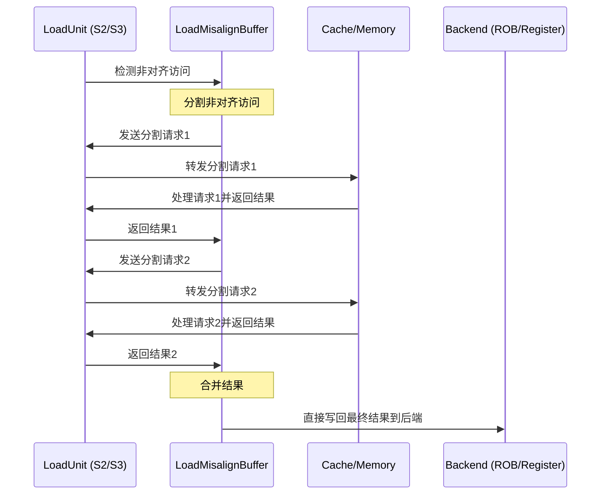

# LoadMisalignBuffer

## 1. 模块概述

`LoadMisalignBuffer.scala` 实现了一个专用的非对齐加载处理器，作为 XiangShan 处理器 LSQ 系统中处理非对齐内存访问的关键组件。当加载指令的地址未按数据类型大小对齐时（如半字、字或双字加载的地址非对齐），该模块负责将非对齐访问分解为多个对齐访问，然后合并结果。

### 1.1 核心功能

- 检测和处理非对齐加载指令
- 将非对齐访问分割为最多两个对齐访问
- 根据指令类型和地址精确计算分割方式
- 管理分割后请求的发送和接收
- 合并分割访问的结果并处理字节对齐
- 处理异常情况，特别是跨页异常
- 支持向量和标量非对齐加载指令

### 1.2 模块定义

```scala
class LoadMisalignBuffer(implicit p: Parameters) extends XSModule
  with HasCircularQueuePtrHelper
  with HasLoadHelper
  with HasTlbConst {
  // 模块实现
}
```

## 2. 系统架构

### 2.1 内部状态机设计

LoadMisalignBuffer 是一个独立的功能模块，使用状态机控制非对齐加载的处理流程：

```scala
val s_idle :: s_split :: s_req :: s_resp :: s_comb_wakeup_rep :: s_wb :: Nil = Enum(6)
val bufferState = RegInit(s_idle)
```

- **s_idle**: 空闲状态，等待新请求
- **s_split**: 分割非对齐加载，确定分割方案
- **s_req**: 发送分割后的请求
- **s_resp**: 接收分割请求的响应
- **s_comb_wakeup_rep**: 合并分割结果数据
- **s_wb**: 将结果写回

该模块设计为单例架构（只能同时处理一个非对齐请求），设置了以下关键参数：
- `enqPortNum = LoadPipelineWidth`: 入队端口数量
- `maxSplitNum = 2`: 最大分割数量，固定为2

### 2.2 在处理器内存系统中的位置

LoadMisalignBuffer 位于 XiangShan 处理器的内存访问系统中，与 LoadUnit、LSQ 和缓存系统紧密交互，为非对齐内存访问提供专门优化。它接收来自 LoadUnit 的非对齐请求，分割后再通过 LoadUnit 访问缓存，最后合并结果返回给处理器后端。

## 3. 数据结构与接口

### 3.1 IO 接口

```scala
val io = IO(new Bundle() {
  val redirect        = Flipped(Valid(new Redirect))          // 重定向信号
  val enq             = Vec(enqPortNum, Flipped(new MisalignBufferEnqIO))  // 非对齐请求入队接口
  val rob             = Flipped(new RobLsqIO)                 // ROB接口
  val splitLoadReq    = Decoupled(new LsPipelineBundle)       // 分割加载请求接口
  val splitLoadResp   = Flipped(Valid(new LqWriteBundle))     // 分割加载响应接口
  val writeBack       = Decoupled(new MemExuOutput)           // 标量结果写回接口
  val vecWriteBack    = Decoupled(new VecPipelineFeedbackIO(isVStore = false))  // 向量结果写回接口
  val loadOutValid    = Input(Bool())                         // 标量加载输出有效信号
  val loadVecOutValid = Input(Bool())                         // 向量加载输出有效信号
  val overwriteExpBuf = Output(new XSBundle {...})            // 覆盖异常缓冲区信息
  val flushLdExpBuff  = Output(Bool())                        // 刷新加载异常缓冲区
  val loadMisalignFull = Output(Bool())                       // 缓冲区满信号
})
```

## 4. 内部数据结构与状态

LoadMisalignBuffer 维护以下关键内部状态和数据结构：

```scala
// 请求和有效位
val req_valid = RegInit(false.B)           // 当前是否有有效请求
val req = Reg(new LqWriteBundle)           // 当前正在处理的请求

// 分割请求和响应存储
val splitLoadReqs = RegInit(VecInit(List.fill(maxSplitNum)(0.U.asTypeOf(new LsPipelineBundle))))
val splitLoadResp = RegInit(VecInit(List.fill(maxSplitNum)(0.U.asTypeOf(new LqWriteBundle))))

// 分割控制和状态
val exceptionVec = RegInit(0.U.asTypeOf(ExceptionVec()))  // 异常向量
val unSentLoads = RegInit(0.U(maxSplitNum.W))             // 未发送的加载请求位图
val curPtr = RegInit(0.U(log2Ceil(maxSplitNum).W))        // 当前处理的分割请求指针

// 结果处理
val combinedData = RegInit(0.U(XLEN.W))                   // 合并后的数据

// 分割结果处理控制
val lowResultShift = RegInit(0.U(3.W))  // 低地址结果需移位的字节数
val lowResultWidth = RegInit(0.U(3.W))  // 低地址结果需保留的字节数
val highResultShift = RegInit(0.U(3.W)) // 高地址结果需移位的字节数
val highResultWidth = RegInit(0.U(3.W)) // 高地址结果需保留的字节数

// 全局状态标志
val globalException = RegInit(false.B)  // 是否有异常
val globalUncache = RegInit(false.B)    // 是否访问非缓存区域
val globalMMIO = RegInit(false.B)       // 是否MMIO访问
val globalNC = RegInit(false.B)         // 是否NC访问
```

## 5. 非对齐加载处理流程

### 5.1 请求接收与选择

LoadMisalignBuffer 从多个加载单元接收非对齐请求，并选择优先级最高的处理：

```scala
val select_req_bit = ParallelPriorityMux(io.enq.map(_.req.valid), io.enq.map(_.req.bits))
val select_req_valid = io.enq.map(_.req.valid).reduce(_ || _)
val canEnqValid = !req_valid && !select_req_bit.uop.robIdx.needFlush(io.redirect) && select_req_valid

when(canEnqValid) {
  req := select_req_bit
  req_valid := true.B
}
```

### 5.2 检测非对齐访问

检测访问是否跨越16字节边界：

```scala
val alignedType = Mux(req.isvec, req.alignedType(1,0), req.uop.fuOpType(1, 0))
val highAddress = LookupTree(alignedType, List(
  LB -> 0.U,
  LH -> 1.U,
  LW -> 3.U,
  LD -> 7.U
)) + req.vaddr(4, 0)
val cross16BytesBoundary = req_valid && (highAddress(4) =/= req.vaddr(4))
```

### 5.3 分割非对齐访问

根据指令类型和地址，将非对齐访问分割为两个对齐访问：

```scala
when (bufferState === s_split) {
  when (!cross16BytesBoundary) {
    assert(false.B, s"There should be no non-aligned access that does not cross 16Byte boundaries.")
  } .otherwise {
    // 分割为两个对齐访问
    unSentLoads := Fill(maxSplitNum, 1.U(1.W))
    curPtr := 0.U
    
    // 设置低地址和高地址访问的通用信息
    lowAddrLoad.uop := req.uop
    lowAddrLoad.uop.exceptionVec(loadAddrMisaligned) := false.B
    lowAddrLoad.fullva := req.fullva
    
    highAddrLoad.uop := req.uop
    highAddrLoad.uop.exceptionVec(loadAddrMisaligned) := false.B
    highAddrLoad.fullva := req.fullva
    
    // 根据指令类型和地址情况，确定分割方式
    switch (alignedType(1, 0)) {
      is (LB) { /* 字节加载不应该非对齐 */ }
      is (LH) { /* 处理半字非对齐访问 */ }
      is (LW) { /* 处理字非对齐访问 */ }
      is (LD) { /* 处理双字非对齐访问 */ }
    }
    
    // 保存分割请求
    splitLoadReqs(0) := lowAddrLoad
    splitLoadReqs(1) := highAddrLoad
  }
}
```

### 5.4 发送分割请求

依次发送分割后的请求：

```scala
io.splitLoadReq.valid := req_valid && (bufferState === s_req || bufferState === s_comb_wakeup_rep && needWakeUpReqsWire && !req.isvec)
io.splitLoadReq.bits  := splitLoadReqs(curPtr)
```

### 5.5 处理分割响应

接收分割请求的响应并检查异常：

```scala
when (io.splitLoadResp.valid) {
  val resp = io.splitLoadResp.bits
  splitLoadResp(curPtr) := io.splitLoadResp.bits
  
  when (isUncache) {
    // 非缓存访问处理
    unSentLoads := 0.U
    exceptionVec := ExceptionNO.selectByFu(0.U.asTypeOf(exceptionVec.cloneType), LduCfg)
    exceptionVec(loadAddrMisaligned) := true.B
  } .elsewhen (hasException) {
    // 异常处理
    unSentLoads := 0.U
    LduCfg.exceptionOut.map(no => exceptionVec(no) := exceptionVec(no) || resp.uop.exceptionVec(no))
  } .elsewhen (!io.splitLoadResp.bits.rep_info.need_rep) {
    // 正常处理，准备接收下一个分割响应或进入合并阶段
    unSentLoads := unSentLoads & ~UIntToOH(curPtr)
    curPtr := curPtr + 1.U
    exceptionVec := 0.U.asTypeOf(ExceptionVec())
  }
}
```

### 5.6 合并分割结果

合并两个分割请求的结果：

```scala
when (bufferState === s_comb_wakeup_rep) {
  val lowAddrResult = getShiftAndTruncateData(lowResultShift, lowResultWidth, splitLoadResp(0).data)
                        .asTypeOf(Vec(XLEN / 8, UInt(8.W)))
  val highAddrResult = getShiftAndTruncateData(highResultShift, highResultWidth, splitLoadResp(1).data)
                        .asTypeOf(Vec(XLEN / 8, UInt(8.W)))
  val catResult = Wire(Vec(XLEN / 8, UInt(8.W)))
  
  // 字节级合并
  (0 until XLEN / 8) .map {
    case i => {
      when (i.U < lowResultWidth) {
        catResult(i) := lowAddrResult(i)
      } .otherwise {
        catResult(i) := highAddrResult(i.U - lowResultWidth)
      }
    }
  }
  
  // 根据指令类型处理数据
  combinedData := Mux(req.isvec, 
                      rdataVecHelper(req.alignedType, (catResult.asUInt)(XLEN - 1, 0)), 
                      rdataHelper(req.uop, (catResult.asUInt)(XLEN - 1, 0)))
}
```

### 5.7 结果写回

将结果写回到处理器后端：

```scala
// 标量写回
io.writeBack.valid := req_valid && (bufferState === s_wb) && 
                    (io.splitLoadResp.valid && io.splitLoadResp.bits.misalignNeedWakeUp || 
                    globalUncache || globalException) && !io.loadOutValid && !req.isvec
io.writeBack.bits.uop := req.uop
io.writeBack.bits.data := newRdataHelper(data_select, combinedData)

// 向量写回
io.vecWriteBack.valid := req_valid && (bufferState === s_wb) && !io.loadVecOutValid && req.isvec
io.vecWriteBack.bits.vecdata.get := combinedData
```

## 6. 异常处理机制

### 6.1 异常检测

检测分割请求执行过程中的各类异常：

```scala
val hasException = io.splitLoadResp.bits.vecActive &&
  ExceptionNO.selectByFu(io.splitLoadResp.bits.uop.exceptionVec, LduCfg).asUInt.orR || 
  TriggerAction.isDmode(io.splitLoadResp.bits.uop.trigger)
val isUncache = io.splitLoadResp.bits.mmio || io.splitLoadResp.bits.nc
```

### 6.2 跨页异常处理

当非对齐访问跨页且高地址页面发生异常时的特殊处理：

```scala
// 特殊情况：非对齐加载跨页，页错误发生在下一页
val shouldOverwrite = req_valid && globalException
val overwriteExpBuf = GatedValidRegNext(shouldOverwrite)
val overwriteVaddr = RegEnable(
  Mux(
    cross16BytesBoundary && (curPtr === 1.U),
    splitLoadResp(curPtr).vaddr,
    splitLoadResp(curPtr).fullva),
  shouldOverwrite)
```

### 6.3 状态机控制流

状态机控制非对齐访问处理的完整流程：

```scala
switch(bufferState) {
  is (s_idle) {
    when (req_valid) {
      bufferState := s_split
    }
  }

  is (s_split) {
    bufferState := s_req
  }

  is (s_req) {
    when (io.splitLoadReq.fire) {
      bufferState := s_resp
    }
  }

  is (s_resp) {
    when (io.splitLoadResp.valid) {
      when (hasException || isUncache) {
        // 出现异常或访问非缓存区域
        bufferState := s_wb
        globalException := hasException
        globalUncache := isUncache
        globalMMIO := io.splitLoadResp.bits.mmio
        globalNC   := io.splitLoadResp.bits.nc
      } .elsewhen(io.splitLoadResp.bits.rep_info.need_rep || (unSentLoads & ~clearOh).orR) {
        // 需要重放或还有未处理的分割请求
        bufferState := s_req
      } .otherwise {
        // 所有分割请求正常完成，准备合并
        bufferState := s_comb_wakeup_rep
        needWakeUpWB := !req.isvec
      }
    }
  }

  is (s_comb_wakeup_rep) {
    // 根据是否为向量指令决定下一步
    when(!req.isvec) {
      when(io.splitLoadReq.fire) {
        bufferState := s_wb
      }
      needWakeUpReqsWire := true.B
    } .otherwise {
      bufferState := s_wb
    }
  }

  is (s_wb) {
    // 写回完成后回到空闲状态，重置所有状态
    when(req.isvec) {
      when(io.vecWriteBack.fire) {
        bufferState := s_idle
        req_valid := false.B
        // 重置状态
      }
    } .otherwise {
      when(io.writeBack.fire) {
        bufferState := s_idle
        req_valid := false.B
        // 重置状态
      }
    }
  }
}
```

## 7. 非对齐加载指令处理示例：LW

### 7.1 初始状态

- 指令：`LW x5, 0x1001` (从地址0x1001加载4字节，跨越16字节边界)
- 加载单元检测到非对齐访问，将请求发送到LoadMisalignBuffer

### 7.2 分割决策 (s_split)

根据字指令和地址模式"01"，决定分割方式：

```scala
lowAddrLoad.uop.fuOpType := LW
lowAddrLoad.vaddr := req.vaddr - 1.U  // 0x1000
lowAddrLoad.mask  := 0xf.U << lowAddrLoad.vaddr(3, 0)
lowResultShift    := BYTE1  // 右移1字节
lowResultWidth    := BYTE3  // 取3字节

highAddrLoad.uop.fuOpType := LB
highAddrLoad.vaddr := req.vaddr + 3.U  // 0x1004
highAddrLoad.mask  := 0x1.U << highAddrLoad.vaddr(3, 0)
highResultShift    := BYTE0  // 不移位
highResultWidth    := BYTE1  // 取1字节
```

### 7.3 发送低地址请求 (s_req)

发送第一个分割请求：
- 地址：0x1000
- 类型：LW (4字节读取)
- 掩码：0xf (4字节全部有效)

### 7.4 接收低地址响应 (s_resp)

接收第一个响应：
- 数据：0xDDCCBBAA（小端表示）
- 处理：保存到splitLoadResp(0)
- 更新状态：unSentLoads = 0b01 (第二个请求未发送)

### 7.5 发送高地址请求 (s_req)

发送第二个分割请求：
- 地址：0x1004
- 类型：LB (1字节读取)
- 掩码：0x1 (仅最低字节有效)

### 7.6 接收高地址响应 (s_resp)

接收第二个响应：
- 数据：0x000000EE（只有低字节有效）
- 处理：保存到splitLoadResp(1)
- 更新状态：unSentLoads = 0b00 (所有请求已完成)
- 进入合并阶段 (s_comb_wakeup_rep)

### 7.7 合并结果 (s_comb_wakeup_rep)

假设内存小端序中的数据布局（以字节为单位）：
```
地址: 0x1000 0x1001 0x1002 0x1003 | 0x1004
数据:   AA     BB     CC     DD   |   EE
```

1. 处理低地址数据：
   - 从0x1000获取的低地址结果：0xDDCCBBAA（小端表示）
   - 右移1字节，保留3字节：0x00DDCCBB
   - 实际获取的字节为：BB, CC, DD

2. 处理高地址数据：
   - 从0x1004获取的高地址结果：0x000000EE（只有低字节有效）
   - 不移位，取低1字节：0xEE
   - 实际获取的字节为：EE

3. 合并数据（正确的小端序处理）：
   - 合并字节：[BB, CC, DD, EE]（从低地址到高地址）
   - 在小端系统中的寄存器中表示为：0xEEDDCCBB
   - 应用rdataHelper处理符号扩展等

### 7.8 完成写回 (s_wb)

- 将合并后的结果0xEEDDCCBB通过io.writeBack写回到寄存器x5
- 重置模块状态，返回s_idle状态

## 8. 支持的分割方案

LoadMisalignBuffer支持多种非对齐访问模式，每种模式有特定的分割策略：

1. **非对齐半字(LH)**：
   - 分割为两个字节访问(LB+LB)
   - 例如：地址0x1001分割为0x1001和0x1002

2. **非对齐字(LW)**：根据地址低2位不同有三种情况：
   - 01：分割为(LW+LB)，前向对齐访问3字节+后向访问1字节
   - 10：分割为(LH+LH)，前向访问2字节+后向访问2字节
   - 11：分割为(LB+LW)，前向访问1字节+后向对齐访问3字节

3. **非对齐双字(LD)**：根据地址低3位不同有七种情况：
   - 001：分割为(LD+LB)，前向对齐访问7字节+后向访问1字节
   - 010：分割为(LD+LH)，前向对齐访问6字节+后向访问2字节
   - ...
   - 111：分割为(LB+LD)，前向访问1字节+后向对齐访问7字节

## 9. 性能监控与调试

LoadMisalignBuffer 实现了性能监控功能，跟踪非对齐访问情况：

```scala
XSPerfAccumulate("alloc",                  RegNext(!req_valid) && req_valid)
XSPerfAccumulate("flush",                  flush)
XSPerfAccumulate("flush_idle",             flush && (bufferState === s_idle))
XSPerfAccumulate("flush_non_idle",         flush && (bufferState =/= s_idle))
```

这些监控点帮助诊断和优化非对齐访问的性能问题，提供以下指标：
- 非对齐请求分配次数
- 请求被刷新的次数
- 不同状态下的刷新情况

## 10. LoadMisalignBuffer与其他模块的交互

### 10.1 LoadMisalignBuffer与LoadUnit的关系

LoadUnit、LoadMisalignBuffer和Load Pipeline的交互关系如下：

1. **检测与转发**：
   - LoadUnit在执行阶段(S2/S3)检测到非对齐访问且跨越16字节边界时，会将请求转发给LoadMisalignBuffer
   - 转发通过`io.misalign_enq.req`接口进行，这是在LoadUnit中的s3阶段进行的：
   ```scala
   val toMisalignBufferValid = s3_can_enter_lsq_valid && s3_mis_align && !s3_frm_mabuf
   io.misalign_enq.req.valid := toMisalignBufferValid && s3_misalign_can_go
   io.misalign_enq.req.bits  := s3_in
   ```

2. **分割请求处理**：
   - LoadMisalignBuffer将非对齐请求分割后，通过`io.splitLoadReq`接口将分割请求发回给LoadUnit
   - LoadUnit通过专门的接口处理来自LoadMisalignBuffer的请求：
   ```scala
   // misalignBuffer issue path
   val misalign_ldin = Flipped(Decoupled(new LsPipelineBundle))
   val misalign_ldout = Valid(new LqWriteBundle)
   ```

3. **执行流路径**：
   - 非对齐加载指令的执行路径为：LoadUnit → LoadMisalignBuffer → LoadUnit → Cache/Memory → LoadUnit → LoadMisalignBuffer → 处理器后端
   - LoadUnit仍然负责实际访问缓存/内存，LoadMisalignBuffer只负责分割和合并

### 10.2 数据流和结果传递

LoadMisalignBuffer的处理结果通过两个不同路径返回，取决于请求类型：

1. **标量加载指令结果传递**：
   ```scala
   io.writeBack.valid := req_valid && (bufferState === s_wb) && 
                       (io.splitLoadResp.valid && io.splitLoadResp.bits.misalignNeedWakeUp || 
                       globalUncache || globalException) && !io.loadOutValid && !req.isvec
   ```
   - 通过`io.writeBack`接口将结果直接返回给处理器后端
   - 结果包含处理后的数据、异常信息和调试信息
   - 目标是LSQ和ROB，完成执行阶段处理

2. **向量加载指令结果传递**：
   ```scala
   io.vecWriteBack.valid := req_valid && (bufferState === s_wb) && !io.loadVecOutValid && req.isvec
   ```
   - 通过`io.vecWriteBack`接口将结果返回给向量处理单元
   - 包含处理后的向量数据、掩码和元素索引等信息

### 10.3 分割和合并职责

LoadMisalignBuffer与LoadUnit的职责划分：

1. **LoadUnit负责**：
   - 检测非对齐访问且跨越16字节边界
   - 将非对齐请求转发给LoadMisalignBuffer
   - 处理分割后的对齐内存访问请求
   - 将分割请求的响应结果返回给LoadMisalignBuffer

2. **LoadMisalignBuffer负责**：
   - 分析非对齐访问类型和地址模式
   - 制定分割策略，生成最多两个对齐访问请求
   - 发送分割请求给LoadUnit处理
   - 接收分割请求的响应
   - 合并多个分割响应结果为最终结果
   - 将最终结果返回给处理器后端

### 10.4 Cache Miss处理

当分割后的请求遇到Cache Miss时，处理流程如下：

1. **请求分发**：
   - LoadMisalignBuffer分割后的请求通过`io.splitLoadReq`发送给LoadUnit
   - LoadUnit通过`io.misalign_ldin`接收并将请求转发到Dcache

2. **Miss检测和处理**：
   - 当LoadUnit检测到Cache Miss时，会设置相应的标志
   - 将响应信息通过`io.misalign_ldout`返回给LoadMisalignBuffer
   - LoadMisalignBuffer根据响应中的miss信息决定后续处理

3. **重放机制**：
   ```scala
   when (io.splitLoadResp.valid) {
     ...
     .elsewhen(io.splitLoadResp.bits.rep_info.need_rep || (unSentLoads & ~clearOh).orR) {
       // 需要重放或还有未处理的分割请求
       bufferState := s_req
     }
   }
   ```
   - 当需要重放时，LoadMisalignBuffer回到`s_req`状态重新发送请求
   - LoadUnit实际负责与缓存缺失处理逻辑交互(如MSHR)
   - LoadMisalignBuffer不直接与缓存交互，而是通过LoadUnit间接处理Miss

### 10.5 异常和特殊情况处理

1. **非缓存访问**：
   ```scala
   when (isUncache) {
     unSentLoads := 0.U
     exceptionVec := ExceptionNO.selectByFu(0.U.asTypeOf(exceptionVec.cloneType), LduCfg)
     exceptionVec(loadAddrMisaligned) := true.B
   }
   ```
   - 检测到非缓存访问时，中止处理并引发loadAddrMisaligned异常
   - 交由软件处理非对齐的非缓存访问

2. **跨页异常处理**：
   ```scala
   val shouldOverwrite = req_valid && globalException
   val overwriteExpBuf = GatedValidRegNext(shouldOverwrite)
   val overwriteVaddr = RegEnable(
     Mux(
       cross16BytesBoundary && (curPtr === 1.U),
       splitLoadResp(curPtr).vaddr,
       splitLoadResp(curPtr).fullva),
     shouldOverwrite)
   ```
   - 当非对齐访问跨页且第二页发生异常时
   - 使用第二页的地址作为异常地址，确保异常处理代码能找到正确的页面

### 10.6 状态交互示意图



## 11. 性能优化与设计考量

LoadMisalignBuffer在设计上考虑了多项性能优化：

### 11.1 流水线效率

1. **状态机设计**：
   - 使用状态机处理非对齐访问，允许后续请求流水线不被阻塞
   - 当LoadMisalignBuffer繁忙时，后续非对齐请求等待处理

2. **单示例设计**：
   - 由于非对齐访问在实际程序中相对罕见，使用单个实例处理
   - 减少了硬件开销，同时不显著影响整体性能

### 11.2 特殊情况优化

1. **向量指令支持**：
   - 对向量非对齐加载进行特殊处理
   - 包括掩码和元素索引的管理

2. **MMIO和非缓存访问**：
   - 对MMIO访问和非缓存访问采取安全处理策略
   - 将这些复杂情况交由软件处理，简化硬件设计

### 11.3 跨模块协作

1. **重定向处理**：
   ```scala
   val flush = req_valid && req.uop.robIdx.needFlush(io.redirect)
   when (flush) {
     bufferState := s_idle
     req_valid := false.B
     // 重置状态
   }
   ```
   - 监听重定向信号，及时取消无效请求
   - 在投机执行中确保正确性

2. **唤醒机制**：
   ```scala
   val needWakeUpWB = RegInit(false.B)
   val needWakeUpReqsWire = Wire(Bool())
   ```
   - 使用专用的唤醒信号，确保依赖于非对齐加载的指令能够及时执行

## 12. 总结与应用

LoadMisalignBuffer 作为 XiangShan 处理器 LSQ 系统的专用组件，具有以下核心特性：

1. **精确分割机制**：根据指令类型和地址精确计算分割方案
2. **高效数据合并**：字节级精细合并确保正确结果
3. **完备的异常处理**：处理各种异常情况，特别是跨页异常
4. **统一接口**：支持向量和标量非对齐加载指令
5. **流水线交互**：与加载流水线无缝衔接

在乱序处理器中，LoadMisalignBuffer 解决了非对齐内存访问的挑战，提高了处理器对不同内存访问模式的适应性。它将复杂的非对齐访问问题转化为可管理的对齐访问，在保证功能正确性的同时最小化性能影响。
