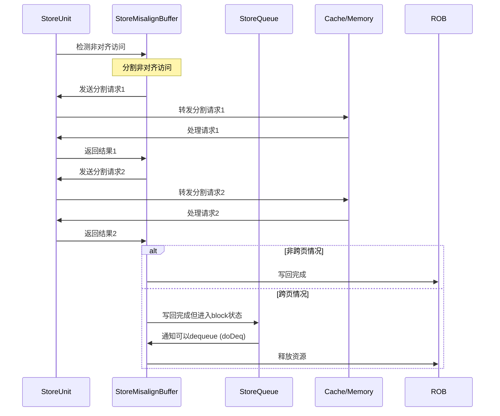

# StoreMisalignBuffer

## 1. 模块概述

`StoreMisalignBuffer.scala` 实现了一个专用的非对齐store处理器，作为 XiangShan 处理器 LSQ 系统中处理非对齐内存写入的关键组件。当store指令的地址未按数据类型大小对齐时（如半字、字或双字store的地址非对齐），该模块负责将非对齐访问分解为多个对齐访问，确保内存写入操作的正确执行。

### 1.1 核心功能

- 检测和处理非对齐store指令
- 将非对齐store分割为最多两个对齐store
- 根据指令类型和地址精确计算分割方式
- 管理分割后请求的发送和接收
- 处理异常情况，特别是跨页异常
- 支持向量和标量非对齐store指令
- 处理跨缓存行和跨页边界的store

### 1.2 模块定义

```scala
class StoreMisalignBuffer(implicit p: Parameters) extends XSModule
  with HasCircularQueuePtrHelper
{
  // 模块实现
}
```

## 2. 系统架构

### 2.1 内部状态机设计

StoreMisalignBuffer 是一个独立的功能模块，使用状态机控制非对齐store的处理流程：

```scala
val s_idle :: s_split :: s_req :: s_resp :: s_wb :: s_block :: Nil = Enum(6)
val bufferState = RegInit(s_idle)
```

- **s_idle**: 空闲状态，等待新请求
- **s_split**: 分割非对齐store，确定分割方案
- **s_req**: 发送分割后的请求
- **s_resp**: 接收分割请求的响应
- **s_wb**: 执行写回操作
- **s_block**: 等待指令到达ROB头部（针对跨页边界store）

该模块设计为单例架构（只能同时处理一个非对齐请求），设置了以下关键参数：

- `enqPortNum = StorePipelineWidth`: 入队端口数量
- `maxSplitNum = 2`: 最大分割数量，固定为2

### 2.2 在处理器内存系统中的位置

StoreMisalignBuffer 位于 XiangShan 处理器的内存访问系统中，与 StoreQueue、StoreUnit 和缓存系统紧密交互，为非对齐store提供专门优化。非对齐store在下列情况下需要特殊处理：

1. 跨越16字节边界的store指令
2. 跨越4KB页面边界的store指令

当检测到这些情况时，StoreMisalignBuffer 将分割store请求，处理后续流程，并确保数据正确写入内存。

## 3. 数据结构与接口

### 3.1 IO 接口

```scala
val io = IO(new Bundle() {
  val redirect         = Flipped(Valid(new Redirect))          // 重定向信号
  val enq              = Vec(enqPortNum, Flipped(new MisalignBufferEnqIO))  // 非对齐请求入队接口
  val rob              = Flipped(new RobLsqIO)                 // ROB接口
  val splitStoreReq    = Decoupled(new LsPipelineBundle)       // 分割store请求接口
  val splitStoreResp   = Flipped(Valid(new SqWriteBundle))     // 分割store响应接口
  val writeBack        = Decoupled(new MemExuOutput)           // 标量结果写回接口
  val vecWriteBack     = Vec(VecStorePipelineWidth, Decoupled(new VecPipelineFeedbackIO(isVStore = true)))  // 向量结果写回接口
  val storeOutValid    = Input(Bool())                         // 标量store输出有效信号
  val storeVecOutValid = Input(Bool())                         // 向量store输出有效信号
  val overwriteExpBuf  = Output(new XSBundle {...})            // 覆盖异常缓冲区信息
  
  val sqControl        = new StoreMaBufToSqControlIO           // 与StoreQueue的控制接口
  val toVecStoreMergeBuffer = Vec(VecStorePipelineWidth, new StoreMaBufToVecStoreMergeBufferIO) // 向量store接口
  val full             = Output(Bool())                         // 缓冲区满信号
})
```

### 3.2 关键数据类型和接口

1. **MisalignBufferEnqIO**：用于非对齐store请求的入队

   ```scala
   class MisalignBufferEnqIO extends XSBundle {
     val req = Decoupled(new LsPipelineBundle)  // 入队请求
     val revoke = Bool()                        // 撤销信号
   }
   ```

2. **StoreMaBufToSqControlIO**：与StoreQueue交互的控制接口

   ```scala
   class StoreMaBufToSqControlIO extends XSBundle {
     val toStoreMisalignBuffer = new XSBundle {
       val sqPtr = new SqPtr                    // StoreQueue指针
       val uop = new DynInst                    // 微操作信息
       val doDeq = Bool()                       // 出队信号
     }
     val toStoreQueue = new XSBundle {
       val crossPageWithHit = Bool()            // 跨页且命中信号
       val crossPageCanDeq = Bool()             // 跨页可出队信号
       val paddr = UInt(PAddrBits.W)            // 物理地址
       val withSameUop = Bool()                 // 相同微操作信号
     }
   }
   ```

3. **StoreMaBufToVecStoreMergeBufferIO**：与向量store合并缓冲区的接口

   ```scala
   class StoreMaBufToVecStoreMergeBufferIO extends XSBundle {
     val flush = Bool()                         // 刷新信号
     val mbIndex = UInt(SuperScalarWidth.W)     // 向量store合并缓冲区索引
   }
   ```

## 4. 内部数据结构与状态

StoreMisalignBuffer 维护以下关键内部状态和数据结构：

```scala
// 请求和有效位
val req_valid = RegInit(false.B)                                // 当前是否有有效请求
val req = Reg(new StoreMisalignBufferEntry)                     // 当前正在处理的请求

// 分割请求和响应store
val splitStoreReqs = RegInit(VecInit(List.fill(maxSplitNum)(0.U.asTypeOf(new LsPipelineBundle))))
val splitStoreResp = RegInit(VecInit(List.fill(maxSplitNum)(0.U.asTypeOf(new SqWriteBundle))))

// 分割控制和状态
val exceptionVec = RegInit(0.U.asTypeOf(ExceptionVec()))        // 异常向量
val unSentStores = RegInit(0.U(maxSplitNum.W))                  // 未发送的store请求位图
val unWriteStores = RegInit(0.U(maxSplitNum.W))                 // 未写入的store请求位图
val curPtr = RegInit(0.U(log2Ceil(maxSplitNum).W))              // 当前处理的分割请求指针

// 结果处理
val lowResultWidth = RegInit(0.U(3.W))                          // 低地址结果需保留的字节数
val highResultWidth = RegInit(0.U(3.W))                         // 高地址结果需保留的字节数

// 特殊状态标志
val isCrossPage = RegInit(false.B)                              // 是否跨页访问
val needFlushPipe = RegInit(false.B)                            // 是否需要刷新流水线
val globalException = RegInit(false.B)                          // 是否有异常
val globalUncache = RegInit(false.B)                            // 是否访问非缓存区域
val globalMMIO = RegInit(false.B)                               // 是否MMIO访问
val globalNC = RegInit(false.B)                                 // 是否NC访问
```

## 5. 非对齐store处理流程

### 5.1 请求接收与选择

StoreMisalignBuffer 从多个store单元接收非对齐请求，并选择最旧的请求优先处理：

```scala
val s1_req = VecInit(io.enq.map(_.req.bits))
val s1_valid = VecInit(io.enq.map(x => x.req.valid))

val s1_index = (0 until io.enq.length).map(_.asUInt)
val reqSel = selectOldest(s1_valid, s1_req, s1_index)

val reqSelValid = reqSel._1(0)
val reqSelBits  = reqSel._2(0)
val reqSelPort  = reqSel._3(0)

val reqRedirect = reqSelBits.uop.robIdx.needFlush(io.redirect)
val canEnq = !req_valid && !reqRedirect && reqSelValid
```

### 5.2 检测非对齐访问类型

检测访问是否跨越16字节边界或4KB页边界：

```scala
val alignedType = Mux(req.isvec, req.alignedType(1,0), req.uop.fuOpType(1, 0))

val highAddress = LookupTree(alignedType, List(
  SB -> 0.U,
  SH -> 1.U,
  SW -> 3.U,
  SD -> 7.U
)) + req.vaddr(4, 0)

val highPageAddress = LookupTree(alignedType, List(
  SB -> 0.U,
  SH -> 1.U,
  SW -> 3.U,
  SD -> 7.U
)) + req.vaddr(12, 0)

// 检查是否跨越16字节边界
val cross16BytesBoundary = req_valid && (highAddress(4) =/= req.vaddr(4))
// 检查是否跨越4KB页边界
cross4KBPageBoundary := req_valid && (highPageAddress(12) =/= req.vaddr(12))
```

### 5.3 分割非对齐访问

根据指令类型和地址，将非对齐访问分割为两个对齐访问：

```scala
when (bufferState === s_split) {
  when (!cross16BytesBoundary) {
    assert(false.B, s"There should be no non-aligned access that does not cross 16Byte boundaries.")
  } .otherwise {
    // 分割为两个对齐访问
    unWriteStores := Fill(maxSplitNum, 1.U(1.W))
    unSentStores := Fill(maxSplitNum, 1.U(1.W))
    curPtr := 0.U
    
    // 设置低地址和高地址访问的通用信息
    lowAddrStore.uop := req.uop
    lowAddrStore.uop.exceptionVec(storeAddrMisaligned) := false.B
    
    highAddrStore.uop := req.uop
    highAddrStore.uop.exceptionVec(storeAddrMisaligned) := false.B
    
    // 根据指令类型和地址情况，确定分割方式
    switch (alignedType(1, 0)) {
      is (SB) { /* 字节store不应该非对齐 */ }
      is (SH) { /* 处理半字非对齐访问 */ }
      is (SW) { /* 处理字非对齐访问 */ }
      is (SD) { /* 处理双字非对齐访问 */ }
    }
    
    // 保存分割请求
    splitStoreReqs(0) := lowAddrStore
    splitStoreReqs(1) := highAddrStore
  }
}
```

### 5.4 发送分割请求

依次发送分割后的请求：

```scala
io.splitStoreReq.valid := req_valid && (bufferState === s_req)
io.splitStoreReq.bits  := splitStoreReqs(curPtr)
io.splitStoreReq.bits.isvec  := req.isvec
// 恢复H扩展store的信息
val reqIsHsv  = LSUOpType.isHsv(req.uop.fuOpType)
io.splitStoreReq.bits.uop.fuOpType := Mux(req.isvec, req.uop.fuOpType, Cat(reqIsHsv, 0.U(2.W), splitStoreReqs(curPtr).uop.fuOpType(1, 0)))
io.splitStoreReq.bits.alignedType  := Mux(req.isvec, splitStoreReqs(curPtr).uop.fuOpType(1, 0), req.alignedType)
io.splitStoreReq.bits.isFinalSplit := curPtr(0)
```

### 5.5 处理分割响应

接收分割请求的响应并检查异常：

```scala
when (io.splitStoreResp.valid) {
  val resp = io.splitStoreResp.bits
  splitStoreResp(curPtr) := io.splitStoreResp.bits
  
  when (isUncache) {
    // 非缓存访问处理
    unWriteStores := 0.U
    unSentStores := 0.U
    exceptionVec := ExceptionNO.selectByFu(0.U.asTypeOf(exceptionVec.cloneType), StaCfg)
    // 委托给软件处理
    exceptionVec(storeAddrMisaligned) := true.B
  } .elsewhen (hasException) {
    // 异常处理
    unWriteStores := 0.U
    unSentStores := 0.U
    StaCfg.exceptionOut.map(no => exceptionVec(no) := exceptionVec(no) || resp.uop.exceptionVec(no))
  } .elsewhen (!io.splitStoreResp.bits.need_rep) {
    // 正常处理，准备处理下一个分割请求
    unSentStores := unSentStores & (~UIntToOH(curPtr)).asUInt
    curPtr := curPtr + 1.U
    exceptionVec := 0.U.asTypeOf(ExceptionVec())
  }
}
```

### 5.6 写回操作

对于标量store指令的写回：

```scala
io.writeBack.valid := req_valid && (bufferState === s_wb) && !io.storeOutValid && !req.isvec
io.writeBack.bits.uop := req.uop
io.writeBack.bits.uop.exceptionVec := DontCare
StaCfg.exceptionOut.map(no => io.writeBack.bits.uop.exceptionVec(no) := (globalUncache || globalException) && exceptionVec(no))
io.writeBack.bits.uop.flushPipe := needFlushPipe
io.writeBack.bits.uop.replayInst := false.B
```

对于向量store指令的写回：

```scala
io.vecWriteBack.zipWithIndex.map{
  case (wb, index) => {
    wb.valid := req_valid && (bufferState === s_wb) && req.isvec && !io.storeVecOutValid && UIntToOH(req.portIndex)(index)
    
    wb.bits.mBIndex           := req.mbIndex
    wb.bits.hit               := true.B
    wb.bits.isvec             := true.B
    wb.bits.sourceType        := RSFeedbackType.tlbMiss
    wb.bits.exceptionVec      := ExceptionNO.selectByFu(exceptionVec, VstuCfg)
    wb.bits.hasException      := globalException
    // 其他控制信息...
  }
}
```

## 6. 跨页边界store处理

### 6.1 跨页检测与特殊处理

StoreMisalignBuffer 对跨页边界的store进行特殊处理：

```scala
// 检测是否跨页
cross4KBPageBoundary := req_valid && (highPageAddress(12) =/= req.vaddr(12))

// 针对跨页store的状态控制
when(cross4KBPageBoundary && !s2_needRevoke) {
  when(robMatch) {
    bufferState := s_split
    isCrossPage := true.B
  }
} .otherwise {
  when (req_valid && !s2_needRevoke) {
    bufferState := s_split
    isCrossPage := false.B
  }
}
```

### 6.2 等待ROB头部状态

对于跨页store，需要等待指令到达ROB头部以确保系统状态一致：

```scala
val robMatch = req_valid && io.rob.pendingst && (io.rob.pendingPtr === req.uop.robIdx)

is (s_wb) {
  when (req.isvec) {
    // 向量store处理...
  }.otherwise {
    when (io.writeBack.fire && (!isCrossPage || globalUncache || globalException)) {
      // 非跨页或异常情况直接完成
      bufferState := s_idle
      // 重置状态...
    } .elsewhen(io.writeBack.fire && isCrossPage) {
      // 跨页情况进入阻塞状态
      bufferState := s_block
    }
  }
}

is (s_block) {
  // 等待StoreQueue通知可以出队
  when (io.sqControl.toStoreMisalignBuffer.doDeq) {
    bufferState := s_idle
    // 重置状态...
  }
}
```

### 6.3 与StoreQueue的协调

提供StoreQueue所需的跨页控制信息：

```scala
// 告知StoreQueue相关状态
io.sqControl.toStoreQueue.crossPageWithHit := io.sqControl.toStoreMisalignBuffer.sqPtr === req.uop.sqIdx && isCrossPage
io.sqControl.toStoreQueue.crossPageCanDeq := !isCrossPage || bufferState === s_block
io.sqControl.toStoreQueue.paddr := Cat(splitStoreResp(1).paddr(splitStoreResp(1).paddr.getWidth - 1, 3), 0.U(3.W))

io.sqControl.toStoreQueue.withSameUop := io.sqControl.toStoreMisalignBuffer.uop.robIdx === req.uop.robIdx && 
                                       io.sqControl.toStoreMisalignBuffer.uop.uopIdx === req.uop.uopIdx && 
                                       req.isvec && robMatch && isCrossPage
```

## 7. 异常处理机制

### 7.1 异常检测

检测分割请求执行过程中的各类异常：

```scala
val hasException = io.splitStoreResp.bits.vecActive && !io.splitStoreResp.bits.need_rep &&
  ExceptionNO.selectByFu(io.splitStoreResp.bits.uop.exceptionVec, StaCfg).asUInt.orR || 
  TriggerAction.isDmode(io.splitStoreResp.bits.uop.trigger)
  
val isUncache = (io.splitStoreResp.bits.mmio || io.splitStoreResp.bits.nc) && !io.splitStoreResp.bits.need_rep
```

### 7.2 跨页异常处理

当非对齐访问跨页且高地址页面发生异常时的特殊处理：

```scala
// 特殊情况：非对齐store跨页，页错误发生在下一页
val shouldOverwrite = req_valid && cross16BytesBoundary && globalException && (curPtr === 1.U)
val overwriteExpBuf = GatedValidRegNext(shouldOverwrite)
val overwriteVaddr = RegEnable(splitStoreResp(curPtr).vaddr, shouldOverwrite)
val overwriteIsHyper = RegEnable(splitStoreResp(curPtr).isHyper, shouldOverwrite)
val overwriteGpaddr = RegEnable(splitStoreResp(curPtr).gpaddr, shouldOverwrite)
val overwriteIsForVSnonLeafPTE = RegEnable(splitStoreResp(curPtr).isForVSnonLeafPTE, shouldOverwrite)

io.overwriteExpBuf.valid := false.B  // 目前保留，但实际不使用
io.overwriteExpBuf.vaddr := overwriteVaddr
io.overwriteExpBuf.isHyper := overwriteIsHyper
io.overwriteExpBuf.gpaddr := overwriteGpaddr
io.overwriteExpBuf.isForVSnonLeafPTE := overwriteIsForVSnonLeafPTE
```

### 7.3 状态机控制流

状态机控制非对齐访问处理的完整流程：

```scala
switch(bufferState) {
  is (s_idle) {
    when(cross4KBPageBoundary && !s2_needRevoke) {
      when(robMatch) {
        bufferState := s_split
        isCrossPage := true.B
      }
    } .otherwise {
      when (req_valid && !s2_needRevoke) {
        bufferState := s_split
        isCrossPage := false.B
      }
    }
  }

  is (s_split) {
    bufferState := s_req
  }

  is (s_req) {
    when (io.splitStoreReq.fire) {
      bufferState := s_resp
    }
  }

  is (s_resp) {
    val needDelay = WireInit(false.B)

    when (io.splitStoreResp.valid) {
      val clearOh = UIntToOH(curPtr)
      when (hasException || isUncache) {
        // 出现异常或访问非缓存区域
        bufferState := s_wb
        globalException := hasException
        globalUncache := isUncache
        globalMMIO := io.splitStoreResp.bits.mmio
        globalNC   := io.splitStoreResp.bits.nc
      } .elsewhen(io.splitStoreResp.bits.need_rep || (unSentStores & (~clearOh).asUInt).orR) {
        // 需要replay或还有未处理的分割请求
        bufferState := s_req
      } .otherwise {
        // 所有分割请求正常完成，等待一个周期以配合RAW延迟
        needDelay := true.B
        bufferState := s_resp
      }
    }

    when (RegNextN(needDelay, RAWTotalDelayCycles)) {
      bufferState := s_wb
    }
  }

  is (s_wb) {
    // 向量和标量store的写回处理不同
    when (req.isvec) {
      when (io.vecWriteBack.map(x => x.fire).reduce(_ || _)) {
        // 向量store完成
        bufferState := s_idle
        // 重置状态...
      }
    }.otherwise {
      when (io.writeBack.fire && (!isCrossPage || globalUncache || globalException)) {
        // 非跨页或异常情况直接完成
        bufferState := s_idle
        // 重置状态...
      } .elsewhen(io.writeBack.fire && isCrossPage) {
        // 跨页情况进入阻塞状态
        bufferState := s_block
      }
    }
  }

  is (s_block) {
    // 等待StoreQueue通知可以出队
    when (io.sqControl.toStoreMisalignBuffer.doDeq) {
      bufferState := s_idle
      // 重置状态...
    }
  }
}
```

## 8. 非对齐store指令处理示例：SW

### 8.1 初始状态

- 指令：`SW x5, 0x1001` (向地址0x1001store4字节，跨越16字节边界)
- store单元检测到非对齐访问，将请求发送到StoreMisalignBuffer

### 8.2 分割决策 (s_split)

根据字store指令和地址模式"01"，决定分割方式：

```scala
lowAddrStore.uop.fuOpType := SW
lowAddrStore.vaddr := req.vaddr - 1.U  // 0x1000
lowAddrStore.mask  := 0xf.U << lowAddrStore.vaddr(3, 0)
lowResultWidth    := BYTE3  // 取3字节

highAddrStore.uop.fuOpType := SB
highAddrStore.vaddr := req.vaddr + 3.U  // 0x1004
highAddrStore.mask  := 0x1.U << highAddrStore.vaddr(3, 0)
highResultWidth    := BYTE1  // 取1字节
```

### 8.3 发送低地址请求 (s_req)

发送第一个分割请求：

- 地址：0x1000
- 类型：SW (4字节写入)
- 掩码：0xf (4字节全部有效)

### 8.4 接收低地址响应 (s_resp)

接收第一个响应：

- 更新状态：unSentStores = 0b01 (第二个请求未发送)
- 检查异常和特殊情况
- 如果正常，继续处理下一个分割请求

### 8.5 发送高地址请求 (s_req)

发送第二个分割请求：

- 地址：0x1004
- 类型：SB (1字节写入)
- 掩码：0x1 (仅最低字节有效)

### 8.6 接收高地址响应 (s_resp)

接收第二个响应：

- 更新状态：unSentStores = 0b00 (所有请求已完成)
- 如果所有响应正常，进入写回阶段

### 8.7 执行写回 (s_wb)

非对齐store写回分为两种情况：

1. **非跨页情况**：
 - 立即写回，更新ROB信息
 - 直接回到s_idle状态

2. **跨页情况**：
 - 写回后进入s_block状态
 - 等待StoreQueue发出doDeq信号后再释放资源

## 9. 支持的分割方案

StoreMisalignBuffer支持多种非对齐访问模式，每种模式有特定的分割策略：

1. **非对齐半字(SH)**：
 - 分割为两个字节store(SB+SB)
 - 例如：地址0x1001分割为0x1001和0x1002

2. **非对齐字(SW)**：根据地址低2位不同有三种情况：
 - 01：分割为(SW+SB)，前向对齐store3字节+后向store1字节
 - 10：分割为(SH+SH)，前向store2字节+后向store2字节
 - 11：分割为(SB+SW)，前向store1字节+后向对齐store3字节

3. **非对齐双字(SD)**：根据地址低3位不同有七种情况：
 - 001：分割为(SD+SB)，前向对齐store7字节+后向store1字节
 - 010：分割为(SD+SH)，前向对齐store6字节+后向store2字节
 - ...
 - 111：分割为(SB+SD)，前向store1字节+后向对齐store7字节

## 10. 向量store支持

### 10.1 向量store特殊处理

StoreMisalignBuffer 支持向量store指令的特殊处理：

```scala
// 向量store写回
io.vecWriteBack.zipWithIndex.map{
  case (wb, index) => {
    wb.valid := req_valid && (bufferState === s_wb) && req.isvec && !io.storeVecOutValid && UIntToOH(req.portIndex)(index)

    wb.bits.mBIndex           := req.mbIndex
    wb.bits.hit               := true.B
    wb.bits.isvec             := true.B
    wb.bits.sourceType        := RSFeedbackType.tlbMiss
    wb.bits.flushState        := DontCare
    wb.bits.trigger           := TriggerAction.None
    wb.bits.mmio              := globalMMIO
    wb.bits.exceptionVec      := ExceptionNO.selectByFu(exceptionVec, VstuCfg)
    wb.bits.hasException      := globalException
    // 其他向量特定参数...
  }
}
```

### 10.2 与向量store合并缓冲区的交互

当处理跨页的向量store时，需要与向量store合并缓冲区进行特殊协调：

```scala
// 通知向量store合并缓冲区刷新
io.toVecStoreMergeBuffer.zipWithIndex.map{
  case (toStMB, index) => {
    toStMB.flush   := req_valid && cross4KBPageBoundary && cross4KBPageEnq && 
                      UIntToOH(req.portIndex)(index)
    toStMB.mbIndex := req.mbIndex
  }
}
```

## 11. StoreMisalignBuffer与其他模块的交互

### 11.1 与StoreQueue的交互

StoreMisalignBuffer 与 StoreQueue 之间的紧密协作是处理非对齐store的关键：

1. **跨页store管理**：

   ```scala
   // 提供跨页状态信息
   io.sqControl.toStoreQueue.crossPageWithHit := io.sqControl.toStoreMisalignBuffer.sqPtr === req.uop.sqIdx && isCrossPage
   io.sqControl.toStoreQueue.crossPageCanDeq := !isCrossPage || bufferState === s_block
   
   // 接收StoreQueue的控制信号
   when (io.sqControl.toStoreMisalignBuffer.doDeq) {
     bufferState := s_idle
     // 重置状态...
   }
   ```

2. **物理地址传递**：

   ```scala
   io.sqControl.toStoreQueue.paddr := Cat(splitStoreResp(1).paddr(splitStoreResp(1).paddr.getWidth - 1, 3), 0.U(3.W))
   ```

### 11.2 数据流路径

1. **非对齐store检测**：
 - StoreUnit 检测到非对齐store且跨16字节边界/4KB页边界
 - 转发请求到 StoreMisalignBuffer

2. **分割请求流程**：
 - StoreMisalignBuffer 分割请求
 - 通过 `io.splitStoreReq` 发送回 StoreUnit
 - StoreUnit 执行实际store操作
 - 结果通过 `io.splitStoreResp` 返回

3. **结果写回**：
 - 对于标量store：通过 `io.writeBack` 写回
 - 对于向量store：通过 `io.vecWriteBack` 写回

### 11.3 异常和特殊情况处理

1. **跨页异常**：

   ```scala
   // 处理跨页异常
   val shouldOverwrite = req_valid && cross16BytesBoundary && globalException && (curPtr === 1.U)
   
   // 覆盖异常缓冲区信息
   io.overwriteExpBuf.valid := false.B  // 实际未使用
   io.overwriteExpBuf.vaddr := overwriteVaddr
   // 其他异常信息...
   ```

2. **MMIO和非缓存访问**：

   ```scala
   when (isUncache) {
     // 委托给软件处理
     exceptionVec(storeAddrMisaligned) := true.B
   }
   ```

### 11.4 状态交互示意图



## 12. 性能优化与设计考量

### 12.1 流水线效率

1. **单例设计**：
 - 由于非对齐store在实际程序中相对罕见，使用单个实例处理
 - 减少了硬件开销，同时保持高效处理

2. **跨页特殊处理**：
 - 为跨页store设计专用的处理路径
 - 确保处理器状态保持一致，同时不阻塞处理流水线

### 12.2 异常处理优化

1. **延迟处理**：

   ```scala
   val needDelay = WireInit(false.B)
   when (RegNextN(needDelay, RAWTotalDelayCycles)) {
     bufferState := s_wb
   }
   ```
 - 使用延迟处理配合RAW冲突检测，确保正确的指令执行顺序

2. **精确异常处理**：
 - 对于跨页异常，使用准确的异常地址
 - 支持向量store的异常传播机制

### 12.3 与store队列协作

1. **跨页管理**：

   ```scala
   // 到StoreQueue的接口
   io.sqControl.toStoreQueue.crossPageWithHit := io.sqControl.toStoreMisalignBuffer.sqPtr === req.uop.sqIdx && isCrossPage
   ```
 - 与StoreQueue紧密协作，确保跨页store正确管理
 - 防止跨页store在未就绪时提交

2. **优化流水线控制**：

   ```scala
   val needFlushPipe = RegInit(false.B)
   io.writeBack.bits.uop.flushPipe := needFlushPipe
   ```
 - 在必要时通知处理器刷新流水线，减少后续指令的错误执行

## 13. 性能监控与调试

StoreMisalignBuffer 实现了性能监控功能，跟踪非对齐访问情况：

```scala
XSPerfAccumulate("alloc",          RegNext(!req_valid) && req_valid)
XSPerfAccumulate("flush",          flush)
XSPerfAccumulate("flush_idle",     flush && (bufferState === s_idle))
XSPerfAccumulate("flush_non_idle", flush && (bufferState =/= s_idle))
```

这些监控点帮助诊断和优化非对齐访问的性能问题，提供以下指标：

- 非对齐请求分配次数
- 请求被刷新的次数
- 不同状态下的刷新情况

## 14. 总结与应用

StoreMisalignBuffer 作为 XiangShan 处理器 LSQ 系统的专用组件，具有以下核心特性：

1. **精确分割机制**：根据指令类型和地址精确计算分割方案
2. **跨页store支持**：处理跨页store的特殊情况
3. **向量store支持**：提供向量store特殊处理机制
4. **完备的异常处理**：处理各种异常情况
5. **与StoreQueue协作**：紧密协调确保正确的store顺序

在乱序处理器中，StoreMisalignBuffer 解决了非对齐内存store的挑战，提高了处理器对不同内存访问模式的适应性。它将复杂的非对齐store问题转化为可管理的对齐store，在保证功能正确性的同时最小化性能影响。
