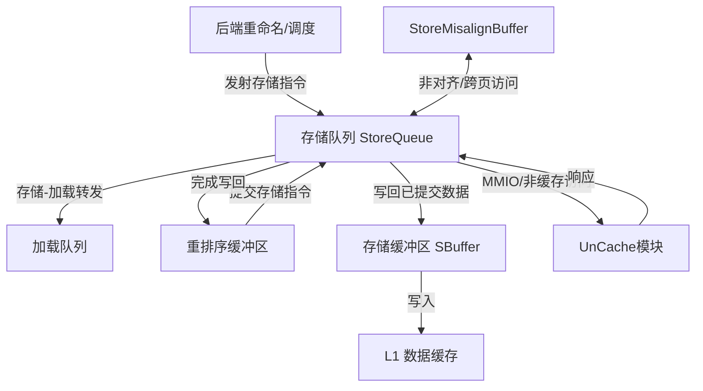

# StoreQueue

## 1. 模块概述

`StoreQueue.scala` 实现了XiangShan处理器的存储队列，它是内存子系统的关键组件，负责处理存储指令。StoreQueue管理存储指令从发射到最终写入内存的全过程，包括存储转发、内存一致性维护和非对齐访问处理等功能。

### 1.1 核心功能

- 接收和处理来自后端的存储指令
- 存储-加载转发，支持部分转发和精确的地址对比
- 管理存储指令的提交和写回
- 处理MMIO (Memory Mapped I/O) 和非缓存 (Non-cacheable) 存储指令
- 支持非对齐访问和跨页存储指令处理
- 向SBuffer传递已提交的存储数据
- 支持向量存储指令的特殊处理
- 实现CMO (Cache Maintenance Operations) 和CBO (Cache Block Operations) 指令

### 1.2 模块定义

```scala
class StoreQueue(implicit p: Parameters) extends XSModule
  with HasDCacheParameters
  with HasCircularQueuePtrHelper
  with HasPerfEvents
  with HasVLSUParameters {
  // 模块实现
}
```

### 1.3 七大特性概述

根据官方文档，StoreQueue具有以下七大核心特性：

1. **数据前递**：实现高效的存储-加载转发机制，确保数据依赖的正确性
2. **非对齐store指令**：支持处理非对齐的存储访问，包括跨16字节边界和跨页访问
3. **向量Store指令**：支持处理RISC-V向量扩展中的向量存储指令
4. **CMO指令**：实现缓存维护操作，用于管理缓存内容
5. **CBO指令**：支持缓存块操作，特别是CBO.ZERO清零操作
6. **MMIO与NonCacheable Store指令**：通过UnCache接口处理设备访问和非缓存存储
7. **store指令提交与SBuffer写入**：采用提前提交策略，高效地将存储数据写入SBuffer
8. **强制刷新Sbuffer**：使用双阈值控制策略管理SBuffer的刷新

## 2. 系统架构

### 2.1 存储队列在处理器中的位置

StoreQueue是XiangShan处理器乱序执行引擎中的关键组件，位于Load-Store单元内。存储队列是处理器进行乱序执行时维护内存访问顺序正确性的关键结构。它与LoadQueue协同工作，共同构成处理器的内存访问子系统。

在XiangShan处理器架构中，StoreQueue的主要角色包括：
1. 存储所有处于飞行(in-flight)状态的存储指令
2. 提供存储-加载转发，确保数据依赖的正确性
3. 按程序顺序提交存储数据到内存层次结构
4. 处理特殊的存储类型（如MMIO、非缓存、向量存储等）

### 2.2 设计特性

StoreQueue采用环形队列设计，具有以下主要特性：

1. **单发射多提交架构**：
	- 每周期可以接收最多`LSQEnqWidth`个新的存储指令
	- 每周期可以提交最多`CommitWidth`个经ROB确认提交的存储指令
	- 每周期可以向下层存储子系统发射最多`EnsbufferWidth`个已提交的存储指令

2. **分离的地址和数据处理**：
	- 地址和数据分别通过不同的端口写入，支持地址和数据在不同时间到达
	- 通过`addrvalid`和`datavalid`标志跟踪每条指令的状态

3. **模块化数据存储**：
	- 使用专用的`SQDataModule`和`SQAddrModule`模块管理数据和地址
	- 支持高效的CAM (Content Addressable Memory) 操作用于地址匹配

4. **优化的转发逻辑**：
	- 使用分段的转发路径实现低延迟转发
	- 支持部分转发（Partial Forwarding）和精确的掩码匹配

5. **特殊状态机**：
	- 为MMIO、非缓存访问和CMO操作提供专用的状态机处理
	- 支持非对齐存储和跨页存储的特殊处理

### 2.3 数据流架构



## 3. 数据结构与接口

### 3.1 主要接口

StoreQueue提供以下主要接口，用于与处理器其他模块交互：

```scala
val io = IO(new Bundle {
  // 核心ID
  val hartId = Input(UInt(hartIdLen.W))
  
  // 存储指令入队接口
  val enq = new SqEnqIO
  
  // 分支重定向信号
  val brqRedirect = Flipped(ValidIO(new Redirect))
  
  // 向量反馈
  val vecFeedback = Vec(VecLoadPipelineWidth, Flipped(ValidIO(new FeedbackToLsqIO)))
  
  // 存储地址和数据输入
  val storeAddrIn = Vec(StorePipelineWidth, Flipped(Valid(new LsPipelineBundle)))
  val storeDataIn = Vec(StorePipelineWidth, Flipped(Valid(new MemExuOutput(isVector = true))))
  val storeMaskIn = Vec(StorePipelineWidth, Flipped(Valid(new StoreMaskBundle)))
  
  // SBuffer接口
  val sbuffer = Vec(EnsbufferWidth, Decoupled(new DCacheWordReqWithVaddrAndPfFlag))
  
  // 特殊操作接口
  val mmioStout = DecoupledIO(new MemExuOutput)
  val vecmmioStout = DecoupledIO(new MemExuOutput(isVector = true))
  val cmoOpReq = DecoupledIO(new CMOReq)
  val cmoOpResp = Flipped(DecoupledIO(new CMOResp))
  
  // 加载转发查询
  val forward = Vec(LoadPipelineWidth, Flipped(new PipeLoadForwardQueryIO))
  
  // ROB接口
  val rob = Flipped(new RobLsqIO)
  
  // 状态输出
  val sqEmpty = Output(Bool())
  val sqFull = Output(Bool())
  // 更多接口...
})
```

### 3.2 数据存储模块

StoreQueue实现了多个专用的数据存储模块，用于高效管理存储指令的数据、地址和状态：

1. **SQDataModule**：管理存储数据，支持读取、写入和转发操作
   ```scala
   val dataModule = Module(new SQDataModule(
     numEntries = StoreQueueSize,
     numRead = EnsbufferWidth,
     numWrite = StorePipelineWidth,
     numForward = LoadPipelineWidth
   ))
   ```

2. **SQAddrModule**：管理物理和虚拟地址，支持CAM操作用于地址匹配
   ```scala
   val paddrModule = Module(new SQAddrModule(
     dataWidth = PAddrBits,
     numEntries = StoreQueueSize,
     numRead = EnsbufferWidth,
     numWrite = StorePipelineWidth,
     numForward = LoadPipelineWidth
   ))
   ```

3. **DatamoduleResultBuffer**：用于缓存写回SBuffer的数据
4. **StoreExceptionBuffer**：存储异常信息

### 3.3 重要的数据类型

1. **SqPtr**：存储队列指针，用于环形队列索引
   ```scala
   class SqPtr(implicit p: Parameters) extends CircularQueuePtr[SqPtr](
     p => p(XSCoreParamsKey).StoreQueueSize
   )
   ```

2. **DataBufferEntry**：数据缓冲条目，包含地址、数据和控制信息
   ```scala
   class DataBufferEntry(implicit p: Parameters) extends DCacheBundle {
     val addr = UInt(PAddrBits.W)
     val vaddr = UInt(VAddrBits.W)
     val data = UInt(VLEN.W)
     val mask = UInt((VLEN/8).W)
     val wline = Bool()
     val sqPtr = new SqPtr
     val prefetch = Bool()
     val vecValid = Bool()
     val sqNeedDeq = Bool()
   }
   ```

3. **SQDataEntry**：存储队列数据条目
   ```scala
   class SQDataEntry(implicit p: Parameters) extends XSBundle {
     val mask = UInt((VLEN/8).W)
     val data = UInt(VLEN.W)
   }
   ```

这些数据类型定义了存储队列中各种数据结构的格式和操作方式。

## 4. 内部数据结构与状态

StoreQueue内部维护了多种数据结构和状态标志，用于跟踪每条存储指令的生命周期和状态：

### 4.1 主要数据数组

```scala
// 微操作数据，保存每条存储指令的详细信息
val uop = Reg(Vec(StoreQueueSize, new DynInst))

// 调试用数据
val debug_paddr = Reg(Vec(StoreQueueSize, UInt((PAddrBits).W)))
val debug_vaddr = Reg(Vec(StoreQueueSize, UInt((VAddrBits).W)))
val debug_data = Reg(Vec(StoreQueueSize, UInt((XLEN).W)))
```

### 4.2 状态标志数组

StoreQueue使用多个状态标志数组跟踪存储指令的生命周期和状态：

```scala
// 基本状态标志
val allocated = RegInit(VecInit(List.fill(StoreQueueSize)(false.B)))  // 条目已分配
val completed = RegInit(VecInit(List.fill(StoreQueueSize)(false.B)))  // 条目已完成处理
val addrvalid = RegInit(VecInit(List.fill(StoreQueueSize)(false.B)))  // 地址有效
val datavalid = RegInit(VecInit(List.fill(StoreQueueSize)(false.B)))  // 数据有效
val allvalid  = VecInit((0 until StoreQueueSize).map(i => addrvalid(i) && datavalid(i)))  // 地址和数据都有效
val committed = RegInit(VecInit(List.fill(StoreQueueSize)(false.B)))  // 指令已被ROB提交

// 地址相关标志
val unaligned = RegInit(VecInit(List.fill(StoreQueueSize)(false.B)))  // 非对齐存储
val cross16Byte = RegInit(VecInit(List.fill(StoreQueueSize)(false.B)))  // 跨越16字节边界

// 特殊访问类型标志
val pending = RegInit(VecInit(List.fill(StoreQueueSize)(false.B)))  // MMIO挂起
val nc = RegInit(VecInit(List.fill(StoreQueueSize)(false.B)))  // 非缓存指令
val mmio = RegInit(VecInit(List.fill(StoreQueueSize)(false.B)))  // MMIO指令
val memBackTypeMM = RegInit(VecInit(List.fill(StoreQueueSize)(false.B)))  // 内存后端类型
val prefetch = RegInit(VecInit(List.fill(StoreQueueSize)(false.B)))  // 需要预取

// 向量存储相关标志
val isVec = RegInit(VecInit(List.fill(StoreQueueSize)(false.B)))  // 向量存储指令
val vecLastFlow = RegInit(VecInit(List.fill(StoreQueueSize)(false.B)))  // 向量存储的最后流
val vecMbCommit = RegInit(VecInit(List.fill(StoreQueueSize)(false.B)))  // 向量存储从合并缓冲区提交

// 异常相关标志
val hasException = RegInit(VecInit(List.fill(StoreQueueSize)(false.B)))  // 存储有异常
val waitStoreS2 = RegInit(VecInit(List.fill(StoreQueueSize)(false.B)))  // 等待存储S2阶段结果
```

这些标志的组合使得StoreQueue能够准确跟踪每条存储指令的状态和类型，从而正确处理各种复杂情况。

### 4.3 队列指针

StoreQueue使用多组指针管理环形队列的操作：

```scala
// 入队指针（新指令插入位置）
val enqPtrExt = RegInit(VecInit((0 until io.enq.req.length).map(_.U.asTypeOf(new SqPtr))))
val enqPtr = enqPtrExt(0).value

// 读取数据指针（用于向SBuffer发送数据）
val rdataPtrExt = RegInit(VecInit((0 until EnsbufferWidth).map(_.U.asTypeOf(new SqPtr))))

// 出队指针（指令完成处理的位置）
val deqPtrExt = RegInit(VecInit((0 until EnsbufferWidth).map(_.U.asTypeOf(new SqPtr))))
val deqPtr = deqPtrExt(0).value

// 提交指针（ROB已提交指令的位置）
val cmtPtrExt = RegInit(VecInit((0 until CommitWidth).map(_.U.asTypeOf(new SqPtr))))
val cmtPtr = cmtPtrExt(0).value

// 地址和数据就绪指针（用于发射阶段）
val addrReadyPtrExt = RegInit(0.U.asTypeOf(new SqPtr))
val dataReadyPtrExt = RegInit(0.U.asTypeOf(new SqPtr))
```

这些指针共同维护了队列的状态和操作，确保指令按正确的顺序处理。

### 4.4 MMIO和非缓存操作状态机

StoreQueue为MMIO和非缓存操作维护专用的状态机：

```scala
// MMIO状态机
val s_idle :: s_req :: s_resp :: s_wb :: s_wait :: Nil = Enum(5)
val mmioState = RegInit(s_idle)
val uncacheUop = Reg(new DynInst)  // 当前处理的MMIO微操作

// 非缓存状态机
val nc_idle :: nc_req :: nc_req_ack :: nc_resp :: Nil = Enum(4)
val ncState = RegInit(nc_idle)
val ncWaitRespPtrReg = RegInit(0.U(uncacheIdxBits.W))  // 等待响应的非缓存指令指针
```

这些状态机确保特殊类型的存储操作能够正确完成，同时避免与正常存储指令的处理冲突。

## 5. 存储队列处理流程

StoreQueue处理存储指令的整个生命周期，从入队到最终写入内存。以下是详细的处理流程：

### 5.1 指令入队

存储指令从后端调度器发射后首先进入StoreQueue：

```scala
// 接收来自后端的存储指令
val canEnqueue = io.enq.req.map(_.valid)
val enqCancel = io.enq.req.map(_.bits.robIdx.needFlush(io.brqRedirect))

// 支持向量存储指令的流处理
val vStoreFlow = io.enq.req.map(_.bits.numLsElem.asTypeOf(UInt(elemIdxBits.W)))
val validVStoreFlow = vStoreFlow.zipWithIndex.map{case (vStoreFlowNumItem, index) => 
  Mux(!RegNext(io.brqRedirect.valid) && canEnqueue(index), vStoreFlowNumItem, 0.U)}
```

入队过程中，StoreQueue为每个有效的入队请求分配存储队列条目，初始化所有状态标志和微操作信息，同时处理分支重定向可能导致的取消情况。

### 5.2 地址和数据写入

入队后，存储指令的地址和数据通过不同的路径写入StoreQueue：

1. **地址写入流程**：
   ```scala
   // 地址写入示例
   when (io.storeAddrIn(i).fire && io.storeAddrIn(i).bits.updateAddrValid) {
     val addr_valid = !io.storeAddrIn(i).bits.miss
     addrvalid(stWbIndex) := addr_valid
     nc(stWbIndex) := io.storeAddrIn(i).bits.nc
   }
   
   when (io.storeAddrIn(i).fire && !io.storeAddrIn(i).bits.isFrmMisAlignBuf) {
     unaligned(stWbIndex) := io.storeAddrIn(i).bits.isMisalign
     cross16Byte(stWbIndex) := io.storeAddrIn(i).bits.isMisalign && 
                              !io.storeAddrIn(i).bits.misalignWith16Byte

     // 写入物理地址模块
     paddrModule.io.waddr(i) := stWbIndex
     paddrModule.io.wdata(i) := io.storeAddrIn(i).bits.paddr
     // 其他地址写入操作...
   }
   ```

2. **数据写入流程**：
   ```scala
   // 数据写入示例
   when (io.storeDataIn(i).fire) {
     // 写入数据模块
     dataModule.io.data.waddr(i) := stWbIndex
     dataModule.io.data.wdata(i) := Mux(io.storeDataIn(i).bits.uop.fuOpType === LSUOpType.cbo_zero,
       0.U,
       Mux(isVec,
         io.storeDataIn(i).bits.data,
         genVWdata(io.storeDataIn(i).bits.data, io.storeDataIn(i).bits.uop.fuOpType(2,0)))
     )
     dataModule.io.data.wen(i) := true.B
   }
   ```

地址和数据写入包括设置各种标志、处理非对齐访问和特殊情况，以及将物理和虚拟地址写入对应模块。

### 5.3 ROB提交处理

当指令到达ROB头部且确认提交时，StoreQueue将其标记为已提交状态：

```scala
// 提交向量，记录哪些指令被提交
val commitVec = WireInit(VecInit(Seq.fill(CommitWidth)(false.B)))
val needCancel = Wire(Vec(StoreQueueSize, Bool()))

for (i <- 0 until CommitWidth) {
  when (
    allocated(cmtPtrExt(i).value) &&
    isNotAfter(uop(cmtPtrExt(i).value).robIdx, GatedRegNext(io.rob.pendingPtr)) &&
    !needCancel(cmtPtrExt(i).value) &&
    (!waitStoreS2(cmtPtrExt(i).value) || isVec(cmtPtrExt(i).value))
  ) {
    // 提交处理逻辑
    // ...
  }
}

// 更新提交指针
commitCount := PopCount(commitVec)
cmtPtrExt := cmtPtrExt.map(_ + commitCount)
```

提交过程确保只有经过ROB确认的指令才会写入内存，这是保证程序正确性的关键步骤。

### 5.4 将提交的存储写入SBuffer

当存储指令被标记为已提交且地址和数据都有效后，存储数据将写入数据缓冲区，然后发送到SBuffer：

```scala
// 准备写入数据缓冲区的条目
dataBuffer.io.enq(i).valid := (
  allocated(ptr) && committed(ptr)
    && ((!isVec(ptr) && (allvalid(ptr) || hasException(ptr))) || vecMbCommit(ptr))
    && !mmioStall && !ncStall
    && (!unaligned(ptr) || !cross16Byte(ptr) && (allvalid(ptr) || hasException(ptr)))
)

// 填充数据缓冲区条目
dataBuffer.io.enq(i).bits.addr := paddrModule.io.rdata(i)
dataBuffer.io.enq(i).bits.vaddr := vaddrModule.io.rdata(i)
dataBuffer.io.enq(i).bits.data := dataModule.io.rdata(i).data
// 其他字段设置...

// 将数据从数据缓冲区写入SBuffer
io.sbuffer(i).valid := dataBuffer.io.deq(i).valid
dataBuffer.io.deq(i).ready := io.sbuffer(i).ready

io.sbuffer(i).bits.cmd := MemoryOpConstants.M_XWR
io.sbuffer(i).bits.addr := dataBuffer.io.deq(i).bits.addr
// 其他字段设置...
```

这个过程完成了存储指令的主要功能：将数据写入内存层次结构。

### 5.5 处理特殊存储类型

StoreQueue使用专用的状态机处理MMIO和非缓存存储指令：

1. **MMIO处理流程**：
   ```scala
   // MMIO状态机
   switch(mmioState) {
     is(s_idle) {
       when(RegNext(io.rob.pendingst && uop(deqPtr).robIdx === io.rob.pendingPtr && 
             pending(deqPtr) && allocated(deqPtr) && datavalid(deqPtr) && addrvalid(deqPtr) && 
             !hasException(deqPtr))) {
         mmioState := s_req
         uncacheUop := uop(deqPtr)
         // 初始化MMIO操作...
       }
     }
     // 其他状态处理...
   }
   ```

2. **非缓存存储处理流程**：
   ```scala
   // 非缓存状态机
   switch(ncState){
     is(nc_idle) {
       when(nc(rptr0) && allocated(rptr0) && committed(rptr0) && !mmio(rptr0) && !isVec(rptr0)) {
         ncState := nc_req
         ncWaitRespPtrReg := rptr0
       }
     }
     // 其他状态处理...
   }
   ```

这些特殊处理机制确保MMIO和非缓存存储能够正确完成，同时维护程序的执行顺序。

### 5.6 处理分支预测错误和异常

当发生分支预测错误时，StoreQueue需要撤销受影响的存储指令：

```scala
// 判断哪些条目需要取消
for (i <- 0 until StoreQueueSize) {
  needCancel(i) := uop(i).robIdx.needFlush(io.brqRedirect) && allocated(i) && !committed(i)
  when (needCancel(i)) {
    allocated(i) := false.B
    completed(i) := false.B
  }
}

// 处理重定向后的指针恢复
// ...
```

这个机制确保错误预测路径上的存储指令不会影响程序状态，是保证推测执行正确性的关键部分。

## 6. 存储-加载转发机制

存储-加载转发是StoreQueue的核心功能之一，它确保后续的加载指令能够从尚未写入缓存的存储数据中读取正确的值。XiangShan的存储-加载转发设计在满足正确性的同时考虑了高性能需求。

### 6.1 转发请求和响应接口

LoadUnit通过以下接口向StoreQueue发送转发查询请求：

```scala
val forward = Vec(LoadPipelineWidth, Flipped(new PipeLoadForwardQueryIO))
```

每个转发查询包含以下信息：
- 物理地址和虚拟地址
- 访问掩码
- 存储队列索引（指示哪些较老的存储指令需要考虑）
- 微操作信息（用于StoreSet依赖检查）

StoreQueue提供两种时序的转发响应：
1. **快速响应(Fast)**: 在请求周期中生成，用于加载流水线的快速检查
2. **完整响应**: 在请求后1个周期生成，包含详细的数据和控制信息

### 6.2 地址匹配逻辑

转发的第一步是确定哪些存储指令的地址与加载指令匹配：

```scala
// 判断哪些区域需要检查
val differentFlag = deqPtrExt(0).flag =/= io.forward(i).sqIdx.flag
val forwardMask = io.forward(i).sqIdxMask
val forwardMask1 = Mux(differentFlag, ~deqMask, deqMask ^ forwardMask)
val forwardMask2 = Mux(differentFlag, forwardMask, 0.U(StoreQueueSize.W))
val needForward = Mux(differentFlag, ~deqMask | forwardMask, deqMask ^ forwardMask)

// 地址有效的存储指令
val addrValidVec = WireInit(VecInit((0 until StoreQueueSize).map(j => 
  addrvalid(j) && allocated(j))))
val dataValidVec = WireInit(VecInit((0 until StoreQueueSize).map(j => 
  datavalid(j))))
val allValidVec = WireInit(VecInit((0 until StoreQueueSize).map(j => 
  addrvalid(j) && datavalid(j) && allocated(j))))

// 计算可以转发的存储指令
val canForward1 = forwardMask1 & allValidVec.asUInt
val canForward2 = forwardMask2 & allValidVec.asUInt

// 执行CAM查找
dataModule.io.needForward(i)(0) := canForward1 & vaddrModule.io.forwardMmask(i).asUInt
dataModule.io.needForward(i)(1) := canForward2 & vaddrModule.io.forwardMmask(i).asUInt
// 设置CAM查找参数...
```

地址匹配通过CAM (Content Addressable Memory) 操作实现。SQAddrModule内部会比较存储和加载指令的地址，判断是否匹配。匹配分为精确匹配（地址完全相等且掩码相交）和行匹配（缓存行地址相等且存储指令有行标志）。

### 6.3 转发数据生成

在匹配到存储指令后，SQDataModule负责生成转发数据：

```scala
// 并行转发逻辑示例（简化版）
for (j <- 0 until numEntries) {
  val needCheck0 = io.needForward(i)(0)(j)
  val needCheck1 = io.needForward(i)(1)(j)
  
  matchResultVec(j).validFast := needCheck0 && data(j).valid
  matchResultVec(j).valid := needCheck0Reg && data(j).valid
  matchResultVec(j).data := data(j).data
  // 同样设置第二部分...
}

// 使用并行操作找到最终结果
val parallelFwdResult = parallelFwd(matchResultVec).asTypeOf(new FwdEntry)

// 生成转发结果
io.forwardValidFast(i) := parallelFwdResult.validFast
io.forwardValid(i) := parallelFwdResult.valid
io.forwardData(i) := parallelFwdResult.data
```

转发数据生成使用并行优先级逻辑，快速找到最相关的匹配（优先考虑较新的存储指令），并生成对应的转发数据。

### 6.4 转发状态检查

转发机制需要处理无法进行转发的特殊情况，如地址尚未就绪、数据尚未就绪或虚拟地址匹配但物理地址不匹配：

```scala
// 地址尚未就绪但存在StoreSet依赖
val storeSetHitVec = Mux(lfstEnable,
  WireInit(VecInit((0 until StoreQueueSize).map(j => 
    io.forward(i).uop.loadWaitBit && uop(j).robIdx === io.forward(i).uop.waitForRobIdx))),
  WireInit(VecInit((0 until StoreQueueSize).map(j => 
    uop(j).storeSetHit && uop(j).ssid === io.forward(i).uop.ssid)))
)

// 数据尚未就绪但地址匹配
val dataInvalidMask1 = ((addrValidVec.asUInt & ~dataValidVec.asUInt & vaddrModule.io.forwardMmask(i).asUInt) | 
                       unaligned.asUInt & allocated.asUInt) & forwardMask1.asUInt
// ...

// 虚拟地址与物理地址匹配结果不一致
val vpmaskNotEqual = (
  (RegEnable(paddrModule.io.forwardMmask(i).asUInt, io.forward(i).valid) ^ 
   RegEnable(vaddrModule.io.forwardMmask(i).asUInt, io.forward(i).valid)) &
  RegNext(needForward) &
  GatedRegNext(addrRealValidVec.asUInt)
) =/= 0.U
```

这些状态检查确保了转发操作的正确性，防止使用错误或不完整的数据。

### 6.5 地址依赖和数据依赖指示

当无法进行转发时，StoreQueue需要提供依赖指示，告知LoadUnit需要重放：

```scala
// 地址依赖指示示例
when (RegEnable(io.forward(i).uop.loadWaitStrict, io.forward(i).valid)) {
  io.forward(i).addrInvalidSqIdx := RegEnable((io.forward(i).uop.sqIdx - 1.U), io.forward(i).valid)
} .elsewhen (addrInvalidFlag) {
  io.forward(i).addrInvalidSqIdx.flag := Mux(!s2_differentFlag || addrInvalidSqIdx >= s2_deqPtrExt.value, 
                                           s2_deqPtrExt.flag, s2_enqPtrExt.flag)
  io.forward(i).addrInvalidSqIdx.value := addrInvalidSqIdx
} .otherwise {
  // 可能存储指令已写入sbuffer
  io.forward(i).addrInvalidSqIdx := RegEnable(io.forward(i).uop.sqIdx, io.forward(i).valid)
}
```

这些依赖指示帮助LoadUnit决定何时重新执行加载指令，是保证数据依赖正确性的关键机制。

### 6.6 协议和时序优化

XiangShan的存储-加载转发机制采用了多项优化措施来提高性能并确保正确性：

1. **两级转发响应**：
	- 快速响应在请求周期生成，用于加速执行正常情况
	- 完整响应在下一周期提供，包含更详细的信息和处理边缘情况

2. **并行CAM操作**：
	- 同时进行虚拟地址和物理地址匹配
	- 使用并行优先级逻辑快速找到最相关的匹配

3. **部分转发检测**：
	- 提前检测无法完成转发的情况，减少重放
	- 支持部分字节转发，只转发所需的数据

4. **安全保障措施**：
	- 虚拟地址和物理地址匹配结果比较，避免别名问题
	- 未对齐存储指令特殊处理，避免不完整转发

这些优化机制使得XiangShan的存储-加载转发能够同时满足高性能和正确性需求。

## 7. MMIO与非缓存存储处理

内存映射I/O (MMIO) 和非缓存 (Non-cacheable) 存储是特殊类型的存储操作，需要通过UnCache接口直接访问设备或内存，不使用缓存机制。XiangShan处理器中，StoreQueue负责这些特殊存储指令的处理。

### 7.1 MMIO和非缓存存储的识别

在地址生成阶段，存储指令会被标记为MMIO或非缓存访问：

```scala
// 更新MMIO和非缓存标志
when (storeAddrInFireReg) {
  pending(stWbIndexReg) := io.storeAddrInRe(i).mmio
  mmio(stWbIndexReg) := io.storeAddrInRe(i).mmio
  memBackTypeMM(stWbIndexReg) := io.storeAddrInRe(i).memBackTypeMM
  nc(stWbIndexReg) := io.storeAddrInRe(i).nc
}
```

这些标记通常基于物理地址范围或特殊的PMA (Physical Memory Attributes) 属性。

### 7.2 MMIO存储处理

MMIO存储使用专用的状态机处理，只有当指令到达ROB头部并确认提交时才会执行：

```scala
val s_idle :: s_req :: s_resp :: s_wb :: s_wait :: Nil = Enum(5)
val mmioState = RegInit(s_idle)

switch(mmioState) {
  is(s_idle) {
    // 当MMIO存储到达ROB头部时启动
    when(RegNext(io.rob.pendingst && uop(deqPtr).robIdx === io.rob.pendingPtr && 
          pending(deqPtr) && allocated(deqPtr) && datavalid(deqPtr) && addrvalid(deqPtr) && 
          !hasException(deqPtr))) {
      mmioState := s_req
      uncacheUop := uop(deqPtr)
      // 初始化状态...
    }
  }
  is(s_req) {
    when (mmioDoReq) {
      mmioState := s_resp
    }
  }
  // 其他状态处理...
}
```

MMIO处理的特点是串行执行，确保每条MMIO指令按程序顺序完成，这对于具有副作用的设备访问至关重要。

### 7.3 非缓存存储处理

非缓存(NC)存储也使用专用的状态机处理，但与MMIO不同，它们在ROB提交后直接处理，不需要到达ROB头部：

```scala
val nc_idle :: nc_req :: nc_req_ack :: nc_resp :: Nil = Enum(4)
val ncState = RegInit(nc_idle)

switch(ncState){
  is(nc_idle) {
    // 当NC存储被提交后启动
    when(nc(rptr0) && allocated(rptr0) && committed(rptr0) && !mmio(rptr0) && !isVec(rptr0)) {
      ncState := nc_req
      ncWaitRespPtrReg := rptr0
    }
  }
  // 其他状态处理...
}
```

非缓存存储允许一定程度的并行执行，但仍然保证了程序顺序的正确性。

### 7.4 UnCache通道复用

MMIO和非缓存存储共享同一个UnCache通道，但具有不同的优先级：

```scala
mmioReq.ready := io.uncache.req.ready
ncReq.ready := io.uncache.req.ready && !mmioReq.valid
io.uncache.req.valid := mmioReq.valid || ncReq.valid
io.uncache.req.bits := Mux(mmioReq.valid, mmioReq.bits, ncReq.bits)
```

MMIO请求具有更高优先级，非缓存请求只在没有MMIO请求时才能使用通道。

### 7.5 缓存操作指令(CMO)处理

缓存操作指令是一类特殊的MMIO指令，用于管理缓存的内容。在XiangShan中，有两种主要的CMO处理机制：

1. **通用CMO处理**：通过专用接口发送操作请求，等待操作完成

2. **CBO.ZERO特殊处理**：需要等待SBuffer刷新，然后执行特殊的零化操作

CMO操作通常用于维护缓存一致性，尤其是在多核系统中，需要特殊的处理机制。

## 8. 异常处理

StoreQueue在处理过程中需要处理多种不同类型的异常。为了确保系统的可靠性和正确性，XiangShan实现了完备的异常处理机制。

### 8.1 异常类型

StoreQueue处理的主要异常类型包括：

1. **存储地址不对齐(Store Address Misaligned)**：
	- 存储指令的地址未按照其访问大小对齐
	- 例如：半字存储地址不是2字节对齐，字存储地址不是4字节对齐

2. **存储访问错误(Store Access Fault)**：
	- 物理地址无效或不允许写入
	- PMP/PMA权限不允许当前请求访问

3. **页错误(Page Fault)**：
	- 虚拟地址转换过程中出现的页错误
	- 包括缺页、权限不足、保护错误等

4. **硬件错误(Hardware Error)**：
	- 设备或总线错误
	- ECC错误
	- 系统错误

5. **非法指令(Illegal Instruction)**：
	- 不支持的存储指令或格式

### 8.2 异常检测

异常检测主要在存储地址计算阶段进行：

```scala
// 在Store_S2阶段识别和记录异常
when (storeAddrInFireReg) {
  hasException(stWbIndexReg) := io.storeAddrInRe(i).hasException
  addrvalid(stWbIndexReg) := addrvalid(stWbIndexReg) || io.storeAddrInRe(i).hasException
  
  // 存储地址错误
  exceptionBuffer.io.storeAddrIn(StorePipelineWidth + i).valid := io.storeAddrInRe(i).hasException && 
                                                               !io.storeAddrInRe(i).isvec
  // 更多异常处理...
}
```

向量存储的异常处理稍有不同，需要通过专门的反馈通道接收异常信息。MMIO访问可能在UnCache响应阶段检测到硬件错误。

### 8.3 StoreExceptionBuffer

为了高效处理异常信息，尤其是在需要提供精确的虚拟地址时，StoreQueue使用专用的StoreExceptionBuffer：

```scala
class StoreExceptionBuffer(implicit p: Parameters) extends XSModule with HasCircularQueuePtrHelper {
  // 定义接口和内部状态
  // ...
  
  // 入队逻辑 - 检测S1阶段的存储异常
  val s1_req = VecInit(io.storeAddrIn.map(_.bits))
  val s1_valid = VecInit(io.storeAddrIn.map(x =>
      x.valid && !x.bits.uop.robIdx.needFlush(io.redirect) && 
        ExceptionNO.selectByFu(x.bits.uop.exceptionVec, StaCfg).asUInt.orR
  ))
  
  // S2阶段 - 延迟1个周期
  // ...
  
  // 选择最旧的异常进行处理
  val reqSel = selectOldest(s2_enqueue, s2_req)
  
  // 更新异常信息
  // ...
  
  // 输出异常地址信息
  io.exceptionAddr.vaddr := req.fullva
  // 其他异常信息...
}
```

StoreExceptionBuffer接收来自多个端口的异常信息，选择最旧的异常进行处理，并提供精确的异常地址信息给处理器的异常处理机制。

### 8.4 异常处理流程

异常的处理流程遵循以下步骤：

1. **检测异常**：在存储地址计算阶段检测异常
2. **跟踪异常**：将带有异常标记的存储指令正常流过存储队列
3. **更新StoreExceptionBuffer**：将异常信息写入专用的异常缓冲区
4. **提供精确异常信息**：当ROB处理异常时，提供精确的虚拟地址和异常信息
5. **特殊情况处理**：处理MMIO硬件错误和向量存储异常

### 8.5 向量存储异常的特殊处理

向量存储指令可能涉及多个元素，需要特殊的异常处理机制：

```scala
// 向量异常标记示例
val vecCommitHasException = (0 until EnsbufferWidth).map{ i =>
  val ptr = rdataPtrExt(i).value
  val exceptionVliad = isVec(ptr) && hasException(ptr) && dataBuffer.io.enq(i).fire
  (exceptionVliad, uop(ptr), vecLastFlow(ptr))
}

// 设置向量异常标记
when(!vecExceptionFlag.valid && vecCommitHasExceptionValidOR && !vecCommitLastFlow) {
  vecExceptionFlag.valid := true.B
  vecExceptionFlag.bits := vecCommitHasExceptionSelectUop
}.elsewhen(vecExceptionFlag.valid && vecExceptionFlagCancel) {
  vecExceptionFlag.valid := false.B
  vecExceptionFlag.bits := 0.U.asTypeOf(new DynInst)
}
```

这种机制确保了向量指令的异常能够正确处理，同时保持了程序执行的正确顺序。

## 9. 性能监控与调试

StoreQueue提供了丰富的性能监控和调试功能，帮助开发者理解和优化存储系统性能。

### 9.1 性能计数器

StoreQueue实现了多项性能计数器以监控关键性能指标：

```scala
// 队列状态统计
QueuePerf(StoreQueueSize, validCount, !allowEnqueue)
val vecValidVec = WireInit(VecInit((0 until StoreQueueSize).map(i => allocated(i) && isVec(i))))
QueuePerf(StoreQueueSize, PopCount(vecValidVec), !allowEnqueue)

// MMIO相关统计
XSPerfAccumulate("mmioCycle", mmioState =/= s_idle) // lq is busy dealing with uncache req
XSPerfAccumulate("mmioCnt", mmioDoReq)
XSPerfAccumulate("mmio_wb_success", io.mmioStout.fire || io.vecmmioStout.fire)
XSPerfAccumulate("mmio_wb_blocked", (io.mmioStout.valid && !io.mmioStout.ready) || 
                                (io.vecmmioStout.valid && !io.vecmmioStout.ready))

// 队列利用率统计
XSPerfAccumulate("validEntryCnt", distanceBetween(enqPtrExt(0), deqPtrExt(0)))
XSPerfAccumulate("cmtEntryCnt", distanceBetween(cmtPtrExt(0), deqPtrExt(0)))
XSPerfAccumulate("nCmtEntryCnt", distanceBetween(enqPtrExt(0), cmtPtrExt(0)))
```

这些性能计数器帮助开发者了解StoreQueue的运行状态和性能瓶颈，为性能优化提供依据。

### 9.2 转发性能监控

StoreQueue对存储-加载转发过程提供了特殊的性能监控：

```scala
// 虚拟地址匹配失败统计
XSPerfAccumulate("vaddr_match_failed", vpmaskNotEqual)
XSPerfAccumulate("vaddr_match_really_failed", vaddrMatchFailed)
```

这些统计信息有助于理解和优化存储-加载转发机制。

### 9.3 队列状态输出

StoreQueue提供多个状态输出接口，帮助处理器其他部分监控存储队列状态：

```scala
// 队列状态输出
io.sqEmpty := RegNext(
  enqPtrExt(0).value === deqPtrExt(0).value &&
  enqPtrExt(0).flag === deqPtrExt(0).flag
)
io.sqFull := !allowEnqueue
io.sqCancelCnt := redirectCancelCount

// 队列指针输出
io.stAddrReadySqPtr := addrReadyPtrExt
io.stAddrReadyVec := GatedValidRegNext(stAddrReadyVecReg)
io.stDataReadySqPtr := dataReadyPtrExt
io.stDataReadyVec := GatedValidRegNext(stDataReadyVecReg)
io.stIssuePtr := enqPtrExt(0)
io.sqDeqPtr := deqPtrExt(0)
```

这些状态输出使处理器其他部分能够了解StoreQueue的状态，做出相应的决策。

### 9.4 Difftest支持

StoreQueue支持Difftest功能，用于与参考模型比较验证行为的正确性：

```scala
// Difftest存储提交信息示例
if (env.EnableDifftest) {
  for (i <- 0 until EnsbufferWidth) {
    val ptr = dataBuffer.io.enq(i).bits.sqPtr.value
    difftestBuffer.get.io.enq(i).valid := dataBuffer.io.enq(i).valid
    difftestBuffer.get.io.enq(i).bits := uop(ptr)
  }
  
  // CMO Inval事件Difftest
  val cmoInvalEvent = DifftestModule(new DiffCMOInvalEvent)
  cmoInvalEvent.coreid := io.hartId
  cmoInvalEvent.valid  := io.mmioStout.fire && deqCanDoCbo && LSUOpType.isCboInval(uop(deqPtr).fuOpType)
  cmoInvalEvent.addr   := cboMmioAddr
}
```

Difftest支持对于验证StoreQueue实现的正确性至关重要，尤其是在复杂的乱序处理器中。

### 9.5 调试接口和断言

StoreQueue包含丰富的调试信息和断言，帮助验证行为的正确性：

```scala
// 调试数据跟踪
val debug_paddr = Reg(Vec(StoreQueueSize, UInt((PAddrBits).W)))
val debug_vaddr = Reg(Vec(StoreQueueSize, UInt((VAddrBits).W)))
val debug_data = Reg(Vec(StoreQueueSize, UInt((XLEN).W)))

// 关键断言
assert(!RegNext(RegNext(io.sbuffer(0).fire) && (io.mmioStout.fire || io.vecmmioStout.fire)))
assert(!(PopCount(isCboZeroToSbVec) > 1.U), 
       "Multiple cbo zero instructions cannot be executed at the same time")
(1 until EnsbufferWidth).foreach(i => when(io.sbuffer(i).fire) { assert(io.sbuffer(i - 1).fire) })
```

这些调试机制有助于在开发和验证阶段发现和修复潜在的问题。

### 9.6 调试日志

StoreQueue使用XSDebug和XSInfo函数记录关键操作的日志信息：

```scala
// 存储地址写入日志
XSInfo(io.storeAddrIn(i).fire && !io.storeAddrIn(i).bits.isFrmMisAlignBuf,
  "store addr write to sq idx %d pc 0x%x miss:%d vaddr %x paddr %x mmio %x isvec %x\n",
  io.storeAddrIn(i).bits.uop.sqIdx.value,
  io.storeAddrIn(i).bits.uop.pc,
  io.storeAddrIn(i).bits.miss,
  io.storeAddrIn(i).bits.vaddr,
  io.storeAddrIn(i).bits.paddr,
  io.storeAddrIn(i).bits.mmio,
  io.storeAddrIn(i).bits.isvec
)
```

这些日志信息对于理解系统行为和调试问题非常有用。

### 9.7 性能调优接口

StoreQueue提供了性能调优接口，允许动态控制某些行为：

```scala
// 强制写入控制
val ForceWriteUpper = Wire(UInt(log2Up(StoreQueueSize + 1).W))
ForceWriteUpper := Constantin.createRecord(s"ForceWriteUpper_${p(XSCoreParamsKey).HartId}", 
                                         initValue = StoreQueueForceWriteSbufferUpper)
val ForceWriteLower = Wire(UInt(log2Up(StoreQueueSize + 1).W))
ForceWriteLower := Constantin.createRecord(s"ForceWriteLower_${p(XSCoreParamsKey).HartId}", 
                                         initValue = StoreQueueForceWriteSbufferLower)

val valid_cnt = PopCount(allocated)
io.force_write := RegNext(Mux(valid_cnt >= ForceWriteUpper, true.B, 
                            valid_cnt >= ForceWriteLower && io.force_write), init = false.B)
```

这些接口使StoreQueue能够根据不同的工作负载特性进行动态调整，提高整体性能。

## 10. StoreQueue与其他模块的交互

StoreQueue是XiangShan处理器内存系统的核心组件，与多个其他模块紧密交互：

### 10.1 与LoadQueue和LoadUnit的交互

1. **存储-加载转发**：
	- 接收LoadUnit的转发查询
	- 提供数据和依赖信息
	- 确保数据依赖的正确性

   ```scala
   // 转发接口
   val forward = Vec(LoadPipelineWidth, Flipped(new PipeLoadForwardQueryIO))
   ```

2. **内存排序检查**：
	- 协助LoadQueue进行内存排序违规检查
	- 提供存储地址信息用于比较

### 10.2 与ROB的交互

1. **提交控制**：
	- 接收ROB的提交信号
	- 根据ROB指示提交存储指令
	- 处理特殊情况（如MMIO必须在ROB头部）

   ```scala
   // ROB接口示例
   val rob = Flipped(new RobLsqIO)
   ```

2. **异常处理**：
	- 向ROB报告存储异常
	- 提供精确的异常地址和类型

3. **完成通知**：
	- 通知ROB存储指令完成
	- 允许ROB释放相关资源

### 10.3 与SBuffer的交互

1. **数据传递**：
	- 将已提交的存储数据发送到SBuffer
	- 设置相应的控制标志（如整行写入、预取等）

   ```scala
   // SBuffer接口
   val sbuffer = Vec(EnsbufferWidth, Decoupled(new DCacheWordReqWithVaddrAndPfFlag))
   ```

2. **状态同步**：
	- 监控SBuffer状态
	- 处理特殊情况（如CBO.ZERO需要等待SBuffer刷新）

### 10.4 与UnCache模块的交互

1. **MMIO请求**：
	- 发送MMIO存储请求
	- 接收响应和处理错误

2. **非缓存请求**：
	- 发送非缓存存储请求
	- 管理请求-响应周期

   ```scala
   // UnCache接口
   val uncache = new UncacheWordIO
   ```

### 10.5 与StoreMisalignBuffer的交互

1. **非对齐存储处理**：
	- 检测非对齐存储
	- 与StoreMisalignBuffer协作完成非对齐访问

2. **跨页存储处理**：
	- 识别跨页存储
	- 协调跨页访问的特殊处理

### 10.6 与分支预测单元的交互

1. **重定向处理**：
	- 接收分支重定向信号
	- 取消错误路径上的存储指令
	- 恢复队列指针和状态

   ```scala
   // 分支重定向接口
   val brqRedirect = Flipped(ValidIO(new Redirect))
   ```

这些交互机制使StoreQueue能够在复杂的乱序处理器环境中正确高效地运行，同时保证内存访问的一致性和正确性。

## 11. 实例分析：存储指令处理流程

为了更好地理解StoreQueue的工作机制，下面通过两个具体实例分析存储指令的完整处理流程，包括普通存储指令和MMIO存储指令的处理。

### 11.1 普通存储指令处理实例

我们以一条普通的32位字存储指令为例，追踪其在StoreQueue中的完整生命周期。

#### 场景设置

假设处理器正在执行以下存储指令：`sw t0, 0(a0)` (将寄存器t0的内容存储到寄存器a0指向的内存地址)

* ROB索引: 76
* 存储数据: 0x12345678
* 目标地址: 0x80001000
* 初始队列状态: `enqPtr = 5`, `deqPtr = 2`, `cmtPtr = 3`

#### 阶段1: 指令入队

后端分发该存储指令到StoreQueue：

```
io.enq.req(0).valid = true
io.enq.req(0).bits.robIdx = 76
io.enq.req(0).bits.sqIdx = 5 (由分配得到)
```

1. **空间检查**:
	- `validCount = enqPtr - deqPtr = 5 - 2 = 3`，小于队列大小
	- 判定`allowEnqueue = true`，可以接收新指令

2. **入队处理**:
	- 条目5被分配给该指令
	- 设置状态标志:
     ```
     allocated(5) = true   // 标记为已分配
     completed(5) = false  // 尚未完成
     addrvalid(5) = false  // 地址尚未就绪
     datavalid(5) = false  // 数据尚未就绪
     committed(5) = false  // 尚未被ROB提交
     ```
	- 更新微操作信息: `uop(5) = 包含存储指令微操作信息`

3. **入队指针更新**:
	- `enqPtr = 5 + 1 = 6` (更新为下一个位置)

#### 阶段2: 地址计算和写入

存储地址从地址生成单元(AGU)写入StoreQueue:

```
io.storeAddrIn(0).valid = true
io.storeAddrIn(0).bits.uop.sqIdx = 5
io.storeAddrIn(0).bits.paddr = 0x80001000
io.storeAddrIn(0).bits.vaddr = 0x80001000  // 简化示例，物理地址等于虚拟地址
io.storeAddrIn(0).bits.mask = 0b1111      // 4字节掩码
```

1. **地址写入处理**:
	- 地址计算未发生缓存缺失，因此`addrvalid(5) = true`
	- 不是MMIO/NC访问: `mmio(5) = false`, `nc(5) = false`
	- 不是非对齐访问: `unaligned(5) = false`
   
2. **地址模块更新**:
	- 物理地址模块: `paddrModule.wdata(0) = 0x80001000`
	- 虚拟地址模块: `vaddrModule.wdata(0) = 0x80001000`
	- 更新访问掩码: `paddrModule.wmask(0) = 0b1111`

#### 阶段3: 数据写入

执行单元计算完数据后写入StoreQueue:

```
io.storeDataIn(0).valid = true
io.storeDataIn(0).bits.uop.sqIdx = 5
io.storeDataIn(0).bits.data = 0x12345678
```

1. **数据写入处理**:
	- 更新数据模块: `dataModule.wdata(0) = 0x12345678`
	- 设置数据就绪标志: `datavalid(5) = true`

2. **状态更新**:
	- 此时条目5的状态为:
     ```
     allocated(5) = true
     addrvalid(5) = true   // 地址已就绪
     datavalid(5) = true   // 数据已就绪
     allvalid(5) = true    // 地址和数据都就绪
     committed(5) = false  // 尚未被ROB提交
     ```

#### 阶段4: ROB提交

指令到达ROB头部并被确认可以提交:

```
// ROB信号
io.rob.scommit(0) = true          // 提交存储指令0
io.rob.scommit(1) = false         // 无提交存储指令1
io.rob.pendingPtr = 76            // 当前ROB头部指令的索引
```

1. **提交处理**:
	- 条件:
	     - `allocated(5) = true`
	     - `robIdx(5) = 76` 与ROB头部指令匹配
	     - 指令未被取消，S2阶段已完成
	- 设置提交标志: `committed(5) = true`

2. **提交指针更新**:
	- `cmtPtr = 3 + 1 = 4` (提交1条指令)

#### 阶段5: 写入SBuffer

指令完成所有准备，准备写入到SBuffer:

1. **数据缓冲区准备**:
	- 检查条件:
     ```
     allocated(5) = true
     committed(5) = true
     allvalid(5) = true   // 地址和数据都就绪
     !mmio(5) && !nc(5)   // 非MMIO和非缓存指令
     !unaligned(5)        // 非非对齐访问
     ```
	- 准备数据缓冲区条目:
     ```
     dataBuffer.enq(0).valid = true
     dataBuffer.enq(0).bits.addr = 0x80001000
     dataBuffer.enq(0).bits.data = 0x12345678
     dataBuffer.enq(0).bits.mask = 0b1111
     ```

2. **写入SBuffer**:
	- SBuffer接受写入请求:
     ```
     io.sbuffer(0).valid = true
     io.sbuffer(0).bits.cmd = M_XWR   // 写操作
     io.sbuffer(0).bits.addr = 0x80001000
     io.sbuffer(0).bits.data = 0x12345678
     io.sbuffer(0).bits.mask = 0b1111
     ```
	- SBuffer接受请求: `io.sbuffer(0).ready = true`
	- 标记条目完成: `completed(5) = true`

#### 阶段6: 指令完成和出队

指令完全执行完毕，需要从队列移除:

1. **完成检查**:
	- 条目5状态:
     ```
     allocated(5) = true
     completed(5) = true  // 已完成写入SBuffer
     ```

2. **出队处理**:
	- 队列出队数据: `deqPtr = 2 + 1 = 3` (假设队列中只有之前的一条指令被处理)

3. **最终状态**:
	- 条目5将在后续被新指令覆盖
	- 队列状态:
     ```
     enqPtr = 6   // 指向下一个要分配的条目
     deqPtr = 3   // 指向下一个要完成的条目
     cmtPtr = 4   // 指向下一个要提交的条目
     ```

### 11.2 MMIO存储指令处理实例

MMIO存储指令需要特殊处理，通过UnCache渠道直接访问设备。

#### 场景设置

假设处理器执行一条访问设备寄存器的存储指令: `sw t1, 0(t2)` (其中t2包含的是一个设备地址)

* ROB索引: 42
* 存储数据: 0xABCDEF01
* 目标地址: 0x10000000 (假设这是一个MMIO地址)
* 初始队列状态: `enqPtr = 10`, `deqPtr = 7`, `cmtPtr = 8`

#### 阶段1: 指令入队和地址写入

入队过程与普通存储类似，此处简化。关键区别在于地址写入阶段:

```
io.storeAddrIn(0).valid = true
io.storeAddrIn(0).bits.uop.sqIdx = 10
io.storeAddrIn(0).bits.paddr = 0x10000000
io.storeAddrIn(0).bits.vaddr = 0x10000000
io.storeAddrIn(0).bits.mask = 0b1111
io.storeAddrIn(0).bits.mmio = true  // 关键区别，标记为MMIO
```

1. **地址写入处理**:
	- 设置MMIO相关标志:
     ```
     addrvalid(10) = true
     mmio(10) = true      // 标记为MMIO指令
     pending(10) = true   // 设置为挂起状态
     ```

2. **数据写入完成后**:
	- 条目10状态:
     ```
     allocated(10) = true
     addrvalid(10) = true
     datavalid(10) = true
     mmio(10) = true
     committed(10) = false
     ```

#### 阶段2: 等待ROB头部且提交

MMIO存储指令必须等到到达ROB头部并成为暂挂存储指令时才能执行:

```
io.rob.pendingst = true      // 存在暂挂存储指令
io.rob.pendingPtr = 42       // 当前暂挂指令的索引
```

1. **MMIO状态机激活**:
	- 检查条件:
     ```
     uop(10).robIdx = 42     // 等于ROB头部指令
     pending(10) = true      // 为MMIO挂起状态
     allocated(10) = true    // 已分配
     datavalid(10) = true    // 数据有效
     addrvalid(10) = true    // 地址有效
     !hasException(10)       // 无异常
     ```
	- MMIO状态机转移: `mmioState: s_idle -> s_req`
	- 保存微操作: `uncacheUop = uop(10)`

#### 阶段3: 发送UnCache请求

MMIO状态机处理UnCache请求:

1. **准备UnCache请求**:
   ```
   mmioReq.valid = true
   mmioReq.bits.cmd = M_XWR         // 写操作
   mmioReq.bits.addr = 0x10000000   // MMIO物理地址
   mmioReq.bits.data = 0xABCDEF01   // 写入数据
   mmioReq.bits.mask = 0b1111       // 4字节掩码
   ```

2. **发送请求到UnCache接口**:
   ```
   io.uncache.req.valid = true
   io.uncache.req.bits = mmioReq.bits
   ```

3. **UnCache确认接收请求**:
	- `io.uncache.req.ready = true`
	- MMIO状态机转移: `mmioState: s_req -> s_resp`

#### 阶段4: 等待UnCache响应

MMIO状态机等待设备响应:

1. **接收UnCache响应**:
   ```
   io.uncache.resp.valid = true
   io.uncache.resp.bits.nc = false
   io.uncache.resp.bits.nderr = false  // 无硬件错误
   ```

2. **状态机更新**:
	- MMIO状态机转移: `mmioState: s_resp -> s_wb`

#### 阶段5: 写回处理器

MMIO状态机将结果写回处理器:

1. **准备写回信息**:
   ```
   io.mmioStout.valid = true
   io.mmioStout.bits.uop = uncacheUop
   io.mmioStout.bits.data = 0xABCDEF01  // 写入数据
   io.mmioStout.bits.debug.isMMIO = true
   ```

2. **处理器确认写回**:
	- `io.mmioStout.ready = true`
	- 标记MMIO指令完成: `completed(10) = true`
	- MMIO状态机转移: `mmioState: s_wb -> s_wait`

#### 阶段6: 等待提交确认

MMIO状态机等待最终提交确认:

1. **ROB确认提交**:
	- `io.rob.scommit > 0` (提交数量大于0)
	- MMIO状态机转移: `mmioState: s_wait -> s_idle`
	- MMIO状态机回到空闲状态，准备处理下一个MMIO请求

2. **指令出队和完成**:
	- 队列状态更新:
     ```
     deqPtr = 7 + 1 = 8    // 出队一条指令
     ```

#### 关键差异对比

| 处理步骤 | 普通存储指令 | MMIO存储指令 |
|---------|-------------|-------------|
| 入队     | 正常入队      | 正常入队      |
| 地址标记  | 正常地址      | 标记为MMIO   |
| 提交条件  | ROB正常提交   | 必须在ROB头部 |
| 执行路径  | 通过SBuffer到缓存 | 通过UnCache到设备 |
| 状态机控制 | 无专用状态机  | 使用MMIO状态机 |
| 并行程度  | 多条指令可并行 | 严格串行化执行 |
| 完成条件  | SBuffer写入完成 | UnCache响应完成 |
| 异常处理  | 正常异常处理  | 支持MMIO特有的硬件错误 |

通过这两个实例，我们可以看到StoreQueue如何处理不同类型的存储指令，如何维护其状态的转换，以及如何与处理器中的其他组件（如ROB、SBuffer和UnCache接口）协同工作。

## 12. 性能优化与设计考量

XiangShan处理器的StoreQueue实现了多种性能优化和特殊设计，以提高处理器的整体性能并适应不同的工作负载：

### 12.1 结构优化

1. **模块化设计**：
	- 使用专用模块管理数据、地址和异常
	- 提高设计清晰度和可维护性

   ```scala
   // 模块化设计示例
   val dataModule = Module(new SQDataModule(...))
   val paddrModule = Module(new SQAddrModule(...))
   val vaddrModule = Module(new SQAddrModule(...))
   val dataBuffer = Module(new DatamoduleResultBuffer(...))
   val exceptionBuffer = Module(new StoreExceptionBuffer)
   ```

2. **环形队列架构**：
	- 高效的资源利用
	- 简化回收和分配逻辑

3. **分离的地址和数据路径**：
	- 允许地址和数据在不同时间到达
	- 减少结构依赖

### 12.2 性能优化

1. **并行查询和匹配**：
	- 并行CAM操作加速地址匹配
	- 优化的优先级编码器快速选择结果

2. **提前就绪检测**：
	- 跟踪地址和数据就绪状态
	- 减少不必要的依赖等待

3. **并行提交和写回**：
	- 每周期支持多条指令提交
	- 多端口SBuffer接口提高带宽

### 12.3 特殊情况处理

1. **非对齐和跨页存储**：
	- 与StoreMisalignBuffer协作处理复杂情况
	- 保持高性能同时确保正确性

2. **向量存储优化**：
	- 特殊流处理机制
	- 优化的向量元素处理

3. **MMIO和非缓存访问专用路径**：
	- 独立状态机减少主路径复杂度
	- 确保特殊访问的正确顺序

### 12.4 关键延迟优化

1. **两级转发响应**：
	- 快速响应满足常见情况
	- 完整响应处理复杂情况

   ```scala
   // 快速转发和完整转发的区分
   io.forwardValidFast(i) := parallelFwdResult.validFast  // 快速响应
   io.forwardValid(i) := parallelFwdResult.valid          // 完整响应
   ```

2. **提前数据准备**：
	- 在请求周期预先准备可能的转发数据
	- 减少关键路径延迟

3. **流水线优化**：
	- 精心设计的流水线阶段平衡
	- 关键路径延迟优化

### 12.5 可扩展性考量

1. **参数化设计**：
	- 队列大小和端口数量可配置
	- 适应不同处理器配置

2. **可调优接口**：
	- 运行时可调整的阈值和策略
	- 适应不同工作负载特性

3. **模块化功能扩展**：
	- 支持添加新的存储类型
	- 扩展为未来特性预留接口

4. **强制刷新SBuffer机制**：
	- 采用双阈值控制策略
	- 当StoreQueue的有效项数超过上阈值时，强制刷新SBuffer
	- 当有效项数低于下阈值时，停止强制刷新

这些优化和设计考量使XiangShan的StoreQueue能够在保证功能正确性的同时，提供高性能和良好的可扩展性。
