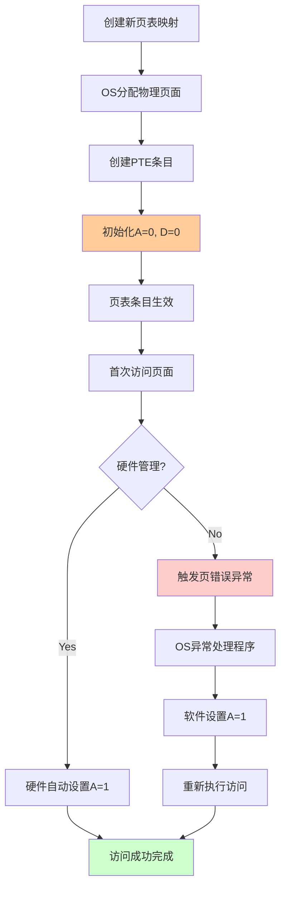
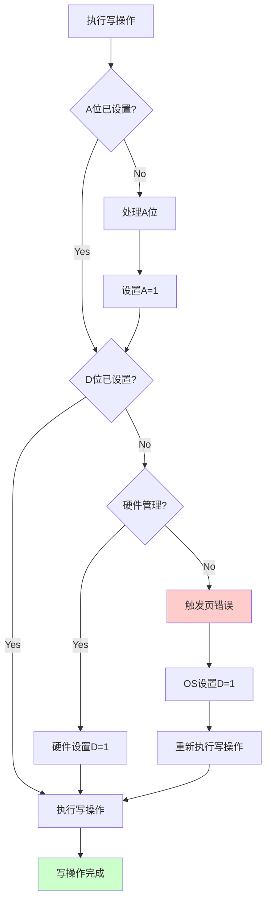
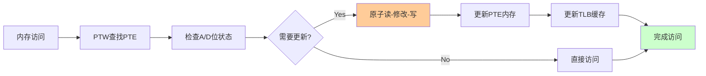
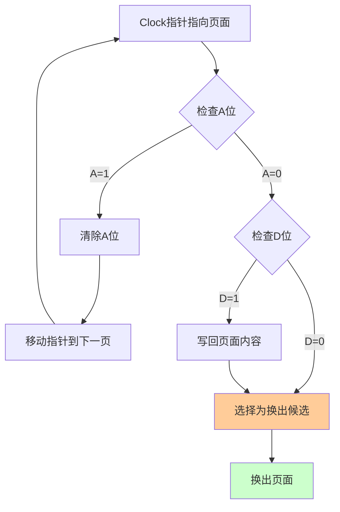
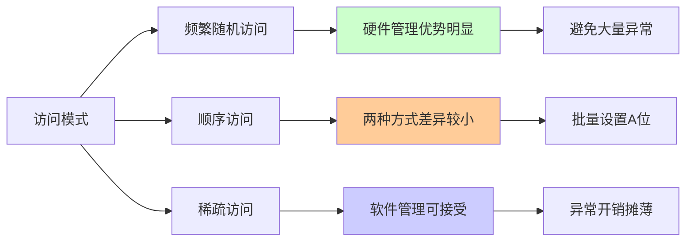

# A/D 位详解：Accessed 和 Dirty 位的管理机制

## 概述

Accessed (A) 位和 Dirty (D) 位是 RISC-V 页表项 (PTE) 中的两个关键状态位，它们为操作系统提供了页面使用情况的重要信息，是实现高效内存管理和页面置换算法的基础。

## A/D 位的基本概念

### Accessed (A) 位

**定义**: 当页面被任何形式访问（读取、写入或执行）时设置的状态位。

**位置**: PTE 的第 6 位

**作用**:

- 跟踪页面是否被使用过
- 为页面置换算法提供"热度"信息
- 支持 LRU (Least Recently Used) 等替换策略

### Dirty (D) 位

**定义**: 当页面内容被修改（写入操作）时设置的状态位。

**位置**: PTE 的第 7 位

**作用**:

- 标识页面内容是否已被修改
- 决定页面换出时是否需要写回存储设备
- 优化 I/O 操作，避免不必要的写回

## A/D 位的生命周期

### 初始状态设置流程



### 写操作时的 D 位设置



## 硬件管理 vs 软件管理

### 硬件自动管理方式

#### 优势

- **性能高**: 无需陷入内核处理页错误
- **透明性**: 对软件完全透明
- **实时性**: 立即更新状态位

#### 实现机制



#### 硬件实现复杂性

```chisel
// 硬件自动更新A/D位的伪代码
when(tlb_miss && pte_valid) {
  val needs_update = !pte.a || (is_write && !pte.d)
  
  when(needs_update) {
    // 准备更新的PTE
    val updated_pte = pte
    updated_pte.a := true.B
    when(is_write) {
      updated_pte.d := true.B
    }
    
    // 执行原子更新（AMO指令）
    val amo_result = atomic_compare_swap(pte_addr, pte, updated_pte)
    
    when(amo_result.success) {
      // 更新成功，使用新PTE
      install_tlb_entry(updated_pte)
    }.otherwise {
      // 更新失败，重试
      retry_page_walk()
    }
  }
}
```

#### 硬件管理的挑战

1. **原子性要求**: 必须保证PTE更新的原子性
2. **并发控制**: 多核访问同一PTE时的竞争条件
3. **性能开销**: 额外的内存写操作
4. **复杂度**: 增加PTW硬件的复杂性

### 软件管理方式

#### Rocket Chip 的选择

Rocket Chip（包括 SiFive U54）采用软件管理方式的原因：

1. **硬件简化**: 避免复杂的原子内存操作逻辑
2. **灵活性**: 软件可以实现更复杂的策略
3. **成本考虑**: 减少硬件实现复杂度和验证工作量

#### 软件管理流程

```mermaid
sequenceDigram
    participant App as 应用程序
    participant HW as 硬件(PTW)
    participant OS as 操作系统
    participant Mem as 内存

    App->>HW: 访问虚拟地址
    HW->>Mem: 读取PTE
    Mem-->>HW: 返回PTE
    
    alt A位未设置或D位未设置(写操作)
        HW->>OS: 触发页错误异常
        Note over OS: 异常码指示A/D位问题
        OS->>Mem: 更新PTE设置A/D位
        OS->>HW: 执行SFENCE.VMA
        OS-->>App: 返回用户态
        App->>HW: 重新访问(重试)
    else A/D位正确设置
        HW-->>App: 访问成功
    end
```

#### 软件异常处理实现

```c
// Linux内核中的页错误处理（简化版本）
void handle_page_fault(struct pt_regs *regs, unsigned long addr, 
                       unsigned long cause) {
    struct vm_area_struct *vma;
    pte_t *pte;
    
    vma = find_vma(current->mm, addr);
    if (!vma) goto bad_area;
    
    pte = get_pte(current->mm, addr);
    
    // 检查是否为A/D位相关的页错误
    if (cause == CAUSE_LOAD_ACCESS_FAULT || 
        cause == CAUSE_STORE_ACCESS_FAULT) {
        
        if (!pte_young(*pte)) {
            // 设置Accessed位
            *pte = pte_mkyoung(*pte);
        }
        
        if ((cause == CAUSE_STORE_ACCESS_FAULT) && !pte_dirty(*pte)) {
            // 设置Dirty位
            *pte = pte_mkdirty(*pte);
        }
        
        // 刷新TLB
        flush_tlb_page(vma, addr);
        return; // 重试访问
    }
    
bad_area:
    // 真正的段错误处理
    send_segv(current, addr, cause);
}
```

## A/D 位在页面管理中的应用

### 页面置换算法

#### LRU (Least Recently Used)

```c
// 基于A位的近似LRU实现
struct page *select_victim_page(struct zone *zone) {
    struct page *page, *victim = NULL;
    
    list_for_each_entry(page, &zone->lru_list, lru) {
        pte_t *pte = get_pte_for_page(page);
        
        if (!pte_young(*pte)) {
            // A位为0，候选换出页面
            victim = page;
            break;
        } else {
            // A位为1，清除A位给第二次机会
            *pte = pte_mkold(*pte);
        }
    }
    
    return victim;
}
```

#### Clock 算法



### 写回优化

#### 脏页面识别

```c
// 脏页面写回策略
void writeback_dirty_pages(struct zone *zone) {
    struct page *page;
    
    list_for_each_entry(page, &zone->dirty_list, dirty) {
        pte_t *pte = get_pte_for_page(page);
        
        if (pte_dirty(*pte)) {
            // D位为1，需要写回
            queue_page_writeback(page);
            
            // 清除D位
            *pte = pte_mkclean(*pte);
            flush_tlb_page_for_addr(page_to_virt(page));
        }
    }
}
```

## 性能影响分析

### 硬件管理的性能特性

#### 硬件管理的优势

- **零软件开销**: 无异常处理延迟
- **透明操作**: 应用程序无感知
- **实时更新**: 状态位即时准确

#### 硬件管理的劣势

- **额外内存访问**: 每次页表遍历可能需要额外写操作
- **缓存影响**: 可能增加缓存一致性开销
- **原子操作成本**: AMO指令的性能开销

### 软件管理的性能特性

#### 软件管理的优势

- **硬件简单**: PTW设计简化
- **批量处理**: 可以批量更新多个PTE
- **策略灵活**: 可实现复杂的更新策略

#### 软件管理的劣势

- **异常开销**: 页错误处理的软件延迟
- **首次访问惩罚**: 新页面访问时的额外开销
- **TLB刷新**: SFENCE.VMA指令的开销

### 性能对比分析



## 实际应用案例

### Linux 中的 A/D 位使用

#### 内存回收 (kswapd)

```c
// 简化的页面扫描逻辑
static unsigned long shrink_page_list(struct list_head *page_list) {
    struct page *page;
    unsigned long nr_reclaimed = 0;
    
    list_for_each_entry(page, page_list, lru) {
        pte_t *pte = page_check_references(page);
        
        if (!pte_young(*pte)) {
            // 页面未被近期访问
            if (pte_dirty(*pte)) {
                // 脏页面，需要写回
                if (writepage(page) == 0) {
                    nr_reclaimed++;
                }
            } else {
                // 干净页面，直接回收
                delete_from_page_cache(page);
                nr_reclaimed++;
            }
        } else {
            // 给页面第二次机会
            *pte = pte_mkold(*pte);
        }
    }
    
    return nr_reclaimed;
}
```

### 数据库系统中的应用

数据库缓冲池管理器利用 A/D 位信息：

```c
// 数据库缓冲页面置换
struct buffer_page *select_victim_buffer(struct buffer_pool *pool) {
    for (int i = 0; i < pool->size; i++) {
        struct buffer_page *page = &pool->pages[i];
        
        // 检查操作系统级别的A位
        if (!check_page_accessed(page->data)) {
            if (!check_page_dirty(page->data)) {
                // 干净且未访问的页面是最佳候选
                return page;
            }
        }
    }
    
    // 如果没有找到理想候选，使用其他策略
    return clock_replacement(pool);
}
```

## 调试和监控

### 系统级监控

```bash
# 查看系统页面统计
cat /proc/vmstat | grep -E "pgpgin|pgpgout|pgfault"

# 监控进程的页错误
cat /proc/[pid]/stat | awk '{print "minor_faults: " $10 ", major_faults: " $12}'
```

### 内核调试接口

```c
// 添加A/D位相关的调试信息
static void dump_pte_info(pte_t *pte, unsigned long addr) {
    printk("PTE for addr 0x%lx:\n", addr);
    printk("  Valid: %d\n", pte_present(*pte));
    printk("  Accessed: %d\n", pte_young(*pte));
    printk("  Dirty: %d\n", pte_dirty(*pte));
    printk("  Writable: %d\n", pte_write(*pte));
}
```

## 总结

A/D 位是虚拟内存系统中的重要机制，它们为操作系统提供了页面使用状况的关键信息。硬件管理和软件管理两种方式各有优缺点：

### 硬件管理方式总结

- **适用场景**: 高性能系统，内存访问模式随机性强
- **优势**: 高性能，透明操作
- **劣势**: 硬件复杂，成本高

### 软件管理方式总结

- **适用场景**: 成本敏感系统，访问模式相对可预测
- **优势**: 硬件简单，灵活性强
- **劣势**: 首次访问有延迟

Rocket Chip 选择软件管理方式体现了其作为开源、可配置平台的设计理念，在简化硬件实现的同时，为操作系统提供了灵活的内存管理策略实现空间。

---

*本文档深入分析了 A/D 位的工作机制、管理策略和性能影响，为理解现代虚拟内存系统的精细化管理提供了全面的技术参考。*
