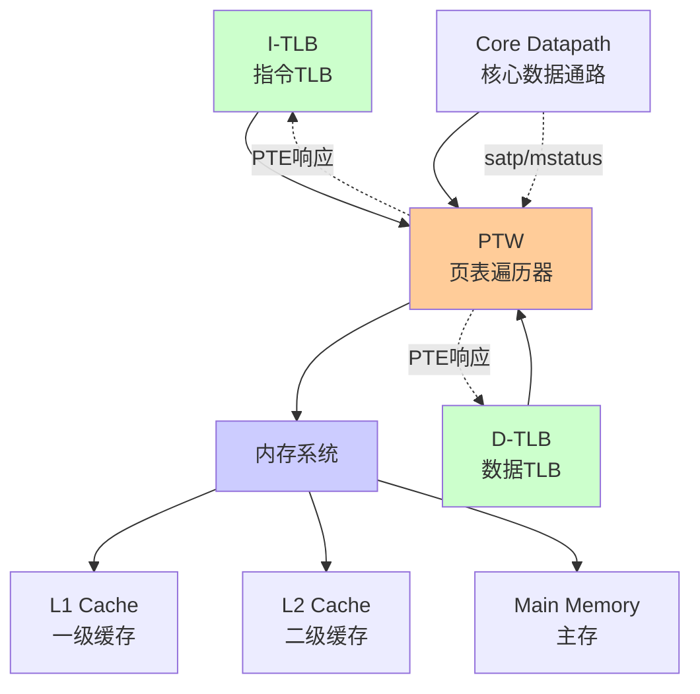
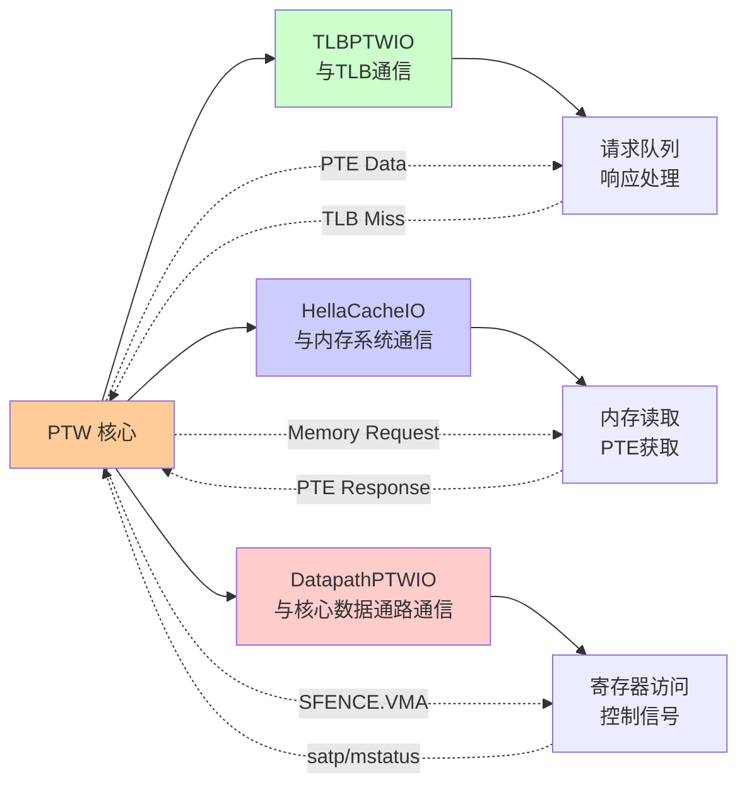
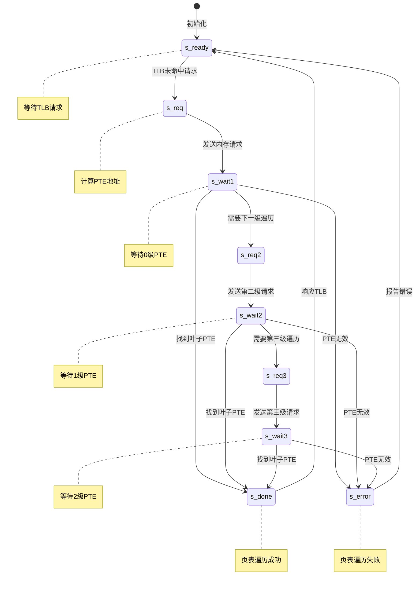
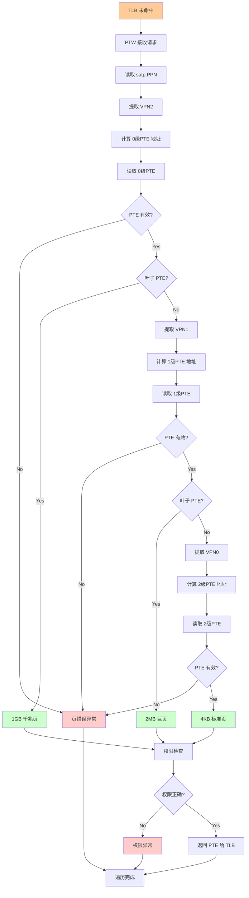
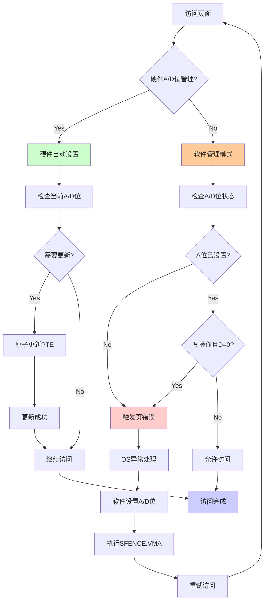
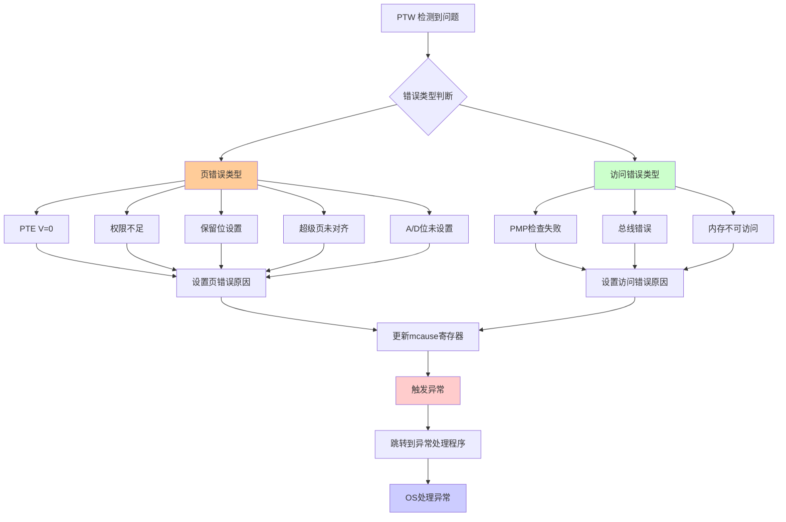
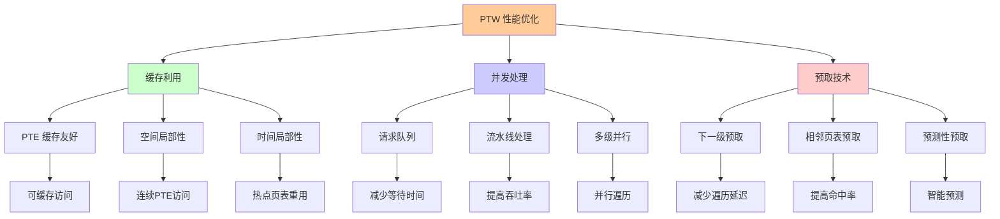

# 页表遍历器（PTW）机制

## 概述

页表遍历器（Page Table Walker, PTW）是 MMU 的关键组件，负责在 TLB 未命中时从内存中的页表结构获取地址转换信息。PTW 实现了 RISC-V 规范中定义的多级页表查找算法，是整个 MMU 的"慢速路径"或后备机制。当高速的 TLB 无法提供所需的地址转换时，PTW 会通过访问主存中的页表来完成地址转换。

## PTW 架构与接口设计

### 整体架构

PTW 作为 RocketTile 的共享组件，服务于 Tile 内的所有 TLB：

#### PTW 系统架构图



#### 传统表示方式

```
    I-TLB ──┐
             ├──→ PTW ──→ Memory System
    D-TLB ──┘          ├──→ L1 Cache
                       ├──→ L2 Cache  
                       └──→ Main Memory
```

### 关键接口定义

#### PTW 接口关系图



#### 与 TLB 的接口 (TLBPTWIO)

```chisel
class TLBPTWIO extends Bundle {
  val req = Decoupled(new PTWReq)      // TLB 向 PTW 的请求
  val resp = Valid(new PTWResp)        // PTW 向 TLB 的响应
  val ptbr = Input(new PTBR)           // 页表基地址寄存器
  val invalidate = Input(Bool())       // TLB 无效化信号
  val status = Input(new MStatus)      // 处理器状态
}
```

#### 与内存系统的接口 (HellaCacheIO)

```chisel
class HellaCacheIO extends Bundle {
  val req = Decoupled(new HellaCacheReq)    // 内存请求
  val resp = Valid(new HellaCacheResp)      // 内存响应
  val replay_next = Output(Bool())          // 重放信号
  val s1_kill = Output(Bool())              // 取消信号
  val s1_data = Output(UInt(64.W))          // 写数据
}
```

#### 与核心数据通路的接口 (DatapathPTWIO)

```chisel
class DatapathPTWIO extends Bundle {
  val ptbr = Input(new PTBR)           // satp 寄存器内容
  val sfence = Input(Bool())           // SFENCE.VMA 指令
  val status = Input(new MStatus)      // mstatus/sstatus 内容
}
```

### 模块化设计的优势

这种接口设计体现了 Rocket Chip 的模块化哲学：

1. **组件复用**: BOOM 等其他核心可以直接复用 PTW 组件
2. **标准化接口**: 减少组件间的紧耦合
3. **设计简化**: 支持异构 SoC 设计

## PTW 状态机设计

### 状态定义

```chisel
object PTWState extends ChiselEnum {
  val s_ready = Value      // 空闲状态，等待请求
  val s_req = Value        // 发出内存请求
  val s_wait1 = Value      // 等待内存响应
  val s_req2 = Value       // 发出第二级请求
  val s_wait2 = Value      // 等待第二级响应
  val s_req3 = Value       // 发出第三级请求  
  val s_wait3 = Value      // 等待第三级响应
  val s_done = Value       // 完成，准备响应
  val s_error = Value      // 错误状态
}
```

### 状态转换逻辑

#### PTW 状态机转换图



### 状态机实现

```chisel
val state = RegInit(s_ready)

switch(state) {
  is(s_ready) {
    when(io.dpath.sfence) {
      // 处理 SFENCE.VMA
    }.elsewhen(arb.io.out.fire) {
      state := s_req
      level := pgLevels.U - 1.U
    }
  }
  
  is(s_req) {
    when(io.mem.req.fire) {
      state := s_wait1
    }
  }
  
  is(s_wait1) {
    when(io.mem.resp.fire) {
      when(pte.isValid) {
        when(pte.isLeaf) {
          state := s_done
        }.otherwise {
          state := s_req2
          level := level - 1.U
        }
      }.otherwise {
        state := s_error
      }
    }
  }
  
  // 类似的逻辑用于 s_req2/s_wait2, s_req3/s_wait3
}
```

## 页表遍历算法实现

### 完整页表遍历流程图



### 地址计算

#### 初始地址计算

```chisel
val base = io.dpath.ptbr.ppn << pgIdxBits
val vpn = io.req.bits.addr >> pgIdxBits
val idx = (vpn >> (level * ptIdxBits)) & ((1 << ptIdxBits) - 1).U
val pte_addr = base + (idx << log2Ceil(xLen/8))
```

#### 各级 VPN 提取

```chisel
def vpn_level(vpn: UInt, level: UInt): UInt = {
  val shift = level * ptIdxBits.U
  val mask = ((1 << ptIdxBits) - 1).U
  (vpn >> shift) & mask
}
```

### PTE 读取与解析

#### 内存请求生成

```chisel
io.mem.req.valid := state === s_req || state === s_req2 || state === s_req3
io.mem.req.bits.addr := pte_addr
io.mem.req.bits.cmd := M_XRD
io.mem.req.bits.size := log2Ceil(xLen/8).U
```

#### PTE 解析

```chisel
class PTE extends Bundle {
  val ppn = UInt(ppnBits.W)      // 物理页号
  val reserved = UInt(2.W)       // 保留位  
  val d = Bool()                 // Dirty 位
  val a = Bool()                 // Accessed 位
  val g = Bool()                 // Global 位
  val u = Bool()                 // User 位
  val x = Bool()                 // Execute 位
  val w = Bool()                 // Write 位
  val r = Bool()                 // Read 位
  val v = Bool()                 // Valid 位
  
  def isValid = v
  def isLeaf = r || w || x
  def isPointer = !isLeaf && isValid
}
```

### 超级页检测

#### 叶子 PTE 判断

```chisel
def isLeafPTE(pte: PTE): Bool = {
  pte.r || pte.w || pte.x
}
```

#### 超级页验证

```chisel
def isMisalignedSuperpage(pte: PTE, level: UInt): Bool = {
  val mask = Wire(UInt(ppnBits.W))
  
  switch(level) {
    is(0.U) { mask := ((1 << 18) - 1).U }  // 1 GiB 页面
    is(1.U) { mask := ((1 << 9) - 1).U }   // 2 MiB 页面
    is(2.U) { mask := 0.U }                // 4 KiB 页面
  }
  
  (pte.ppn & mask) =/= 0.U
}
```

## A/D 位管理策略

### A/D 位管理决策流程



### 软件管理方式

Rocket Chip（如 SiFive U54）采用软件管理 A/D 位的策略：

#### 检测未设置的 A/D 位

```chisel
def needAccessFault(pte: PTE, access_type: UInt): Bool = {
  val access_fault = !pte.a
  val write_fault = access_type === AccessType.WRITE && !pte.d
  access_fault || write_fault
}
```

#### 触发页错误

```chisel
when(needAccessFault(pte, access_type)) {
  cause := Causes.store_page_fault // 或其他相应的原因
  state := s_error
}
```

### 硬件管理方式（可选）

某些实现可能支持硬件自动更新 A/D 位：

```chisel
when(hardware_ad_update_enabled) {
  val updated_pte = pte
  updated_pte.a := true.B
  when(access_type === AccessType.WRITE) {
    updated_pte.d := true.B  
  }
  
  // 执行原子性的内存更新
  io.mem.req.bits.cmd := M_XSC  // Store conditional
  io.mem.req.bits.data := updated_pte.asUInt
}
```

## 错误检测与异常处理

### PTW 错误处理流程



### 页错误类型

#### 基本页错误

```chisel
object PageFaultCause extends ChiselEnum {
  val invalid_pte = Value        // PTE V 位为 0
  val permission_denied = Value  // 权限不足
  val reserved_bit_set = Value   // 保留位被设置
  val misaligned_superpage = Value // 超级页未对齐
  val access_bit_clear = Value   // A 位为 0
  val dirty_bit_clear = Value    // D 位为 0（写操作时）
}
```

#### 错误检测逻辑

```chisel
val page_fault_cause = Wire(UInt())
page_fault_cause := PageFaultCause.invalid_pte

when(pte.v) {
  when(pte.reserved =/= 0.U) {
    page_fault_cause := PageFaultCause.reserved_bit_set
  }.elsewhen(isLeafPTE(pte) && isMisalignedSuperpage(pte, level)) {
    page_fault_cause := PageFaultCause.misaligned_superpage
  }.elsewhen(!pte.a) {
    page_fault_cause := PageFaultCause.access_bit_clear
  }.elsewhen(is_write && !pte.d) {
    page_fault_cause := PageFaultCause.dirty_bit_clear
  }
}
```

### 访问错误检测

#### 物理内存保护（PMP）检查

```chisel
val pmp_check_result = pmp.check(pte_addr, AccessType.READ)
when(!pmp_check_result.allowed) {
  cause := Causes.load_access_fault
  state := s_error
}
```

#### 总线错误处理

```chisel
when(io.mem.resp.fire && io.mem.resp.bits.has_error) {
  cause := Causes.load_access_fault
  state := s_error
}
```

## 性能优化技术

### PTW 性能优化策略图



### PTE 缓存利用

#### 缓存友好的访问模式

```chisel
// PTE 访问会经过缓存层次结构
io.mem.req.bits.phys := true.B  // 物理地址访问
io.mem.req.bits.cacheable := true.B  // 可缓存
```

#### 空间局部性利用

连续的虚拟地址往往访问同一页表页中的不同 PTE，充分利用缓存行的空间局部性。

### 并发请求处理

#### 请求队列

```chisel
val req_queue = Module(new Queue(new PTWReq, entries = 4))
req_queue.io.enq <> arb.io.out
```

#### 流水线化处理

```chisel
val pipeline_stages = 3
val stage_valid = RegInit(VecInit(Seq.fill(pipeline_stages)(false.B)))
val stage_req = Reg(Vec(pipeline_stages, new PTWReq))
```

### 预取优化

#### 下一级页表预取

```chisel
when(pte.isPointer && prefetch_enabled) {
  val next_level_base = pte.ppn << pgIdxBits
  val next_vpn = vpn_level(vpn, level - 1.U)
  val prefetch_addr = next_level_base + (next_vpn << log2Ceil(xLen/8))
  
  // 发起预取请求
  prefetch_queue.enq(prefetch_addr)
}
```

## 调试与验证

### 性能监控

#### 关键性能计数器

```chisel
val ptw_requests = RegInit(0.U(64.W))
val ptw_cycles = RegInit(0.U(64.W))
val ptw_page_faults = RegInit(0.U(64.W))

when(io.req.fire) {
  ptw_requests := ptw_requests + 1.U
}

when(state =/= s_ready) {
  ptw_cycles := ptw_cycles + 1.U
}

when(state === s_error) {
  ptw_page_faults := ptw_page_faults + 1.U
}
```

### 调试接口

```chisel
when(debug_enable) {
  printf("PTW: state=%d level=%d addr=%x pte=%x\n",
    state, level, pte_addr, io.mem.resp.bits.data)
}
```

### 功能验证要点

1. **多级遍历正确性**: 验证 3 级页表遍历的正确性
2. **超级页处理**: 验证不同大小超级页的正确处理  
3. **错误检测**: 验证各种错误条件的正确检测
4. **A/D 位管理**: 验证 A/D 位的管理策略
5. **并发处理**: 验证多个 TLB 请求的正确处理

---

*本文档详细分析了 Rocket Chip PTW 的设计与实现，为理解其页表遍历机制提供了全面的技术参考。*
