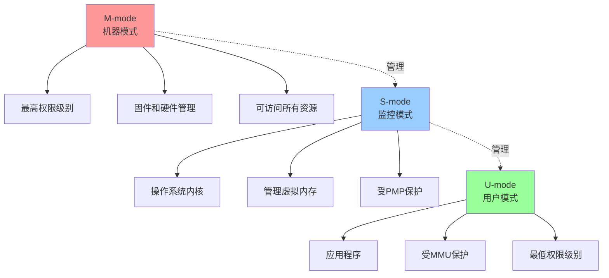
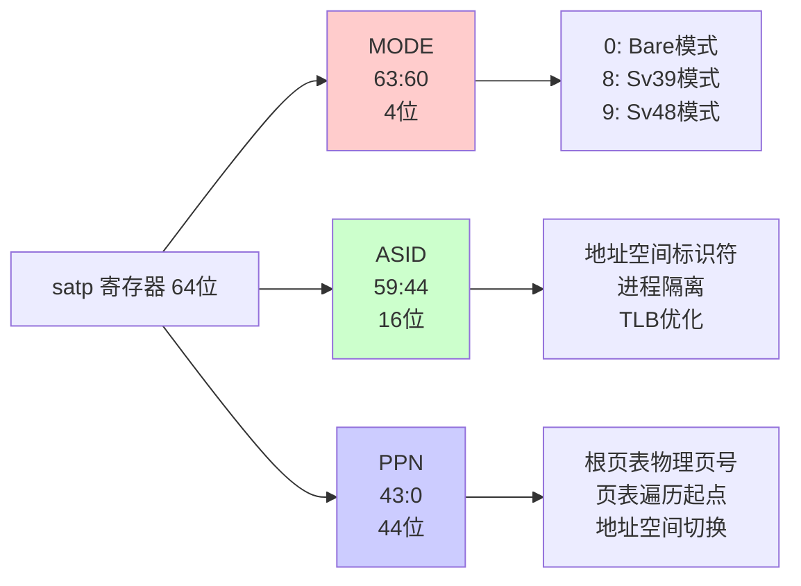
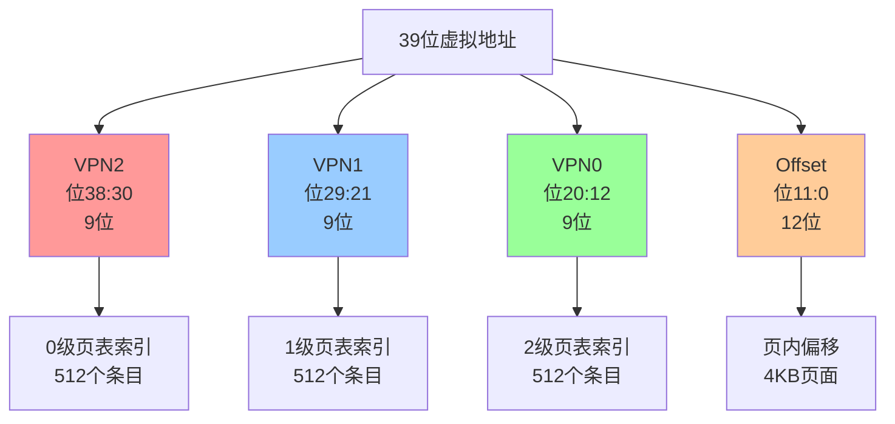
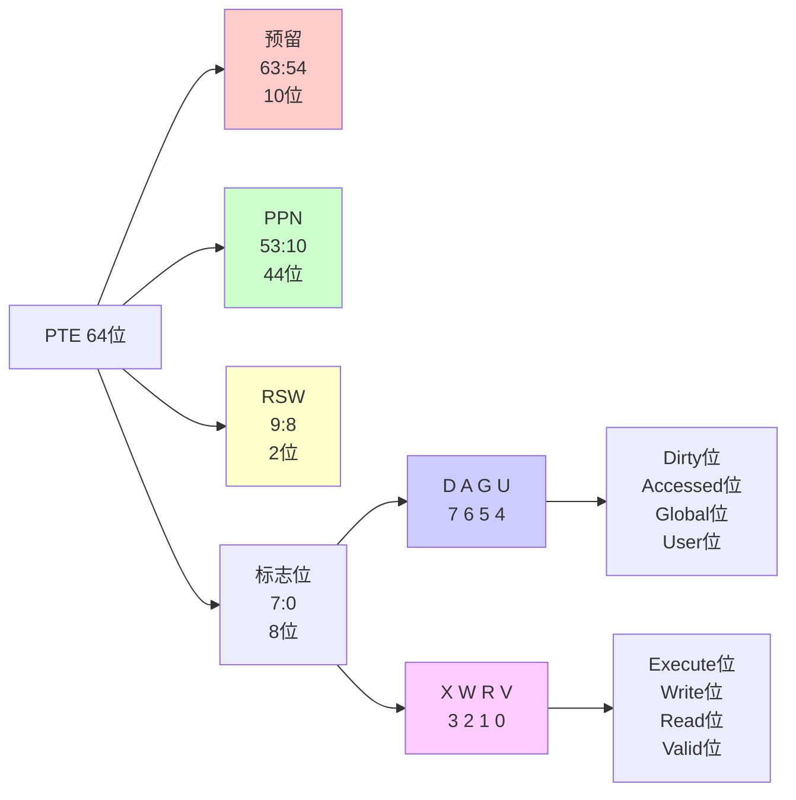
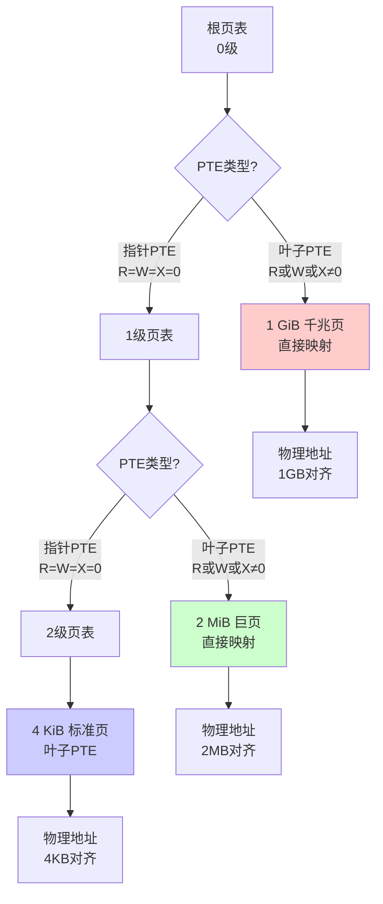
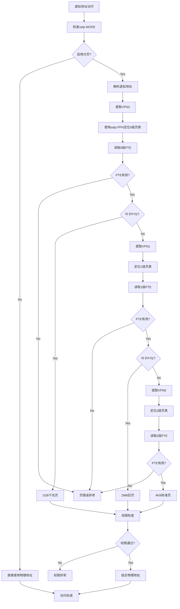

# RISC-V Sv39 虚拟内存架构

## 概述

Sv39 是 RISC-V 架构中针对 64 位系统的一种虚拟内存实现方案，支持 39 位虚拟地址空间。作为 RISC-V 特权级架构规范的重要组成部分，Sv39 定义了硬件必须遵循的地址转换和内存保护机制。Rocket Chip MMU 严格按照这一规范实现，确保与 RISC-V 软件生态系统的完全兼容。

## 特权模式与内存访问

### 特权级别层次

RISC-V 架构定义了一个分层的保护系统，包含三个主要特权级别：



- **机器模式 (M-mode)**: 最高权限级别，用于固件和底层硬件管理
- **监控模式 (S-mode)**: 为操作系统内核设计的特权级别
- **用户模式 (U-mode)**: 用于运行应用程序的非特权级别

### MMU 的作用域

MMU 和虚拟内存机制主要服务于 S-mode 和 U-mode：

- **进程隔离**: 为每个用户进程创建独立的虚拟地址空间
- **内存保护**: 防止进程访问未授权的内存区域
- **地址转换**: 将虚拟地址转换为物理地址

## 控制和状态寄存器

### satp 寄存器详解

监控地址转换与保护（satp）寄存器是控制 MMU 行为的核心寄存器。

#### satp 寄存器结构图



#### satp 寄存器字段布局

| 位域 (RV64) | 字段名称 | 描述 |
|-------------|----------|------|
| 63:60 | MODE | 选择地址转换方案。0 = Bare, 8 = Sv39, 9 = Sv48 |
| 59:44 | ASID | 地址空间标识符，用于标记TLB条目 |
| 43:0 | PPN | 根页表的物理页号 |

#### MODE 字段

MODE 字段是 MMU 的总开关：

- **0 (Bare 模式)**: MMU 被禁用，所有地址被视为物理地址
- **8 (Sv39 模式)**: 启用 39 位虚拟地址的分页方案
- **9 (Sv48 模式)**: 启用 48 位虚拟地址的分页方案（可选）

#### ASID 字段

地址空间标识符（ASID）提供了进程间的地址空间区分：

- **作用**: 为每个地址空间提供唯一标签
- **TLB 优化**: 避免进程切换时清空整个 TLB
- **性能提升**: 多个进程的转换条目可以同时存在于 TLB 中

#### PPN 字段

物理页号（PPN）字段指向根页表：

- **起始点**: 页表遍历的起始物理地址
- **地址空间视图**: 定义当前虚拟地址空间的完整视图
- **切换机制**: 修改此值可瞬间切换到新的页表

### mstatus 寄存器的虚拟内存控制位

mstatus 寄存器包含几个对 MMU 权限检查有直接影响的控制位：

#### 关键控制位

| 位 | 字段名称 | 描述 |
|----|----------|------|
| 18 | SUM | 允许监控模式访问用户内存 |
| 19 | MXR | 使可执行页面变为可读 |
| 20 | TVM | 捕获虚拟内存管理操作 |

#### SUM (Supervisor User Memory access)

- **SUM=0**: S-mode 不能访问用户页面（U=1 的页面）
- **SUM=1**: S-mode 可以访问用户空间内存
- **应用**: 系统调用中内核访问用户缓冲区

#### MXR (Make eXecutable Readable)

- **MXR=0**: 仅可执行页面不允许读操作
- **MXR=1**: 可执行页面同时允许读操作
- **优化**: 允许从代码页面读取常量数据

#### TVM (Trap Virtual Memory)

- **TVM=0**: S-mode 可以正常访问 satp 和执行 SFENCE.VMA
- **TVM=1**: S-mode 的虚拟内存操作会触发异常
- **虚拟化**: 支持 Hypervisor 截获客户机的内存管理操作

## Sv39 地址结构

### 虚拟地址格式

Sv39 采用 39 位虚拟地址，结构如下：

#### Sv39 虚拟地址结构图



#### 传统表示方式

```
38    30 29    21 20    12 11      0
+-------+-------+-------+---------+
| VPN[2]| VPN[1]| VPN[0]|  Offset |
+-------+-------+-------+---------+
   9位     9位     9位     12位
```

### 地址字段说明

- **VPN[2]**: 第2级虚拟页号（位 38:30）
- **VPN[1]**: 第1级虚拟页号（位 29:21）
- **VPN[0]**: 第0级虚拟页号（位 20:12）
- **Offset**: 页内偏移（位 11:0）

### 地址转换流程

1. **VPN[2]** 用作 0 级页表的索引
2. **VPN[1]** 用作 1 级页表的索引
3. **VPN[0]** 用作 2 级页表的索引
4. **Offset** 直接作为物理页内的偏移

## 页表项（PTE）格式

### PTE 结构布局

#### PTE 字段可视化



#### 详细字段表

| 位域 (63-0) | 字段名称 | 描述 |
|-------------|----------|------|
| 63:54 | 预留 | 为未来标准使用而保留，必须为0 |
| 53:10 | PPN[43:0] | 44位的物理页号 |
| 9:8 | RSW | 2位，为软件保留，硬件忽略 |
| 7 | D | Dirty位，表示页面是否被写入 |
| 6 | A | Accessed位，表示页面是否被访问 |
| 5 | G | Global位，表示是否为全局映射 |
| 4 | U | User位，表示页面是否对用户模式可见 |
| 3 | X | Execute位，表示页面是否可执行 |
| 2 | W | Write位，表示页面是否可写 |
| 1 | R | Read位，表示页面是否可读 |
| 0 | V | Valid位，表示PTE是否有效 |

### 权限位详解

#### 基本权限位 (R, W, X)

- **R=1**: 页面可读
- **W=1**: 页面可写
- **X=1**: 页面可执行
- **R=W=X=0**: 指向下一级页表的指针

#### 状态位详解

**V (Valid)**:

- **V=0**: PTE 无效，访问将导致页错误
- **V=1**: PTE 有效，可以进行地址转换

**U (User)**:

- **U=0**: 仅 S-mode 可访问
- **U=1**: U-mode 和 S-mode 都可访问（取决于 SUM 位）

**G (Global)**:

- **G=0**: 普通映射，受 ASID 限制
- **G=1**: 全局映射，不受 ASID 影响

**A (Accessed)**:

- 硬件或软件在页面被访问时设置
- 用于操作系统的页面置换算法

**D (Dirty)**:

- 硬件或软件在页面被写入时设置
- 表示页面内容已被修改

### 保留位处理

RISC-V 规范严格要求：

- **软件义务**: 必须将保留位清零
- **硬件检查**: 遇到保留位为1的PTE时触发页错误
- **前向兼容**: 确保未来扩展的兼容性

## 超级页支持

### 超级页类型

Sv39 支持三种页面大小：

- **4 KiB 页面**: 标准页面大小
- **2 MiB 巨页**: 在 1 级页表中的叶子 PTE
- **1 GiB 千兆页**: 在 0 级页表中的叶子 PTE

### 超级页实现机制

超级页通过在中间层级设置叶子 PTE 实现：

#### 超级页层次结构图



#### 传统表示方式

```
0级页表 -> 1 GiB 千兆页 (如果 R|W|X != 0)
         -> 1级页表 -> 2 MiB 巨页 (如果 R|W|X != 0)
                   -> 2级页表 -> 4 KiB 页面
```

### 对齐要求

- **虚拟地址对齐**: 必须对齐到页面大小边界
- **物理地址对齐**: 物理页号也必须适当对齐
- **性能优势**: 单个 TLB 条目覆盖大内存区域

### 超级页的优势

1. **TLB 效率**: 减少 TLB 条目数量需求
2. **遍历减少**: 减少页表遍历层级
3. **性能提升**: 特别适合大块连续内存的应用

## 地址转换详细流程

### 完整地址转换流程图



### 基本转换步骤

1. **模式检查**: 检查 satp.MODE 确定是否启用分页
2. **权限预检**: 基于特权级别和 mstatus 位进行初步检查
3. **地址解析**: 将虚拟地址分解为 VPN 字段和偏移
4. **页表遍历**: 从根页表开始逐级查找
5. **权限验证**: 检查最终 PTE 的权限位
6. **地址组合**: 组合物理页号和偏移形成物理地址

### 异常处理

**页错误条件**:

- PTE 的 V 位为 0
- 权限检查失败
- 保留位被设置
- 超级页未正确对齐

**访问错误条件**:

- 物理内存保护（PMP）冲突
- 总线访问错误

## 与 Rocket Chip 的集成

### 硬件实现特点

- **严格合规**: 完全符合 RISC-V 特权级规范
- **模块化设计**: TLB 和 PTW 组件可复用
- **高度可配置**: 支持多种 TLB 配置选项

### 软件兼容性

- **Linux 支持**: 原生支持 Linux 内核
- **标准接口**: 遵循标准的硬件-软件接口
- **生态系统**: 兼容整个 RISC-V 软件生态

---

*本文档是 Rocket Chip MMU 技术文档系列的一部分，详细介绍了 Sv39 虚拟内存架构的各个方面。*
