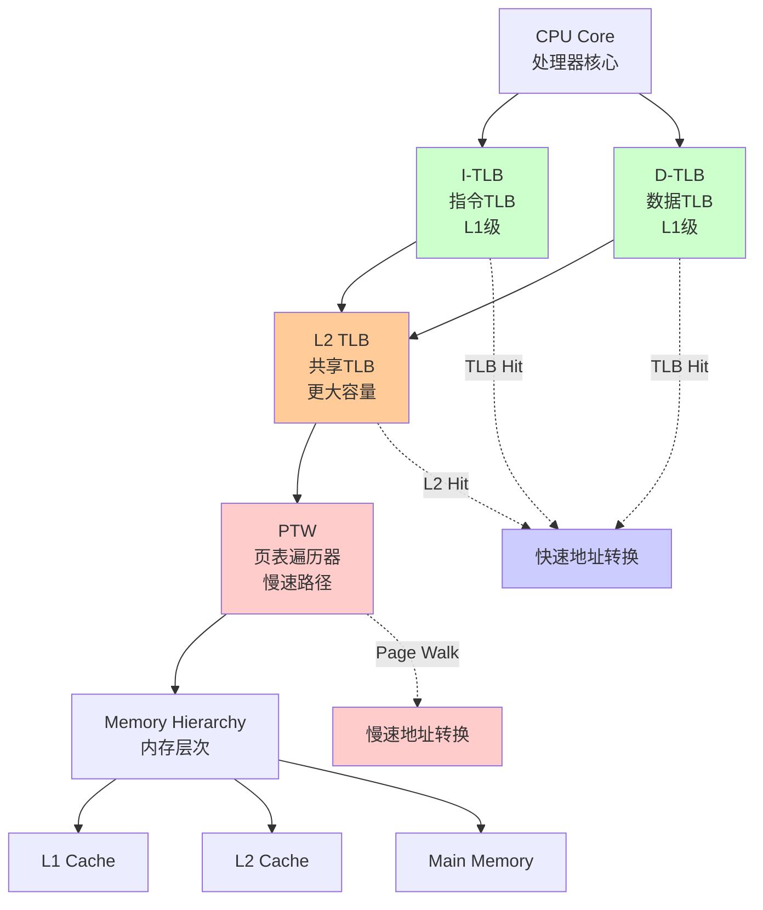
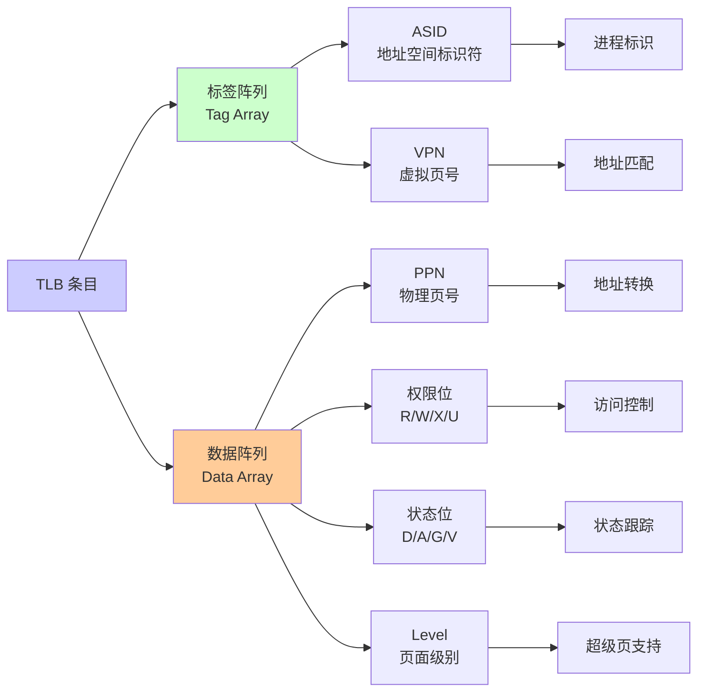
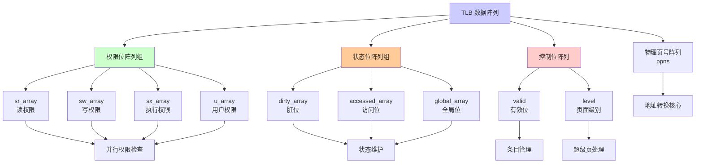
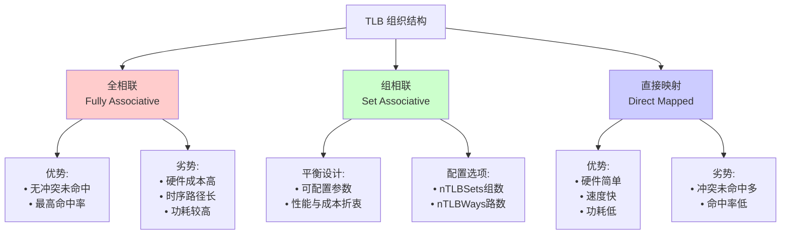
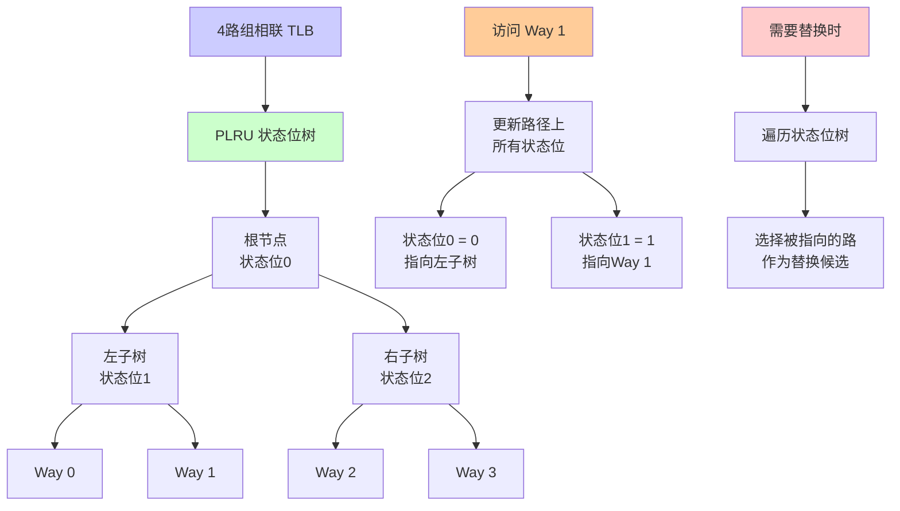
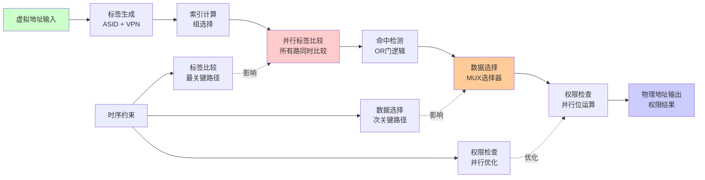

# TLB 结构与硬件实现

## 概述

转换检测缓冲区（Translation Lookaside Buffer, TLB）是 MMU 的核心组件，作为一个高速的、基于内容的相联存储器（CAM），用于缓存最近使用的虚拟到物理地址转换。TLB 是地址转换的"快速路径"，没有它，每次内存访问都需要进行多级页表遍历，这将导致不可接受的性能损失。

## 系统级组织结构

### 分离式 L1 TLB 设计

Rocket Chip 采用分离式 L1 TLB 架构，包含：

- **指令 TLB (I-TLB)**： 专门用于指令获取
- **数据 TLB (D-TLB)**： 专门用于加载和存储操作

#### 分离设计的优势

1. **消除结构冲突**： 指令获取和数据访问不会争用同一 TLB 端口
2. **提高吞吐率**： 流水线可以并行进行指令和数据的地址转换
3. **优化针对性**： 可以针对不同访问模式进行专门优化

### 层次化 TLB 结构

#### TLB 层次架构图



#### 传统表示方式

```
        I-TLB (L1)     D-TLB (L1)
              \           /
               \         /
                L2 TLB (共享)
                    |
                   PTW
```

#### L2 TLB 的作用

- **后备缓存**： 作为 L1 TLB 的后备
- **命中率提升**： 减少到达 PTW 的请求数量
- **性能平衡**： 在性能和功耗间取得平衡

## TLB 条目硬件结构

### 整体架构

#### TLB 条目结构图



TLB 条目在硬件中分为两个主要部分：

- **标签阵列 (Tag Array)**： 存储用于匹配的标签信息
- **数据阵列 (Data Array)**： 存储转换结果和权限信息

### 标签阵列设计

#### 标签组成

从 Rocket Chip 源码可见，标签由以下部分组成：

```chisel
lookup_tag = Cat(io.ptw.ptbr.asid, io.req.bits.vpn)
```

- **ASID**： 当前地址空间标识符
- **VPN**： 虚拟页号

#### 标签存储

```chisel
val tags = Reg(Vec(entries, UInt(tagBits.W)))
```

- **并行比较**： 支持所有条目的并行查找
- **匹配逻辑**： 确保地址和上下文的双重匹配

### 数据阵列设计

#### 分离存储策略

#### TLB 数据阵列组织图



为了实现高效的并行读取，PTE 信息被分解存储在多个并行阵列中：

```chisel
val ppns = Reg(Vec(entries, UInt(ppnBits.W)))
val u_array = Reg(Vec(entries, Bool()))
val sw_array = Reg(Vec(entries, Bool()))
val sx_array = Reg(Vec(entries, Bool()))
val sr_array = Reg(Vec(entries, Bool()))
val dirty_array = Reg(Vec(entries, Bool()))
val valid = RegInit(VecInit(Seq.fill(entries)(false.B)))
```

#### 字段映射表

| 架构字段 (PTE) | Chisel 硬件寄存器 | 功能描述 |
|----------------|--------------------|----------|
| VPN + ASID | tags | 标签匹配，确定命中 |
| PPN | ppns | 物理页号，地址转换 |
| U (User) | u_array | 用户模式访问权限 |
| R (Read) | sr_array | 读权限控制 |
| W (Write) | sw_array | 写权限控制 |
| X (Execute) | sx_array | 执行权限控制 |
| D (Dirty) | dirty_array | 脏位状态跟踪 |
| V (Valid) | valid | 条目有效性标记 |

### 并行访问的硬件优势

这种分离存储设计带来以下优势：

1. **单周期访问**： 一个时钟周期内完成 PPN 读取和权限检查
2. **并行操作**： 所有权限位可以并行读取
3. **时序优化**： 避免复杂的多路选择器

## 超级页支持

### 页面大小表示

TLB 必须支持不同大小的页面：

- **4 KiB 页面**： 标准页面大小
- **2 MiB 巨页**： 中等大小超级页
- **1 GiB 千兆页**： 大型超级页

### Level 字段

```chisel
val level = Reg(Vec(entries, UInt(log2Ceil(pgLevels).W)))
```

- **level=0**： 1 GiB 千兆页
- **level=1**： 2 MiB 巨页  
- **level=2**： 4 KiB 标准页

### 超级页地址计算

在 TLB 命中时，物理地址的计算取决于页面级别：

```
物理地址 = TLB_PPN[高位] :: 虚拟地址[低位]
```

低位部分的宽度取决于页面大小：

- 4 KiB: 12 位偏移
- 2 MiB: 21 位偏移  
- 1 GiB: 30 位偏移

## 可配置的组织结构

### 从全相联到组相联的演进

#### TLB 组织结构演进图



#### 早期全相联实现

```chisel
hitsVec = (0 until entries).map(i => 
  valid(i) && tags(i) === lookup_tag
)
```

**优势**：

- 完全消除冲突未命中
- 最大化命中率

**劣势**：

- 硬件成本高（大量比较器）
- 时序路径长
- 功耗较高

#### 现代组相联实现

Rocket Chip 现在支持完全可配置的 N 路组相联结构：

```chisel
val nSets = nTLBSets
val nWays = nTLBWays
```

#### 配置灵活性

通过调整参数可以生成不同的 TLB 结构：

| nTLBSets | nTLBWays | 结构类型 |
|----------|----------|----------|
| 1 | N | 全相联 |
| N | 1 | 直接映射 |
| S | W | S组W路组相联 |

### 索引和标签分离

在组相联设计中：

```
VPN = [Tag部分] [Index部分] [Offset]
```

- **Index部分**： 用于选择 TLB 组（set）
- **Tag部分**： 与 ASID 组合形成完整标签

## 替换策略实现

### 伪 LRU (PLRU) 算法

#### PLRU 替换策略结构图



#### 硬件实现

```chisel
val plru = new PseudoLRU(entries)
```

#### PLRU 状态位

- **N 路组**： 需要 N-1 个状态位
- **状态树**： 使用二叉树结构跟踪访问模式
- **近似 LRU**： 以较低的硬件成本近似真正的 LRU

#### 替换过程

1. **PLRU 查询**： 根据当前状态位确定替换候选
2. **写入地址生成**： `repl_waddr` 信号指向被替换的路
3. **状态更新**： 更新 PLRU 状态位反映新的访问模式

### 与真正 LRU 的比较

| 算法 | 状态位数量 | 硬件复杂度 | 替换准确性 |
|------|------------|------------|------------|
| True LRU | log₂(N!) | 高 | 完全准确 |
| PLRU | N-1 | 中 | 近似准确 |

## 硬件时序考虑

### 关键路径分析

#### TLB 访问时序关键路径图



TLB 访问的关键路径包括：

1. **标签生成**： ASID + VPN 拼接
2. **并行比较**： 所有条目的标签比较
3. **命中检测**： 命中信号的或逻辑
4. **数据选择**： 根据命中选择对应数据
5. **权限检查**： 权限位的逻辑运算

### 时序优化策略

#### 流水线化

某些复杂的 TLB 可能采用流水线设计：

- **第一级**： 索引和标签比较
- **第二级**： 数据读取和权限检查

#### 预取优化

```chisel
// 预取下一个可能访问的 TLB 条目
val prefetch_enable = // 预测逻辑
```

### 功耗优化

#### 选择性激活

```chisel
when(tlb_enable) {
  // 只在需要时激活 TLB
}
```

#### 时钟门控

对未使用的 TLB 区域进行时钟门控以降低功耗。

## 验证和测试考虑

### 功能验证要点

1. **地址转换正确性**： 验证各种页面大小的转换
2. **权限检查**： 确保权限位正确执行
3. **替换策略**： 验证 PLRU 算法的正确性
4. **并发访问**： 多请求的并行处理

### 性能验证

1. **命中率测量**： 不同工作负载下的 TLB 命中率
2. **时序验证**： 确保满足时钟频率要求
3. **功耗分析**： 在不同配置下的功耗特性

---

*本文档详细分析了 Rocket Chip TLB 的硬件结构和实现细节，为理解其微架构特性提供了全面的技术参考。*
