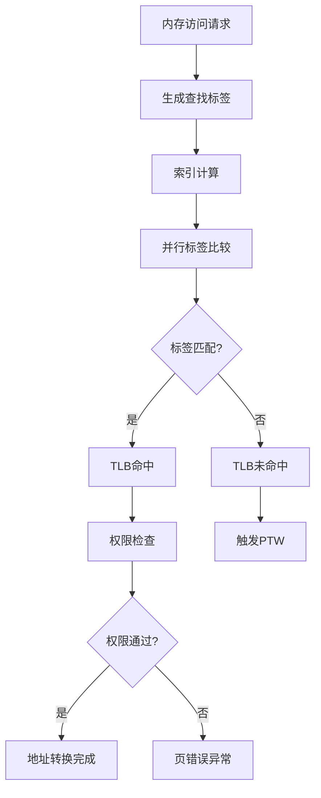

# TLB 工作流程与查找过程

## 概述

TLB 查找过程是 MMU 地址转换的核心环节，每次内存访问都会触发一次 TLB 查找操作。本文档详细描述了 Rocket Chip 中 TLB 的完整工作流程，包括查找、命中判断、权限检查和未命中处理等各个阶段。

## TLB 查找完整流程

### 触发条件

TLB 查找在以下情况下被触发：

1.  **指令获取**  ： CPU 需要获取下一条指令
2.  **数据读取**  ： 执行 load 指令
3.  **数据写入**  ： 执行 store 指令
4.  **原子操作**  ： 执行原子内存操作

### 查找流程概览



## 详细查找步骤

### 步骤 1: 标签生成

#### 标签组成

```chisel
lookup_tag = Cat(io.ptw.ptbr.asid, io.req.bits.vpn)
```

标签包含两个关键部分：

-  **ASID**  ： 来自 `satp.ASID` 字段
-  **VPN**  ： 虚拟页号，从虚拟地址中提取

#### 虚拟页号提取

对于不同的页面大小，VPN 的提取方式不同：

```
4 KiB 页面: VPN = VA[38:12]
2 MiB 巨页: VPN = VA[38:21] 
1 GiB 千兆页: VPN = VA[38:30]
```

### 步骤 2: 索引计算与组选择

#### 组相联索引

在组相联 TLB 中，使用 VPN 的低位部分作为组索引：

```chisel
val idx = vpn(idxBits-1, 0)
val set = tlb_sets(idx)
```

#### 索引位宽计算

```
idxBits = log2(nTLBSets)
```

例如，32 组的 TLB 需要 5 位索引。

### 步骤 3: 并行标签比较

#### 组内并行比较

```chisel
val hits = VecInit((0 until nWays).map { w =>
  set(w).valid && set(w).tag === lookup_tag
})
```

#### 比较逻辑

每个路（way）都进行独立的比较：

1.  **有效性检查**  ： `valid` 位必须为 1
2.  **标签匹配**  ： 存储的标签与查找标签完全匹配

### 步骤 4: 命中检测

#### 命中信号生成

```chisel
val hit = hits.asUInt.orR
val hit_way = OHToUInt(hits)
```

#### 多命中检测

正常情况下，最多只能有一个命中：

```chisel
assert(PopCount(hits) <= 1.U, "Multiple TLB hits detected")
```

### 步骤 5: 数据读取

#### 命中数据选择

```chisel
val hit_ppn = Mux1H(hits, ppns)
val hit_perms = VecInit(Seq(
  Mux1H(hits, sr_array),
  Mux1H(hits, sw_array), 
  Mux1H(hits, sx_array),
  Mux1H(hits, su_array)
))
```

#### 并行读取优势

所有权限位在同一周期内并行读取，无需额外的选择延迟。

## 权限检查机制

### 基本权限验证

#### 读权限检查

```chisel
val can_read = hit_perms(0) || (hit_perms(2) && mstatus.mxr)
```

- 基本读权限：R 位为 1
- MXR 扩展：X 位为 1 且 `mstatus.MXR` 为 1

#### 写权限检查

```chisel
val can_write = hit_perms(1)
```

写权限直接由 W 位控制。

#### 执行权限检查

```chisel
val can_exec = hit_perms(2)
```

执行权限由 X 位控制。

### 特权级权限检查

#### 用户模式访问

```chisel
val user_access_ok = hit_perms(3) // U bit
```

#### 监控模式访问

```chisel
val supervisor_access_ok = !hit_perms(3) || mstatus.sum
```

- 非用户页面：U=0，直接允许
- 用户页面：需要 `mstatus.SUM=1`

### 综合权限判断

```chisel
val access_ok = Wire(Bool())
access_ok := false.B

switch(io.req.cmd) {
  is(M_XRD) { access_ok := can_read }
  is(M_XWR) { access_ok := can_write }
  is(M_XEX) { access_ok := can_exec }
}

access_ok := access_ok && (
  (privilege === PRV.U && user_access_ok) ||
  (privilege === PRV.S && supervisor_access_ok)
)
```

## 超级页处理

### 级别检测

```chisel
val page_level = Mux1H(hits, level_array)
```

### 物理地址计算

根据页面级别计算最终物理地址：

```chisel
val paddr = Wire(UInt(paddrBits.W))

switch(page_level) {
  is(0.U) { // 1 GiB 页面
    paddr := Cat(hit_ppn(ppnBits-1, 18), io.req.bits.vaddr(29, 0))
  }
  is(1.U) { // 2 MiB 页面  
    paddr := Cat(hit_ppn(ppnBits-1, 9), io.req.bits.vaddr(20, 0))
  }
  is(2.U) { // 4 KiB 页面
    paddr := Cat(hit_ppn, io.req.bits.vaddr(11, 0))
  }
}
```

### 对齐检查

超级页必须正确对齐：

```chisel
val misaligned = Wire(Bool())
misaligned := false.B

when(page_level === 0.U) {
  misaligned := hit_ppn(17, 0) =/= 0.U
}.elsewhen(page_level === 1.U) {
  misaligned := hit_ppn(8, 0) =/= 0.U
}

when(misaligned) {
  // 触发页错误异常
}
```

## 异常处理

### 页错误条件

TLB 在以下情况会触发页错误：

1.  **权限不足**  ： 访问类型与权限位不匹配
2.  **特权级错误**  ： 特权级别不允许访问
3.  **超级页未对齐**  ： 超级页的 PPN 未正确对齐

### 异常信息生成

```chisel
io.resp.bits.xcpt.pf.ld := hit && req_read && !can_read
io.resp.bits.xcpt.pf.st := hit && req_write && !can_write  
io.resp.bits.xcpt.pf.inst := hit && req_exec && !can_exec
```

### 异常优先级

1.  **访问错误**  >  **页错误** 
2.  **指令页错误**  >  **数据页错误** 

## 未命中处理

### 未命中检测

```chisel
val tlb_miss = !hit && io.req.valid
```

### PTW 请求生成

```chisel
io.ptw.req.valid := tlb_miss
io.ptw.req.bits.addr := io.req.bits.vaddr
io.ptw.req.bits.need_gpa := false.B
```

### 等待状态管理

```chisel
val s_ready :: s_wait :: Nil = Enum(2)
val state = RegInit(s_ready)

switch(state) {
  is(s_ready) {
    when(tlb_miss) {
      state := s_wait
    }
  }
  is(s_wait) {
    when(io.ptw.resp.valid) {
      state := s_ready
    }
  }
}
```

## 性能优化技术

### 预测技术

#### 下一行预取

```chisel
val next_line_addr = current_addr + line_size.U
// 预取下一缓存行的 TLB 条目
```

#### 分支预测集成

结合分支预测器的目标地址预取 TLB 条目。

### 流水线优化

#### 查找流水线化

```chisel
// 第一级：索引和标签比较
val stage1_hit = RegNext(hits)
val stage1_data = RegNext(hit_data)

// 第二级：权限检查和地址生成
val stage2_paddr = RegNext(calculated_paddr)
```

### 并发访问支持

#### 多端口设计

```chisel
val req_ports = Vec(nPorts, Flipped(new TLBReq))
val resp_ports = Vec(nPorts, new TLBResp)
```

#### 仲裁机制

```chisel
val arbiter = Module(new RRArbiter(new TLBReq, nPorts))
arbiter.io.in <> req_ports
```

## 调试和性能监控

### 性能计数器

```chisel
val tlb_hits = RegInit(0.U(64.W))
val tlb_misses = RegInit(0.U(64.W))

when(io.req.fire) {
  when(hit) {
    tlb_hits := tlb_hits + 1.U
  }.otherwise {
    tlb_misses := tlb_misses + 1.U
  }
}
```

### 调试接口

```chisel
when(debug_enable) {
  printf("TLB: addr=%x hit=%d way=%d ppn=%x\n", 
    io.req.bits.vaddr, hit, hit_way, hit_ppn)
}
```

### 覆盖率监控

跟踪不同场景的覆盖情况：

- 不同页面大小的访问
- 不同权限组合的检查
- 不同特权级别的访问

---

*本文档详细描述了 Rocket Chip TLB 的完整工作流程，为理解其操作机制和性能特性提供了全面的技术参考。*
