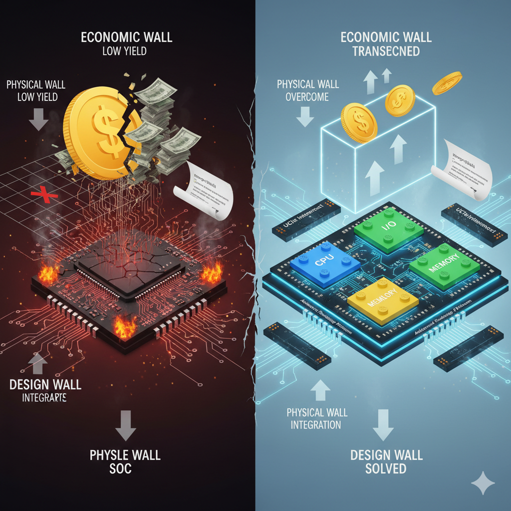

# Why Chiplet

在半导体产业的宏伟篇章中，单片系统级芯片（Monolithic System-on-Chip, SoC）无疑是绝对的主角。通过在单一硅基板上集成海量晶体管，它遵循摩尔定律的指引，驱动了数十年的计算革命。然而，当技术演进至个位数纳米节点，这一曾经所向披靡的集成模式，正迎面撞上三堵坚不可摧的高墙： **成本之墙、物理之墙与设计之墙**  。这些障碍共同构成了传统SoC发展的瓶颈，并催生了一场深刻的架构变革——Chiplet的崛起。

### 单片SoC面临的“三堵墙”

#### 1. 成本之墙 (The Economic Wall)

这堵墙由半导体制造的经济学原理所构建，其核心是良率（Yield）与成本的非线性关系。

*  **良率与芯片面积的指数诅咒：**  芯片良率对芯片面积（Die Area）极其敏感。基于泊松（Poisson）等经典的良率模型，随着芯片面积的线性增长，其良率会呈现指数级的下降。在给定的缺陷密度（Defect Density）下，制造一块巨大且无关键缺陷的SoC的概率极低。例如，在7nm及以下的先进工艺中，一个600mm²的Die，其制造成本可能远不止是三个200mm² Die成本的总和，因为前者的低良率带来了巨大的晶圆面积浪费。
*  **高昂的非经常性工程（NRE）费用：**  启动一款全新SoC的研发成本是惊人的。其中，光掩模（Mask Set）的费用在EUV光刻时代已攀升至数千万美元。这种高昂的前期投入意味着，只有预期出货量极大的产品才能摊薄成本，这极大地限制了芯片创新的多样性，将许多潜在的专用芯片（ASIC）项目扼杀在摇篮里。

#### 2. 物理之墙 (The Physical Wall)

这堵墙由硅基半导体的物理定律和制造工艺的极限所决定。

*  **光刻扫描仪极限（Reticle Limit）：**  这是芯片尺寸最直接、最“硬”的物理天花板。当前最先进的光刻设备（Scanner）单次曝光所能覆盖的最大面积约为858mm²（26mm x 33mm）。任何想要通过单片集成方式制造的芯片，其尺寸都无法逾越此界限。对于追求极致算力的高性能计算（HPC）和AI训练芯片而言，这一限制已成为其扩展计算单元数量的根本障碍。
*  **功率密度与散热瓶颈：**  登纳德缩放定律（Dennard Scaling）的终结，意味着晶体管尺寸缩小的同时，其功率密度 ($W/mm^2$) 不再保持恒定，而是急剧上升。一个大型单片SoC内部集成了功能各异的单元，其功耗分布极不均匀，容易形成局部热点（Hotspot）。高功率密度不仅带来了严峻的散热挑战，限制了芯片的最高工作频率，还可能影响芯片的长期可靠性。

#### 3. 设计之墙 (The Design Wall)

这堵墙源于日益膨胀的系统复杂性与单一工艺平台之间的矛盾。

*  **异构IP与单一工艺的错配：**  现代SoC是一个高度异构化的系统，包含了多种功能IP。例如，CPU/GPU核心追求极致的数字逻辑性能，最能从先进工艺中获益；而高速SerDes I/O或ADC/DAC等模拟IP，对工艺的模拟特性、噪声表现更为敏感，它们在相对成熟的工艺节点上往往能实现更佳的性能和更低的成本。在单片SoC中，所有IP被迫“锁定”在同一工艺上，这是一种设计上的妥协，牺牲了各个功能模块达到其自身最优PPA（性能、功耗、面积）的机会。
*  **设计与验证复杂度的爆炸：**  随着晶体管数量突破数百亿，对一个大型SoC进行后端布局布线、时序收敛、功耗分析和物理验证的复杂度呈指数级增长。这不仅需要庞大的EDA计算资源，更极大地延长了产品的设计和验证周期，使得产品上市时间（Time-to-Market, TTM）变得漫长而充满风险。

### Chiplet：穿越高墙的架构性解决方案

Chiplet架构的核心思想是分解（Disaggregation)与重构（Reintegration）。它通过将单片SoC拆解，然后利用先进封装技术重新互连，精准地绕过或“拆解”了上述三堵墙。

1.  **穿越成本之墙：**  通过将大芯片分解为多个小尺寸的Chiplet，每个Chiplet的良率都得到大幅提升。这种方法显著降低了因制造缺陷导致的经济损失，并允许厂商通过筛选（Binning）不同等级的Chiplet来构建不同档次的产品，最大化了每片晶圆的经济价值。

2.  **绕过物理之墙：**  Chiplet设计从根本上解决了Reticle Limit的限制。通过在封装基板（Substrate）或中介层（Interposer）上将多个Chiplet并排“拼接”，可以构建出总面积远超858mm²的超级计算系统，为算力的持续扩展打开了全新的空间。

3.  **拆解设计之墙：**  Chiplet是实现异构集成（Heterogeneous Integration) 的最佳载体。设计团队可以为计算、I/O、模拟等不同功能的Chiplet独立选择最优的工艺节点，实现系统级的PPA最优化。同时，这种模块化的设计理念支持IP复用，企业可以开发标准化的Chiplet，像搭积木一样快速组合出不同的产品，从而极大地缩短研发周期，加速产品上市。
