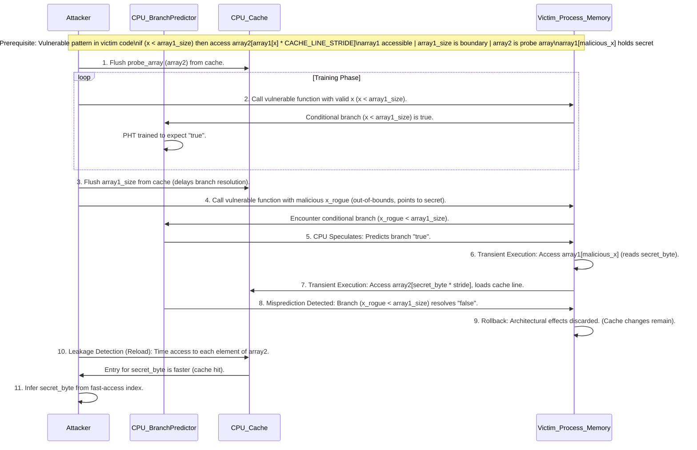
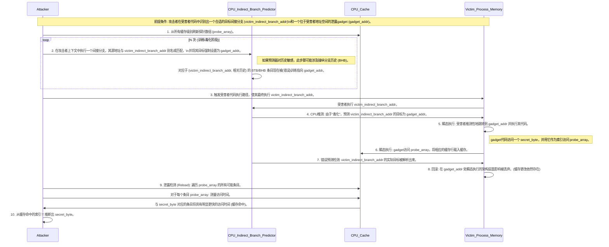
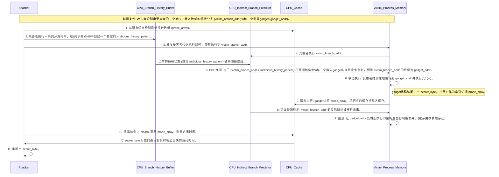

# Spectre Variants

**摘要**

本报告深入剖析了现代中央处理器（CPU）中的推测执行机制及其相关的安全漏洞，重点聚焦于Spectre系列攻击。推测执行作为提升CPU性能的关键技术，通过预测分支指令的结果或内存访问的依赖关系，提前执行后续指令。然而，这一机制的副作用，特别是微架构状态在错误预测后未能完全回滚，为侧信道攻击提供了可乘之机。Spectre系列攻击，包括其主要变体Spectre V1（边界检查绕过）、Spectre V2（分支目标注入）以及Spectre-BHB（分支历史缓冲区利用），均利用了这一基本原理。本报告将详细阐述这些攻击的执行条件、核心机制、逐步攻击流程，并探讨了攻击中关键的gadget的特性与利用方式。通过对这些攻击变体的比较分析，揭示了其共性与差异，并突出了推测执行漏洞带来的持续性安全挑战。

**I. 引言：推测执行及其安全双刃剑**

**A. 现代CPU中的推测执行原理**

现代CPU为了突破冯·诺依曼瓶颈，追求极致的运算性能，广泛采用了推测执行（Speculative Execution）技术。其核心思想在于，当处理器遇到执行路径不确定或需要等待较长时间（如内存读取、复杂计算或分支判断）的指令时，它不会选择空闲等待，而是会"猜测"一个最可能的执行路径或数据结果，并提前沿着这条路径执行后续指令。这些被提前执行的指令被称为瞬态指令（transient instructions），它们的执行结果暂时保存在处理器的内部缓冲区中，而不会立即更新到架构状态（如寄存器文件或主内存）。

如果后续证实CPU的预测是正确的，那么这些已经预先执行的指令结果将被提交（commit），从而节省了大量的等待时间，显著提升了处理器的指令级并行度和整体性能。反之，如果预测错误，CPU则会丢弃（squash）这些推测执行的指令及其结果，恢复到预测前的状态，然后沿着正确的路径重新执行。尽管错误预测会带来一定的性能开销（用于丢弃和重执行），但由于现代处理器的预测准确率通常较高，推测执行在整体上仍然能够带来显著的性能增益。这一机制是克服内存延迟和指令流水线停顿的关键手段。

然而，这种对性能的极致追求也为安全带来了新的挑战。随着CPU设计越来越复杂，推测执行的深度和广度不断增加，处理器会更积极地进行预测，并在更长的指令序列上进行推测。这种复杂性的增加，意味着有更多的内部状态在推测过程中被临时改变。如果这些改变，特别是微架构层面的状态变化（如缓存内容），在预测错误后未能被完美地、无痕迹地回滚，就可能为恶意行为者提供了可利用的攻击面。Spectre系列漏洞正是利用了推测执行过程中这种微架构层面副作用的残留。

**B. 关键的预测机制：分支预测**

分支指令（如条件跳转、间接跳转）是程序中常见的控制流改变指令，它们是影响处理器流水线效率的关键点。为了减少分支指令带来的停顿，CPU内置了复杂的分支预测单元（Branch Prediction Unit, BPU）。

1. **条件分支预测 (Conditional Branch Prediction)**：对于条件分支指令（如`if-else`语句编译后的指令），CPU需要预测分支是否会发生（taken or not-taken）。一种常见的机制是模式历史表（Pattern History Table, PHT），它记录了特定分支指令过去多次执行的结果（例如，一个循环的末尾判断通常会多次不跳转，最后一次跳转退出）。CPU根据这些历史信息来预测下一次该分支的走向。攻击者可以通过重复以特定方式执行某条件分支来"训练"PHT，使其在后续的关键时刻做出符合攻击者意图的错误预测。

2. **间接分支预测 (Indirect Branch Prediction)**：间接分支指令（如通过函数指针的调用、虚函数调用、`switch-case`语句的跳转表）的目标地址在编译时通常是未知的，需要在运行时动态确定。为了预测这类分支的目标，CPU使用了诸如分支目标缓冲区（Branch Target Buffer, BTB）和间接分支预测器（Indirect Branch Predictor, IBP）等结构。BTB会缓存近期执行过的间接分支的源地址及其对应的目标地址。当再次遇到相同的间接分支源地址时，CPU会从BTB中查找并预测其目标地址。

3. **分支历史缓冲区 (Branch History Buffer, BHB)**：更为高级的分支预测器还会利用分支历史缓冲区（BHB）。BHB记录了最近执行的一系列分支指令的结果（例如，对于条件分支是"taken"或"not-taken"，对于间接分支可能包含目标地址的部分信息或与之相关的历史模式）。这些历史信息可以与当前分支指令的地址结合，用于索引更复杂的预测结构（如BTB或IBP），从而提高预测的准确性。重要的是，BHB中的历史信息有时是全局共享的，或者在不同安全上下文间可能存在影响，这成为了某些Spectre变种的攻击点。

Spectre攻击的不同变体正是精确地利用了这些分支预测机制的特性。例如，Spectre Variant 1主要针对条件分支预测器（如PHT），而Spectre Variant 2则针对间接分支预测器（如BTB/IBP）。更新的变种如Spectre-BHB则直接操纵BHB的状态来影响预测。攻击者从利用相对简单的PHT机制（如Spectre V1）转向操纵更复杂、影响范围更广的BTB和BHB（如Spectre V2、Spectre-BHB），反映了攻击手段的演进。这种演进趋势部分源于，相较于PHT的局部性影响，BTB尤其是BHB等结构因其可能在不同特权级别或安全上下文间共享硬件资源，为攻击者提供了潜在的更强攻击向量，例如实现跨特权级的信息泄露。例如，Branch Privilege Injection (BPI) 作为Spectre V2的一个变种，即便在存在如BHI_DIS_S这类影响IBP的缓解措施时，仍能利用BTB的漏洞。

**C. 微架构状态与侧信道**

推测执行的一个核心问题在于，即使其在架构层面（对软件可见的寄存器、内存状态）的更改在预测错误后被回滚，但其在CPU微架构层面（如缓存内容、分支预测器内部状态等）留下的痕迹却可能不会被完全清除。这些残留的微架构状态变化可以被攻击者通过侧信道（Side Channel）的方式观测到，从而推断出在推测执行期间发生的行为，包括对秘密数据的访问。

缓存计时攻击（Cache-Timing Attack）是Spectre系列攻击中最常用的侧信道。这类攻击利用了CPU访问缓存中的数据远快于访问主内存数据的原理。常见的缓存计时攻击技术包括：

- **Flush+Reload**：攻击者首先使用特定指令（如x86架构的`clflush`）将一个与受害者共享的内存行（cache line）从缓存中清除（Flush）。然后，允许受害者进程执行一段时间。之后，攻击者重新加载（Reload）该内存行，并精确测量加载所需的时间。如果加载时间非常短，说明该内存行在受害者执行期间被访问过并重新载入了缓存（缓存命中）；如果加载时间很长，则说明受害者未访问该内存行（缓存未命中）。此方法要求攻击者与受害者之间存在共享内存。

- **Prime+Probe**：攻击者首先用自己的数据填满（Prime）一部分缓存集合（cache sets）。然后，允许受害者进程执行。如果受害者访问了这些缓存集合中的某些内存行，其数据就会替换掉攻击者之前填入的数据。最后，攻击者重新访问（Probe）自己之前填入的数据，并测量访问时间。如果访问时间变长（缓存未命中），则表明受害者进程使用了相应的缓存集合。此方法不严格要求共享内存，但要求共享缓存层级。

Spectre攻击的本质正是诱骗CPU推测性地执行访问秘密数据的指令序列，这次访问会改变缓存的状态（例如，将秘密数据相关的某个指示性数据加载到缓存）。随后，攻击者利用缓存计时侧信道来探测这些缓存状态的变化，从而间接推断出秘密数据的内容。

从根本上看，Spectre利用的并非仅仅是推测执行本身，而是微架构层面副作用的**不完美回滚**。现代CPU在设计时，主要确保在分支预测错误或发生异常时，能够回滚所有**架构状态**的更改，如寄存器值、程序计数器等，使得从软件层面看，错误的推测路径似乎从未发生过。然而，像缓存行是否存在于缓存中这样的微架构状态，其主要目的是提升性能，通常不被认为是架构状态的一部分，因此在推测执行回滚过程中往往不会被恢复到原始状态。正是这种架构状态回滚与微架构状态残留之间的差异，使得瞬态执行的指令能够在缓存中留下可被检测的"足迹"。这个"足迹"通过计时攻击等手段变得可读，从而构成了泄露信息的隐蔽信道。

**II. Spectre Variant 1 (CVE-2017-5753): 边界检查绕过**

**A. 核心攻击机制：利用条件分支错误预测**

Spectre Variant 1 (Spectre-V1)，也被称为边界检查绕过（Bounds Check Bypass），其核心机制在于利用CPU对条件分支指令的错误预测。在许多编程语言和编译后的代码中，对数组等数据结构的访问通常会伴随一个边界检查，例如 `if (index < array_size)`，以防止越界访问。Spectre-V1攻击的目标正是这类用于安全检查的条件分支。

攻击者首先通过一系列操作来"训练"（train）CPU的分支预测器，使其倾向于预测上述边界检查条件为真（即，索引在边界内）。完成训练后，攻击者会提供一个恶意的、越界的索引值。由于分支预测器的惯性，以及可能的预测解析延迟（例如，`array_size`的值不在缓存中，需要从内存读取），CPU会在边界检查条件实际解析完成之前，就推测性地执行了条件为真路径下的代码，即数组访问操作。此时，CPU使用的是攻击者提供的恶意越界索引，从而推测性地访问了本不应访问的内存区域（即秘密数据）。

**B. 详细执行条件**

成功实施Spectre-V1攻击需要满足一系列精细的执行条件：

1. 分支预测器训练 (Branch Predictor Training):

    攻击者必须首先诱导分支预测器（特别是PHT）进入一种可预测的状态。这通常通过重复调用包含目标条件分支的受害者代码片段，并使用合法的、使条件为真（或攻击者期望的预测方向）的输入参数来实现。例如，如果攻击目标是 if (x < limit)，攻击者会多次使用满足 x < limit 的 x 值调用相关代码。

2. 诱导越界推测 (Inducing Out-of-Bounds Speculation):

    在分支预测器被充分训练后，攻击者会提供一个特制的恶意输入，该输入将导致条件分支的实际结果与预测相反（例如，一个越界的数组索引）。由于预测器的"惯性"，它很可能会错误地预测分支走向，从而启动对原本受保护代码块的推测执行，但此时使用的是攻击者提供的恶意输入。

    为了增加推测执行窗口的长度（即从开始推测执行到错误预测被发现并纠正之间的时间），攻击者可能会设法延迟分支条件的解析。例如，如果分支条件依赖于某个内存中的值（如 array1_size），攻击者可以通过 clflush 指令将该值从缓存中清除，迫使CPU从主存中读取，从而延长条件解析时间，为推测执行争取更多时间。

3. 缓存状态管理 (Cache State Management - e.g., Flush+Reload):

    推测执行本身并不能直接将秘密数据传递给攻击者，因为它最终会被回滚。因此，攻击者需要在推测执行期间，通过某种方式将秘密数据的值编码到CPU的微架构状态（通常是缓存状态）中，然后在推测执行结束后通过侧信道读取这个状态。

    这通常涉及到使用一个"探针数组"（probe array），在许多示例中被称为 array2。在推测执行路径中，攻击者构造的代码会以推测性读取到的秘密字节（secret_byte）作为索引（或索引的一部分）来访问这个探针数组，例如 probe_array[secret_byte * stride]。这个访问操作会将探针数组中对应 secret_byte 的特定缓存行加载到缓存中。

    攻击流程如下：

    - **刷新 (Flush):** 在触发推测执行之前，攻击者首先将整个探针数组从缓存中清除。
    - **推测访问 (Speculative Access):** 触发包含恶意输入的推测执行，使得 `probe_array[secret_byte * stride]` 被访问，相应缓存行进入缓存。
    - **重载 (Reload):** 推测执行结束后（无论是否被回滚），攻击者遍历探针数组的所有可能条目，并测量访问每个条目的时间。由于对应于 `secret_byte` 的那个条目已经在缓存中，其访问时间会显著短于其他条目（它们需要从主存加载）。通过找到访问最快的条目，攻击者就能推断出 `secret_byte` 的值。 `CACHE_LINE_STRIDE` 的选择至关重要，它需要足够大，以确保不同的 `secret_byte` 值映射到探针数组中不同的、不重叠的缓存行，避免因缓存行冲突导致的干扰。

**C. 逐步攻击执行流程**

以下是Spectre-V1攻击的典型执行流程：

此流程清晰地展示了攻击的各个步骤，以及攻击者行为与CPU内部机制之间的相互作用。推测执行窗口的管理对于攻击的成功至关重要。在上述流程的第3步，攻击者通过刷新`array1_size`来主动延长这个窗口，确保瞬态执行（第6-7步）能够在错误预测被发现（第8步）之前完成并留下缓存痕迹。如果分支条件（如`x < array1_size`）解析过快，瞬态路径可能在`array2`被访问之前就被终止，导致攻击失败。通过使`array1_size`（或参与分支条件计算的任何操作数）的访问变慢（例如，强制缓存未命中），攻击者为推测指令争取了更多时间来执行并在缓存中留下痕迹。

**D. Spectre V1中的gadget (Gadgets in Spectre V1)**

在Spectre-V1攻击中，gadget通常是指紧跟在被错误预测的条件分支之后的代码序列。这个序列首先执行一个越界读取操作（例如，`array1[x]`，其中 `x` 是越界索引），然后利用这个读取到的值（即秘密数据）去访问一个隐蔽信道（例如，`array2[array1[x] * stride]`）。具体来说，`array1[x]` 部分是信息泄露操作（disclosure），而 `array2[...]` 访问则是通过缓存进行的信息传输操作（transmission）。这个gadget必须存在于受害者的地址空间内，并且可以通过推测执行到达。

**III. Spectre Variant 2 (CVE-2017-5715): 分支目标注入**

**A. 核心攻击机制：利用间接分支错误预测**

Spectre Variant 2 (Spectre-V2)，又称分支目标注入（Branch Target Injection, BTI），它利用的是CPU对_间接分支_指令的错误预测。间接分支指令（如间接调用 `call *%rax`、间接跳转 `jmp *%rax`、以及返回指令 `ret`）的目标地址是在运行时从寄存器或内存中动态确定的，而非编译时固定。

攻击者通过"毒化"（poisoning）或"训练"（training）分支目标缓冲区（BTB）或其他相关的间接分支预测器（如分支历史缓冲区BHB，它也会影响间接分支的预测），使得受害者上下文中的某个间接分支在推测执行时，错误地跳转到攻击者选定的地址。这个选定的地址通常指向一个精心构造或挑选的gadget代码序列，该序列在被推测执行时会泄露秘密信息。

与Spectre-V1相比，Spectre-V2通常被认为更强大但也更难利用。它的威力在于能够将执行流重定向到内存中几乎任意位置的gadget，而不仅仅是条件分支后的紧邻代码，这为数据泄露提供了更大的灵活性。

**B. 详细执行条件**

成功实施Spectre-V2攻击需要满足更为复杂的条件：

1. 操纵间接分支预测器 (Manipulating Indirect Branch Predictors):

    攻击者需要在其自身进程上下文中执行一系列间接分支指令。这些指令的源地址需要与受害者进程中某个目标间接分支的源地址相同，或者在BTB索引计算上产生"别名"（aliasing）效应。同时，攻击者执行的这些间接分支的目标地址则被设置为指向攻击者希望受害者推测执行的gadget的地址。通过这种方式，"训练"与受害者间接分支相关的BTB条目，使其错误地指向gadget。

    某些BTB实现可能仅使用分支指令地址的一部分（例如低位比特）来进行索引，这为攻击者利用地址"别名"创造了机会，即不同的分支源地址可能映射到同一个BTB条目。此外，在启用了超线程（Hyper-Threading）技术的处理器上，一个逻辑处理器（线程）的行为可能会影响同一物理核心上另一个逻辑处理器的BTB条目。

    更高级的攻击（如BHI，一种V2变体）可能还涉及到对分支历史缓冲区（BHB）的"毒化"。因为BHB的状态可以与分支地址结合起来，共同用于选择BTB条目或预测目标地址。因此，理解BTB的具体结构（如组相联度、索引方式、标签匹配机制）对于成功实施攻击至关重要。

2. 跨权限级别考量 (Cross-Privilege Level Considerations):

    Spectre-V2的一个显著特点是它可以被用于跨权限级别的攻击，例如用户态进程攻击内核，或者虚拟机（Guest VM）攻击宿主机（Hypervisor）。这是因为BTB或BHB中的条目可能并非总是严格按照特权级别进行隔离，或者现有的隔离措施可能存在缺陷。

    诸如间接分支受限推测（Indirect Branch Restricted Speculation, IBRS）和间接分支预测器屏障（Indirect Branch Predictor Barrier, IBPB）等缓解措施旨在阻止此类跨权限的"毒化"行为。然而，新的攻击变种，如分支特权注入（Branch Privilege Injection, BPI），已经展示了通过利用特权切换期间预测器更新过程中的竞争条件来绕过这些缓解措施的方法。跨权限攻击的能力使得Spectre-V2尤为危险。

**C. 逐步攻击执行流程**

以下是Spectre-V2攻击的一个通用执行流程：

此流程突出了Spectre-V2更为复杂的"毒化"和重定向策略。Spectre-V2的威力在于它能够将执行流重定向到任意合适的gadget，但这同时也意味着一个重要的前提条件：攻击者必须能够找到或植入这样的gadget。这个"gadget搜寻"（gadget hunt）过程本身就是攻击的一个非平凡组成部分，常常需要扫描大型共享库，甚至在受害者环境允许的情况下使用诸如JIT喷射（JIT spraying）之类的技术。与Spectre-V1中gadget通常是紧邻分支的连续代码不同，Spectre-V2允许跳转到任意（可推测到达的）位置。 gadget必须能够实现两个功能：访问秘密数据，然后将该秘密数据编码到缓存状态中。在大型二进制文件（如共享库）中找到满足这些条件的现有代码序列，需要复杂的分析工具或对目标软件的深入了解。在某些特殊环境中，例如内核中的eBPF，攻击者甚至可能注入自己的gadget，从而简化这一步骤。

**D. Spectre V2中的泄露gadget定位与利用**

对于Spectre-V2而言，泄露gadget（disclosure gadgets）是指受害者地址空间内的一段指令序列，当它被推测性执行时，能够 (a) 访问到秘密信息，并且 (b) 利用这个秘密信息执行一个操作，该操作会在微架构层面留下可被检测的痕迹（例如，一次特定的缓存访问）。

攻击者通常会搜索已编译的二进制文件（包括受害者自身的代码和操作系统共享库）来寻找这些指令序列。共享库因其庞大且被广泛映射到各进程地址空间，往往是gadget的丰富来源。一个有效的gadget不一定是连续的指令，例如："一个简单有效的gadget可能由两条指令组成……一条指令可以将攻击者控制的寄存器（R1）寻址的内存位置（秘密）加到（或异或、减等）另一个攻击者控制的寄存器（R2）上……随后是任何访问R2中地址的内存指令。"

选定的gadget必须是可以通过BTB"毒化"等手段在推测执行期间被跳转到的。因此，gadget的质量和可获得性直接影响Spectre-V2攻击的可行性和有效性。

**IV. Spectre-BHB (例如 CVE-2022-23960): 利用分支历史缓冲区**

**A. 核心攻击机制：操纵共享分支历史**

Spectre-BHB及其相关变种（如分支历史注入 - Branch History Injection, BHI）主要利用了分支历史缓冲区（Branch History Buffer, BHB）的特性。BHB用于存储最近执行过的分支指令的结果（如走向、目标等），以辅助更精确的分支预测。在许多处理器实现中，BHB的内容可能在不同的安全上下文之间（例如用户态和内核态之间），甚至在所有进程之间全局共享。

攻击者可以在一个上下文中（例如用户态）通过执行特定的分支序列来"毒化"或"篡改"BHB中的内容，即构造一个特定的分支历史模式。当受害者进程在另一个上下文（例如内核态）执行一个间接分支时，其分支预测器的决策会受到这个被"毒化"的BHB历史的影响，从而导致错误预测，将推测执行流导向攻击者选定的gadget。

与某些Spectre-V2攻击直接从攻击者上下文向受害者上下文注入目标地址不同，Spectre-BHB的核心在于通过操纵共享的_历史记录_部分来迫使受害者_自身_的预测发生错误。

**B. 详细执行条件**

1. 篡改全局/共享分支历史 (Tampering with Global/Shared Branch History):

    攻击者需要在其自身控制的上下文中执行一连串精心挑选的分支指令，目的是在BHB中制造出一种特定的、恶意的分支历史模式。这种模式的设计需要使得当它与受害者后续将要执行的某个间接分支的地址结合时，能够让分支预测器错误地选择一个指向gadget的目标。这通常需要对目标CPU的BHB索引方式、大小以及其如何与预测器交互有深入的理解或进行逆向工程分析。

2. 强制受害者自身分支的错误预测 (Forcing Misprediction of Victim's Own Branches):

    受害者进程必须执行一个间接分支，并且该分支的预测结果对攻击者所操纵的BHB状态敏感。攻击的时机也至关重要：攻击者对BHB的操纵必须紧接在受害者执行易受攻击的间接分支之前完成，因为BHB的内容是动态更新的，过早或过晚的操纵都可能失效。这与简单的BTB"毒化"（仅改变BTB条目中的目标地址）不同，Spectre-BHB中，历史记录部分是主要的操纵向量。

**C. 逐步攻击执行流程**

以下是Spectre-BHB攻击的一个通用执行流程：

此流程强调了将BHB的操纵作为攻击的主要驱动因素。Spectre-BHB及其变种如BHI和BPI的出现，清晰地展示了攻击者为绕过现有缓解措施所付出的持续努力。BHI证明了即使存在eIBRS等缓解措施，通过"毒化"BHB，跨权限的Spectre-V2攻击仍然是可能的。BPI进一步揭示了预测器更新过程中的竞争条件可以使eIBRS和IBPB等防御机制失效。这表明，分支预测机制本身极为复杂，其内部组件之间的交互可能隐藏着微妙的、难以察觉的缺陷。最初针对Spectre-V2的缓解措施（如IBRS、IBPB）主要集中在隔离BTB条目或在上下文切换时刷新预测器。随后，攻击者意识到，如果BHB是共享的或未能得到适当的清除/隔离，它仍然可以成为跨上下文影响的向量。更为精妙的是，BPI利用了预测器组件（BTB、IBP、特权域标签）更新的_时序和异步性_，发现了允许错误标记预测的竞争条件。这反映了一个趋势：随着较为明显的漏洞被修补，攻击者会更深入地挖掘微架构的复杂性和时序行为，以寻找新的攻击路径。

**D. 同权限与跨权限BHB攻击**

Spectre-BHB攻击既可能表现为同权限攻击（例如，如果攻击者能够在内核中运行eBPF代码，则可以在内核内部发起攻击），也可能表现为跨权限攻击（例如，从用户态攻击内核态）。特别地，像eBPF这样的环境，由于允许在与内核相同的上下文中运行用户提供的代码，可能会增加此类攻击的风险。攻击者不仅可以利用eBPF注入gadget，还可以在同一上下文中控制错误预测，从而可能绕过那些依赖于上下文切换来触发的缓解措施。这种攻击向量的灵活性使得BHB攻击具有广泛的适用性。

**V. 推测执行攻击中的gadget**

**A. 定义推测执行gadget**

在推测执行攻击的语境中，gadget是指被攻击者利用的、存在于受害者地址空间内的特定指令序列。它们在攻击中扮演关键角色，是信息泄露的执行者。主要可以分为两类：

1. **泄露gadget (Disclosure Gadgets):** 这些代码片段在被瞬态执行（即推测性执行但最终可能被回滚）时，能够首先访问到攻击者本无权访问的秘密信息，然后通过某种方式将这个秘密信息的值编码到一个微架构的隐蔽信道中（最常见的是CPU缓存）。

2. **窗口gadget (Windowing Gadgets):** 这些代码片段的作用是帮助延长推测执行窗口，即从CPU开始错误路径的推测执行到该错误预测被最终发现并纠正之间的时间差。推测执行窗口越长，泄露gadget就有越充裕的时间来执行其泄密操作。窗口gadget通常包含一些执行缓慢的操作，例如访问未缓存的内存数据（导致cache miss并从主存加载）、或者形成一条较长的数据依赖链，从而拖延后续关键指令（如分支条件解析）的完成时间。

没有这些gadget，即使攻击者成功地误导了CPU的推测执行路径，也无法将秘密信息提取出来。

**B. 可利用gadget的信息流与时序条件**

并非任何代码片段都能成为可被利用的gadget。一个有效的gadget必须满足特定的信息流和时序条件：

1. **信息流条件 (Information Flow Condition):** 在瞬态执行路径上，必须存在一个可被攻击者影响的数据通路。这条通路首先允许攻击者引导CPU去访问一个秘密数据，然后，这个被访问到的秘密数据的值必须能够影响后续某条瞬态指令的操作，该操作最终会改变某个微架构状态（如缓存状态），从而将秘密信息编码进去。

2. **时序条件 (Timing Condition):** 这是至关重要的一点。gadget中负责泄露信息的指令（即改变微架构状态的指令）必须在CPU发现分支预测错误（或其他导致进入错误推测路径的原因被纠正）并取消（squash）这条瞬态执行路径_之前_完成执行。这本质上是一个竞争条件（race condition）：泄密操作必须在这场"比赛"中胜过CPU的纠错机制。

如果时序条件不满足，例如泄密指令执行过慢，或者CPU纠错过快，那么在秘密信息被成功编码到微架构状态之前，瞬态执行就被终止了，攻击便会失败。

**C. gadget的查找与利用方法**

攻击者通常不会自己编写并注入全新的gadget到受害者进程中（除非在特定环境如eBPF中），而是通过搜索受害者进程自身代码或其加载的共享库中已存在的、符合上述条件的指令序列来找到可利用的gadget。一些自动化工具和技术，如静态污点分析、动态污点分析、符号执行等，可以被用来辅助查找这些gadget。

一旦找到了合适的gadget，攻击者的下一步就是通过Spectre-V1、V2或BHB等技术手段，诱导CPU推测性地执行这个gadget，并同时创造条件确保其信息流和时序条件得到满足，从而成功泄露秘密信息。这个gadget搜寻的过程是许多Spectre攻击能否成功实施的关键准备步骤。

**VI. Spectre攻击家族的共性与区别**

Spectre系列攻击虽然有不同的变体，但它们都根植于现代CPU推测执行机制的共同特性，同时也利用了各自独特的攻击向量。

**共性：**

1. **利用推测执行：** 所有Spectre变体的核心都是利用CPU的推测执行能力。
2. **依赖错误预测：** 它们都依赖于诱导CPU的分支预测器（或其他预测机制）产生错误预测，从而使CPU进入一个本不应执行的瞬态路径。
3. **微架构侧信道泄露：** 秘密信息的泄露都通过微架构状态的改变（主要是CPU缓存状态的改变）并通过侧信道（主要是缓存计时攻击）来完成。
4. **gadget执行：** 都需要在瞬态执行路径中执行一个或多个gadget来实现秘密数据的访问和编码。

**区别：**

主要的区别在于它们攻击的预测器类型、操纵预测器的方式以及gadget的利用方式。

- **Spectre Variant 1 (边界检查绕过):**

  - **主要攻击目标：** 条件分支预测器（如PHT）。
  - **利用的关键CPU组件：** PHT或类似的条件分支历史记录和预测逻辑。
  - **简要机制概述：** 通过训练条件分支预测器，使其在遇到恶意输入（通常是越界索引）时错误预测分支走向，从而推测性地执行原本受边界检查保护的代码。
  - **典型gadget交互：** gadget通常是紧跟在被错误预测的条件分支之后的代码，它使用越界索引访问秘密数据，并将该数据用作探针数组的索引。
- **Spectre Variant 2 (分支目标注入):**

  - **主要攻击目标：** 间接分支预测器（如BTB、IBP）。
  - **利用的关键CPU组件：** BTB、IBP以及可能相关的BHB。
  - **简要机制概述：** 通过"毒化"间接分支预测器的条目，使得受害者进程中的一个间接分支在推测执行时，错误地跳转到攻击者选择的gadget地址。
  - **典型gadget交互：** gadget可以位于受害者地址空间中的任意（可推测到达）位置，攻击者将其地址注入BTB。该gadget负责访问秘密并将其编码到缓存。
- **Spectre-BHB (分支历史缓冲区利用):**

  - **主要攻击目标：** 间接分支预测器，但主要通过操纵BHB来实现。
  - **利用的关键CPU组件：** 分支历史缓冲区（BHB），以及受BHB影响的间接分支预测逻辑。
  - **简要机制概述：** 攻击者通过在自身上下文中执行特定分支序列来操纵共享的BHB内容，当受害者执行间接分支时，被污染的BHB历史导致其预测错误，跳转到gadget。它侧重于影响受害者_自身_的预测，而非直接注入一个外来目标。
  - **典型gadget交互：** 与Spectre-V2类似，gadget用于泄密，但其执行是由于BHB被操纵而导致的受害者自身分支的错误预测。

**表1: Spectre 变体对比**

|                               |                |                |                                         |                                        |
| ----------------------------- | -------------- | -------------- | --------------------------------------- | -------------------------------------- |
| **变体名称 (CVE)**                | **主要攻击目标**     | **利用的关键CPU组件** | **简要机制概述**                              | **典型gadget交互**                          |
| Spectre V1 (CVE-2017-5753)    | 条件分支预测器        | PHT            | 训练条件分支预测器，在恶意输入时错误预测分支走向，绕过边界检查。        | gadget紧随条件分支，进行越界读取，并将结果用于访问探针数组。       |
| Spectre V2 (CVE-2017-5715)    | 间接分支预测器        | BTB, IBP       | "毒化"BTB条目，使受害者的间接分支推测性跳转到攻击者选择的gadget地址。 | gadget可位于任意位置，通过BTB注入其地址，负责访问秘密并编码到缓存。  |
| Spectre-BHB (CVE-2022-23960等) | 间接分支预测器（通过BHB） | BHB, 间接分支预测逻辑  | 操纵共享的BHB，使受害者自身间接分支因错误历史而错误预测，跳转到gadget。 | gadget的执行由被操纵的BHB导致的受害者自身分支错误预测触发，用于泄密。 |

此表格清晰地总结了各主要Spectre变体的核心特征，有助于理解它们之间的细微差别和各自独特的攻击途径。

**VII. 结论：推测执行漏洞的持久挑战**

对Spectre系列攻击的深入分析揭示了现代CPU设计中一个根本性的困境：对极致性能的追求（通过积极的推测执行和共享微架构资源实现）与信息安全保障之间的内在矛盾。Spectre漏洞并非传统的软件缺陷，而是源于处理器微架构层面为提升效率而引入的特性被恶意利用。

**核心发现总结：**

1. **推测执行是双刃剑：** 它极大地提升了CPU性能，但也打开了瞬态执行攻击的潘多拉魔盒。
2. **微架构状态泄露是关键：** 攻击的核心在于，推测执行即使在架构层面被回滚，其在微架构（如缓存）中留下的痕迹也可能不会被完全清除，从而构成了侧信道。
3. **分支预测器是主要目标：** Spectre的各种变体均通过操纵不同类型的分支预测器（条件分支、间接分支、分支历史）来诱导CPU进入错误的推测路径。
4. **gadget是泄密工具：** 攻击者依赖于在受害者地址空间中找到或利用现有的gadget代码序列，在瞬态执行期间访问秘密并将其编码到侧信道。
