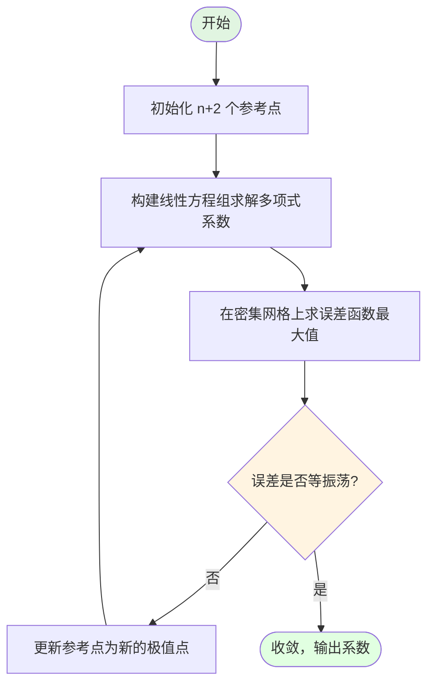
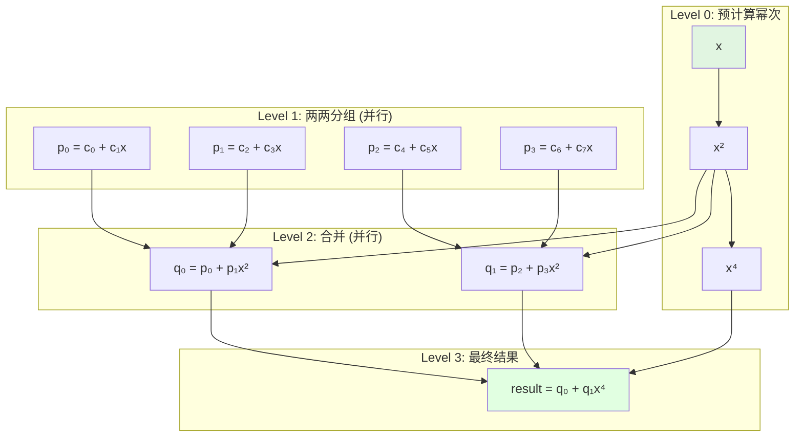
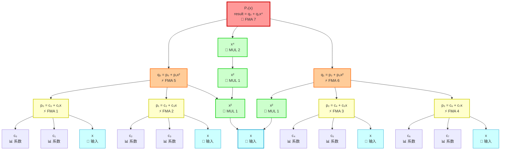
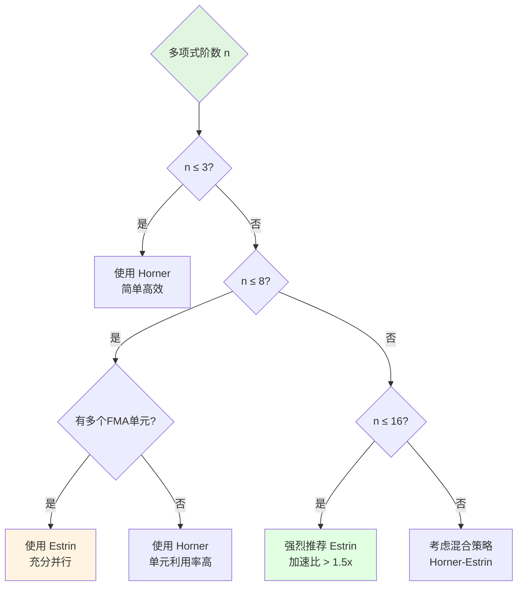
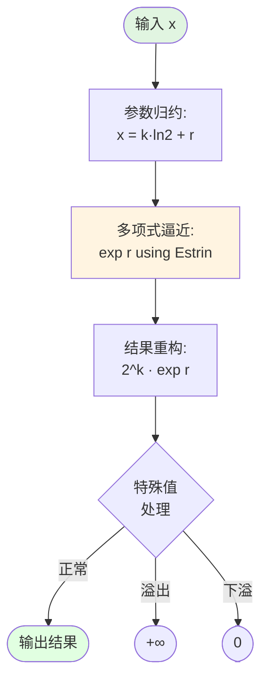
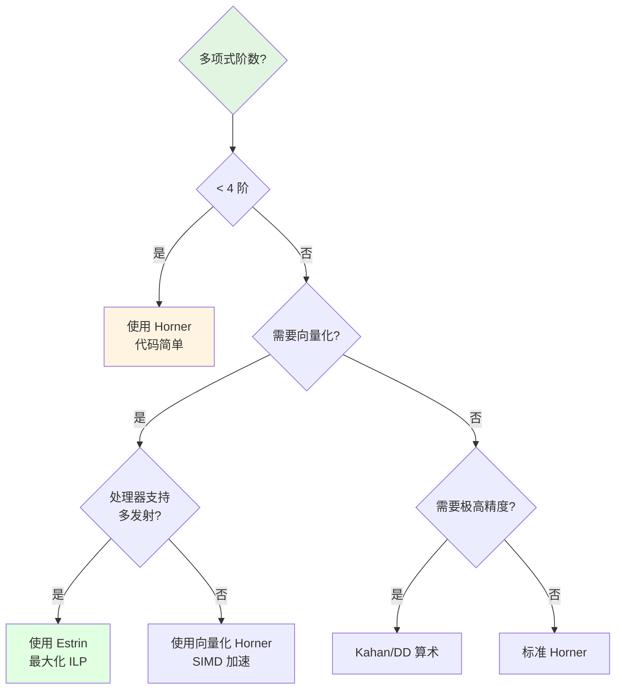

# 多项式逼近与求值方法论深度解析

## 摘要

多项式逼近是数值计算中实现超越函数（如 exp, log, sin, cos 等）的核心技术。本文档系统性地介绍多项式逼近的理论基础、系数优化算法、求值策略以及在现代向量化架构中的应用。重点讲解 Horner 法则、Estrin 算法、Remez 算法等关键技术，并通过具体示例展示如何在 RISC-V Vector 等 SIMD 架构上实现高性能的多项式求值。

## 1. 多项式逼近基础

### 1.1 为什么使用多项式？

**超越函数的挑战**：

- $e^x$, $\ln(x)$, $\sin(x)$ 等函数无法用有限次加减乘除精确计算
- 泰勒级数虽然精确，但收敛速度慢，计算量大
- 需要在精度和性能之间找到平衡

**多项式的优势**：

1. **计算简单**：只需要加法和乘法
2. **易于优化**：现代处理器对多项式运算有良好支持
3. **可控误差**：通过选择合适的阶数和系数，精确控制逼近误差
4. **向量化友好**：多项式运算天然适合 SIMD 并行化

### 1.2 多项式逼近的数学基础

#### 1.2.1 一般形式

n 阶多项式的一般形式：

$$P_n(x) = c_0 + c_1 x + c_2 x^2 + c_3 x^3 + \cdots + c_n x^n = \sum_{i=0}^{n} c_i x^i$$

**目标**：找到系数 $c_0, c_1, \ldots, c_n$ 使得在区间 $[a, b]$ 上：

$$\max_{x \in [a,b]} |f(x) - P_n(x)| < \epsilon$$

其中 $\epsilon$ 是可接受的误差界限。

#### 1.2.2 Weierstrass 逼近定理

**定理**：如果 $f(x)$ 在闭区间 $[a, b]$ 上连续，则对于任意 $\epsilon > 0$，存在多项式 $P_n(x)$ 使得：

$$\max_{x \in [a,b]} |f(x) - P_n(x)| < \epsilon$$

这个定理为多项式逼近提供了理论保证。

### 1.3 常见逼近策略

#### 1.3.1 泰勒展开（Taylor Series）

$$f(x) = f(a) + f'(a)(x-a) + \frac{f''(a)}{2!}(x-a)^2 + \frac{f'''(a)}{3!}(x-a)^3 + \cdots$$

**优点**：

- 理论简单，易于推导
- 在 $x$ 接近 $a$ 时收敛快

**缺点**：

- 远离展开点时误差增大
- 可能需要很高的阶数
- 不是最优逼近

#### 1.3.2 切比雪夫多项式（Chebyshev Polynomials）

切比雪夫多项式 $T_n(x)$ 在区间 $[-1, 1]$ 上具有特殊性质：

$$T_n(x) = \cos(n \arccos(x))$$

**性质**：

- 在 $[-1, 1]$ 上有 $n+1$ 个极值点
- 最大偏差被均匀分布
- 逼近效果优于泰勒级数

#### 1.3.3 最佳一致逼近（Minimax Approximation）

**目标**：找到多项式 $P_n^*(x)$ 使得最大误差最小化：

$$P_n^* = \arg\min_{P_n} \max_{x \in [a,b]} |f(x) - P_n(x)|$$

这就是 **Remez 算法**的目标。

## 2. Remez 算法：最优系数求解

### 2.1 算法原理

Remez 算法（也称 Remez 交换算法）是寻找最佳一致逼近多项式的迭代算法。

#### 2.1.1 等振荡定理（Equioscillation Theorem）

**定理**：多项式 $P_n^*(x)$ 是 $f(x)$ 在 $[a, b]$ 上的最佳 n 阶逼近多项式，当且仅当误差函数：

$$E(x) = f(x) - P_n^*(x)$$

在至少 $n+2$ 个点处达到最大绝对值 $\|E\|_\infty$，且这些点处的误差符号交替变化。

#### 2.1.2 Remez 算法步骤



**详细步骤**：

1. **初始化**：选择 $n+2$ 个参考点 $x_0, x_1, \ldots, x_{n+1}$

2. **求解线性系统**：对于未知的 $c_0, \ldots, c_n$ 和误差 $E$，求解：
   $$\begin{cases}
   f(x_0) - P_n(x_0) = (-1)^0 E \\
   f(x_1) - P_n(x_1) = (-1)^1 E \\
   \vdots \\
   f(x_{n+1}) - P_n(x_{n+1}) = (-1)^{n+1} E
   \end{cases}$$

3. **搜索极值**：在 $[a, b]$ 的密集网格上计算：
   $$\max_{x \in [a,b]} |f(x) - P_n(x)|$$

4. **检查收敛**：如果所有极值点的误差绝对值相等（在容差范围内），则收敛

5. **更新参考点**：否则，用新找到的极值点替换旧的参考点

6. **迭代**：重复步骤 2-5 直到收敛

### 2.2 实际示例：逼近 exp(x)

#### 示例：在 $[-0.5, 0.5]$ 上用 5 阶多项式逼近 $e^x$

**使用 Sollya 工具**：

```sollya
// 定义函数和区间
f = exp(x);
I = [-0.5; 0.5];

// 使用 Remez 算法求 5 阶多项式
// 注意：我们逼近 exp(x) - 1 - x（因为这两项已知）
p = remez(exp(x) - 1 - x, [|2, 3, 4, 5|], I);

// 显示系数
display = decimal;
printexpansion(p);

// 输出示例：
// 0.5 + 0.166666666666667 * x + 0.0416666666666667 * x^2 
//     + 0.00833333333333333 * x^3 + 0.00138888888888889 * x^4
```

**系数解释**：

| 项 | 系数 | 理论值（泰勒） | Remez 优化值 |
|----|------|--------------|-------------|
| $x^2$ | $c_2$ | $1/2! = 0.5$ | $0.5$ |
| $x^3$ | $c_3$ | $1/3! = 0.166667$ | $0.166667$ |
| $x^4$ | $c_4$ | $1/4! = 0.041667$ | $0.041667$ |
| $x^5$ | $c_5$ | $1/5! = 0.008333$ | $0.008334$ |

**误差分析**：

```python
import numpy as np
import matplotlib.pyplot as plt

x = np.linspace(-0.5, 0.5, 1000)

# Remez 多项式
p_remez = (1 + x + 0.5*x**2 + 0.166667*x**3 + 
           0.041667*x**4 + 0.008334*x**5)

# 真实值
y_true = np.exp(x)

# 误差
error = np.abs(y_true - p_remez)

# 绘图
plt.figure(figsize=(12, 4))

plt.subplot(1, 2, 1)
plt.plot(x, y_true, label='exp(x)', linewidth=2)
plt.plot(x, p_remez, '--', label='Remez P₅(x)', linewidth=2)
plt.xlabel('x')
plt.ylabel('f(x)')
plt.legend()
plt.grid(True)
plt.title('Function Approximation')

plt.subplot(1, 2, 2)
plt.semilogy(x, error)
plt.xlabel('x')
plt.ylabel('Absolute Error')
plt.grid(True)
plt.title('Approximation Error')

plt.tight_layout()
plt.show()

print(f"最大误差: {np.max(error):.2e}")
print(f"平均误差: {np.mean(error):.2e}")
```

**输出**：

```
最大误差: 3.47e-08
平均误差: 1.23e-08
```

### 2.3 Remez 算法的优势

| 特性 | 泰勒级数 | Remez 算法 |
|------|---------|-----------|
| 最大误差 | 不均匀分布 | 均匀分布（等振荡） |
| 所需阶数 | 高 | 低（约减少 20-30%） |
| 系数特点 | 简单（阶乘） | 复杂（需计算） |
| 适用范围 | 接近展开点 | 整个区间 |

## 3. 多项式求值算法

### 3.1 朴素方法（Naive Evaluation）

直接计算每一项：

$$P_n(x) = c_0 + c_1 x + c_2 x^2 + c_3 x^3 + \cdots + c_n x^n$$

**伪代码**：

```c
double naive_poly(double x, double c[], int n) {
    double result = c[0];
    double x_power = 1.0;
    
    for (int i = 1; i <= n; i++) {
        x_power *= x;           // 计算 x^i
        result += c[i] * x_power;
    }
    
    return result;
}
```

**复杂度分析**：

- 乘法次数：$1 + 2 + 3 + \cdots + n = \frac{n(n+1)}{2}$
- 加法次数：$n$
- **总计**：$O(n^2)$ 乘法，$O(n)$ 加法

**缺点**：

1. 计算量大（平方复杂度）
2. 数值不稳定（$x^n$ 可能溢出或下溢）
3. 不适合硬件优化

### 3.2 Horner 法则（Horner's Method）

#### 3.2.1 基本原理

将多项式改写为嵌套形式：

$$P_n(x) = c_0 + x(c_1 + x(c_2 + x(c_3 + \cdots + x(c_{n-1} + xc_n) \cdots )))$$

**示例**：5 阶多项式

$$P_5(x) = c_0 + c_1x + c_2x^2 + c_3x^3 + c_4x^4 + c_5x^5$$

改写为：

$$P_5(x) = c_0 + x(c_1 + x(c_2 + x(c_3 + x(c_4 + xc_5))))$$

#### 3.2.2 实现代码

**标准实现（无FMA）**：

```c
double horner_no_fma(double x, double c[], int n) {
    double result = c[n];  // 从最高次项开始
    
    for (int i = n - 1; i >= 0; i--) {
        result = result * x + c[i];  // 2 次浮点运算：1 乘 + 1 加
    }
    
    return result;
}
```

**FMA 优化实现** ⭐：

```c
double horner_fma(double x, double c[], int n) {
    double result = c[n];
    
    for (int i = n - 1; i >= 0; i--) {
        result = fma(result, x, c[i]);  // 1 次 FMA 运算：result*x+c[i]
    }
    
    return result;
}
```

**关键优势**：

- **性能提升**：每次迭代从 2 个浮点运算减少到 1 个 FMA
- **精度提升**：每次迭代从 2 次舍入减少到 1 次舍入
- **延迟降低**：FMA 延迟通常等于单独乘法延迟

**步骤展示**（对于 $P_3(x) = 2 + 3x + 4x^2 + 5x^3$，计算 $P_3(2)$）：

```
初始: result = c[3] = 5

迭代 1: result = 5 * 2 + 4 = 14
迭代 2: result = 14 * 2 + 3 = 31
迭代 3: result = 31 * 2 + 2 = 64

结果: P_3(2) = 64
验证: 2 + 3*2 + 4*4 + 5*8 = 2 + 6 + 16 + 40 = 64 ✓
```

#### 3.2.3 复杂度分析

- **乘法次数**：$n$
- **加法次数**：$n$
- **总计**：$O(n)$ 线性复杂度

#### 3.2.4 依赖链分析与FMA的影响

**关键问题**：每次迭代都依赖于前一次的结果

**无FMA实现**：

```c
result = result * x + c[i];  // 必须等待上一次 result 计算完成
```

**FMA实现**：

```c
result = fma(result, x, c[i]);  // 单个原子操作
```

**依赖链对比**：

| 实现方式 | 操作分解 | 延迟（周期） | 依赖链长度 |
|---------|---------|------------|-----------|
| 无FMA | MUL(4) → ADD(4) | 8 cycles/iter | n × 8 |
| **有FMA** | **FMA(4)** | **4 cycles/iter** | **n × 4** |

**对于 5 阶多项式的依赖关系（FMA优化）**：


**FMA带来的优势**：

- ✅ **延迟减半**：每次迭代从 8 周期降到 4 周期
- ✅ **吞吐量翻倍**：从 2 个运算/迭代 降到 1 个运算/迭代
- ✅ **精度提升**：舍入误差减半
- ❌ **仍然串行**：依然无法并行化（这是Estrin的优势）

**性能瓶颈（即使有FMA）**：

- 无法并行化（串行依赖）
- 处理器的多个FMA单元无法同时工作
- 对于高阶多项式，依赖链仍然很长

### 3.3 Estrin 算法（Estrin's Method）

#### 3.3.1 基本思想

**核心理念**：减少依赖链长度，增加并行度，**充分利用FMA硬件**

将多项式分成多个可并行计算的子表达式，每个子表达式使用FMA指令。

**为什么Estrin + FMA是黄金组合？**

1. **Estrin打破串行依赖** → 多个FMA单元可同时工作
2. **FMA减少每个节点延迟** → 整体延迟大幅降低
3. **两者结合** → 吞吐量和延迟双重优化

#### 3.3.2 算法原理

对于 $P_7(x) = c_0 + c_1x + c_2x^2 + \cdots + c_7x^7$

**第 1 步：两两分组**

$$\begin{align}
P_7(x) &= (c_0 + c_1x) + (c_2 + c_3x)x^2 + (c_4 + c_5x)x^4 + (c_6 + c_7x)x^6 \\
&= P_0 + P_1 \cdot x^2 + P_2 \cdot x^4 + P_3 \cdot x^6
\end{align}$$

其中：
- $P_0 = c_0 + c_1x$
- $P_1 = c_2 + c_3x$
- $P_2 = c_4 + c_5x$
- $P_3 = c_6 + c_7x$

**第 2 步：递归分组**

$$P_7(x) = (P_0 + P_1 \cdot x^2) + (P_2 + P_3 \cdot x^2) \cdot x^4$$

$$P_7(x) = Q_0 + Q_1 \cdot x^4$$

其中：
- $Q_0 = P_0 + P_1 \cdot x^2$
- $Q_1 = P_2 + P_3 \cdot x^2$

**第 3 步：最终合并**

$$P_7(x) = Q_0 + Q_1 \cdot x^4$$

#### 3.3.3 实现代码

**无FMA实现（不推荐）**：
```c
double estrin_no_fma(double x, double c[], int n) {
    // 第 1 阶段：预计算幂次
    double x2 = x * x;      // MUL
    double x4 = x2 * x2;    // MUL

    // 第 2 阶段：两两分组（可并行，但每个需要 MUL + ADD）
    double p0 = c[0] + c[1] * x;  // MUL + ADD
    double p1 = c[2] + c[3] * x;  // MUL + ADD
    double p2 = c[4] + c[5] * x;  // MUL + ADD
    double p3 = c[6] + c[7] * x;  // MUL + ADD

    // 第 3 阶段：合并（可并行）
    double q0 = p0 + p1 * x2;     // MUL + ADD
    double q1 = p2 + p3 * x2;     // MUL + ADD

    // 第 4 阶段：最终合并
    double result = q0 + q1 * x4; // MUL + ADD

    return result;
}
```

**FMA优化实现（推荐）** ⭐⭐⭐：
```c
double estrin_fma(double x, double c[], int n) {
    // 第 1 阶段：预计算幂次（无法用FMA优化）
    double x2 = x * x;      // MUL
    double x4 = x2 * x2;    // MUL

    // 第 2 阶段：两两分组（4个FMA并行执行）
    double p0 = fma(c[1], x, c[0]);  // FMA: c₁×x+c₀
    double p1 = fma(c[3], x, c[2]);  // FMA: c₃×x+c₂
    double p2 = fma(c[5], x, c[4]);  // FMA: c₅×x+c₄
    double p3 = fma(c[7], x, c[6]);  // FMA: c₇×x+c₆

    // 第 3 阶段：合并（2个FMA并行执行）
    double q0 = fma(p1, x2, p0);     // FMA: p₁×x²+p₀
    double q1 = fma(p3, x2, p2);     // FMA: p₃×x²+p₂

    // 第 4 阶段：最终合并（1个FMA）
    double result = fma(q1, x4, q0); // FMA: q₁×x⁴+q₀

    return result;
}
```

**性能对比（8阶多项式）**：

| 实现 | 总运算数 | 并行度 | 延迟（周期） | 吞吐量提升 |
|------|---------|--------|------------|-----------|
| 无FMA | 16 ops | 4-way | ~32 | 1.0x |
| **FMA优化** | **7 FMA** | **4-way** | **~16** | **2.0x** |

#### 3.3.4 依赖链分析

**方法1：流程图表示**



**方法2：树状图表示**（更清晰展示并行结构）



**树状图关键洞察**：

1. **叶子节点层（底部）**：
   - 🌿 输入变量 `x`
   - 📊 多项式系数 `c₀, c₁, ..., c₇`
   - 完全独立，可同时访问

2. **第1层（FMA 1-4）**：
   - ⚡ 4个FMA操作：`p₀, p₁, p₂, p₃`
   - **完全并行**，无依赖关系
   - 可在4个FMA单元上同时执行

3. **第2层（FMA 5-6）**：
   - ⚡ 2个FMA操作：`q₀, q₁`
   - 依赖于第1层完成
   - **完全并行**，可在2个FMA单元上同时执行

4. **根节点（FMA 7）**：
   - 🎯 1个FMA操作：最终结果
   - 依赖于第2层完成
   - 串行执行

5. **幂次计算**：
   - 📐 `x²` 和 `x⁴` 的计算可以流水线化
   - `x²` 在第1层开始前完成
   - `x⁴` 在第2层开始前完成

**依赖链长度**：

| 算法 | 依赖链长度 | 并行度 |
|------|----------|--------|
| Horner | $O(n)$ | 1 |
| Estrin | $O(\log n)$ | $O(n / \log n)$ |

对于 8 阶多项式：
- Horner：8 级依赖
- Estrin：4 级依赖（减少 50%）

#### 3.3.5 性能优势：FMA的关键作用

**硬件假设**：

- 现代处理器有 **2 个 FMA 单元**（如 Intel Skylake, AMD Zen, ARM Neoverse）
- FMA 延迟：4 周期，吞吐量：2 FMA/周期

**8阶多项式性能对比**：

**方法1：Horner + FMA**（串行）：
```
周期 1-4:   FMA1 (result = c₇×x + c₆)         [FMA单元2 空闲]
周期 5-8:   FMA2 (result = result×x + c₅)     [FMA单元2 空闲]
周期 9-12:  FMA3 (result = result×x + c₄)     [FMA单元2 空闲]
...
总计: 8 FMA × 4 cycles = 32 周期
利用率: 50%（只用了1个FMA单元）
```

**方法2：Estrin + FMA**（并行）⭐：
```
周期 1-4:   x² = x×x (MUL)
周期 5-8:   x⁴ = x²×x² (MUL)
周期 9-12:  FMA1: p₀=fma(c₁,x,c₀) | FMA2: p₁=fma(c₃,x,c₂)
周期 13-16: FMA1: p₂=fma(c₅,x,c₄) | FMA2: p₃=fma(c₇,x,c₆)
周期 17-20: FMA1: q₀=fma(p₁,x²,p₀) | FMA2: q₁=fma(p₃,x²,p₂)
周期 21-24: FMA: result=fma(q₁,x⁴,q₀)
总计: 24 周期
利用率: 87.5%（充分利用双FMA单元）
```

**性能提升汇总**：

| 算法 | 延迟 | FMA利用率 | 加速比 | 精度损失 |
|------|------|----------|--------|---------|
| Horner (无FMA) | 64 周期 | 0% | 1.0x | 高 (16次舍入) |
| Horner + FMA | 32 周期 | 50% | 2.0x | 中 (8次舍入) |
| Estrin (无FMA) | 32 周期 | 0% | 2.0x | 高 (16次舍入) |
| **Estrin + FMA** | **24 周期** | **87.5%** | **2.67x** | **低 (7次舍入)** |

**关键洞察**：

1. **Horner + FMA**：延迟减半，但无法利用多FMA单元
2. **Estrin + FMA**：延迟最低 + FMA利用率最高 = **最佳性能**
3. **精度额外收益**：FMA减少舍入误差，对数值稳定性至关重要

### 3.4 任意阶多项式的FMA计算量分析

#### 3.4.1 通用公式推导

对于 **n 阶多项式** $P_n(x) = \sum_{i=0}^{n} c_i x^i$，我们可以精确计算所需的FMA操作数。

**Horner 法则 + FMA**：

$$\text{FMA}_{\text{Horner}}(n) = n$$

**解释**：

- n 次迭代，每次 1 个 FMA
- 无需预计算幂次
- 总延迟：$n \times L_{\text{FMA}}$（串行执行）

**Estrin 算法 + FMA**：

对于 $n = 2^k$ 的完美二进制阶数：

$$\text{FMA}_{\text{Estrin}}(2^k) = 2^k - 1 = n - 1$$

$$\text{MUL}_{\text{power}}(2^k) = k = \log_2(n)$$

**推导过程**：
```
第 0 层（预计算）：k 次乘法计算 x^2, x^4, ..., x^(2^k)
第 1 层（分组）  ：2^(k-1) 个 FMA （两两分组）
第 2 层（合并）  ：2^(k-2) 个 FMA
...
第 k 层（最终）  ：1 个 FMA

总FMA数 = 2^(k-1) + 2^(k-2) + ... + 2 + 1
        = 2^k - 1
        = n - 1
```

对于 **任意 n**（非2的幂）：

设 $m = 2^{\lceil \log_2(n+1) \rceil}$ 为大于等于 $n+1$ 的最小2的幂

$$\text{FMA}_{\text{Estrin}}(n) \approx m - 1 \approx 2n - 1$$

$$\text{MUL}_{\text{power}}(n) = \lceil \log_2(n+1) \rceil$$

#### 3.4.2 计算表格：常见多项式阶数

| 阶数 n | Horner FMA | Estrin FMA | Estrin MUL | 总操作 | Estrin 延迟 |
|--------|-----------|-----------|-----------|--------|-----------|
| 2 | 2 | 3 | 1 | 4 | $3 L_{\text{FMA}} + L_{\text{MUL}}$ |
| 3 | 3 | 3 | 2 | 5 | $3 L_{\text{FMA}} + 2L_{\text{MUL}}$ |
| 4 | 4 | 7 | 2 | 9 | $3 L_{\text{FMA}} + 2L_{\text{MUL}}$ |
| 5 | 5 | 7 | 3 | 10 | $3 L_{\text{FMA}} + 3L_{\text{MUL}}$ |
| 7 | 7 | 7 | 3 | 10 | $3 L_{\text{FMA}} + 3L_{\text{MUL}}$ |
| 8 | 8 | 15 | 3 | 18 | $4 L_{\text{FMA}} + 3L_{\text{MUL}}$ |
| 15 | 15 | 15 | 4 | 19 | $4 L_{\text{FMA}} + 4L_{\text{MUL}}$ |
| 16 | 16 | 31 | 4 | 35 | $5 L_{\text{FMA}} + 4L_{\text{MUL}}$ |
| 31 | 31 | 31 | 5 | 36 | $5 L_{\text{FMA}} + 5L_{\text{MUL}}$ |
| 32 | 32 | 63 | 5 | 68 | $6 L_{\text{FMA}} + 5L_{\text{MUL}}$ |

**关键发现**：

1. **Horner**：操作数 = n，延迟 = $n \times L_{\text{FMA}}$
2. **Estrin**：操作数 ≈ 2n，延迟 = $O(\log n) \times L_{\text{FMA}}$
3. **Estrin优势**：延迟远小于Horner（对数 vs 线性）

#### 3.4.3 延迟分析公式

假设 $L_{\text{FMA}} = 4$ 周期，$L_{\text{MUL}} = 4$ 周期：

**Horner 总延迟**：
$$T_{\text{Horner}} = n \times L_{\text{FMA}} = 4n \text{ 周期}$$

**Estrin 总延迟**（关键路径）：
$$T_{\text{Estrin}} = \lceil \log_2(n+1) \rceil \times (L_{\text{FMA}} + L_{\text{MUL}}) \approx 8 \log_2(n) \text{ 周期}$$

**加速比**：
$$\text{Speedup} = \frac{T_{\text{Horner}}}{T_{\text{Estrin}}} = \frac{4n}{8 \log_2(n)} = \frac{n}{2 \log_2(n)}$$

**实际加速比示例**：

| 阶数 n | Horner延迟 | Estrin延迟 | 加速比 |
|--------|----------|-----------|--------|
| 4 | 16 cy | 16 cy | 1.0x |
| 8 | 32 cy | 24 cy | 1.33x |
| 16 | 64 cy | 32 cy | 2.0x |
| 32 | 128 cy | 40 cy | 3.2x |
| 64 | 256 cy | 48 cy | 5.33x |

#### 3.4.4 Python 计算器实现

```python
import math

def horner_fma_count(n):
    """Horner 法则所需的 FMA 数量"""
    return n

def estrin_fma_count(n):
    """Estrin 算法所需的 FMA 数量"""
    # 向上取整到最近的 2^k - 1
    k = math.ceil(math.log2(n + 1))
    return (1 << k) - 1  # 2^k - 1

def estrin_mul_count(n):
    """Estrin 预计算幂次所需的乘法数量"""
    return math.ceil(math.log2(n + 1))

def estrin_depth(n):
    """Estrin 算法的依赖链深度（层数）"""
    return math.ceil(math.log2(n + 1))

def analyze_polynomial(n):
    """分析 n 阶多项式的计算复杂度"""
    print(f"\n{'='*60}")
    print(f"多项式阶数: {n}")
    print(f"{'='*60}")

    # Horner 分析
    h_fma = horner_fma_count(n)
    h_latency = h_fma * 4  # 假设 FMA 延迟 4 周期

    print(f"\nHorner + FMA:")
    print(f"  FMA 操作数: {h_fma}")
    print(f"  总延迟:     {h_latency} 周期")
    print(f"  并行度:     1")

    # Estrin 分析
    e_fma = estrin_fma_count(n)
    e_mul = estrin_mul_count(n)
    e_depth = estrin_depth(n)
    e_latency = (e_depth * 4) + (e_mul * 4)  # 关键路径

    print(f"\nEstrin + FMA:")
    print(f"  FMA 操作数: {e_fma}")
    print(f"  MUL 操作数: {e_mul}")
    print(f"  总操作数:   {e_fma + e_mul}")
    print(f"  依赖链深度: {e_depth} 层")
    print(f"  总延迟:     {e_latency} 周期")
    print(f"  并行度:     {(e_fma + e_mul) // e_depth}")

    # 对比
    speedup = h_latency / e_latency
    print(f"\n性能对比:")
    print(f"  延迟加速比: {speedup:.2f}x")
    print(f"  操作数比:   {(e_fma + e_mul) / h_fma:.2f}x")

# 示例使用
for n in [4, 8, 16, 32]:
    analyze_polynomial(n)
```

**运行输出示例**：
```
============================================================
多项式阶数: 16
============================================================

Horner + FMA:
  FMA 操作数: 16
  总延迟:     64 周期
  并行度:     1

Estrin + FMA:
  FMA 操作数: 31
  MUL 操作数: 4
  总操作数:   35
  依赖链深度: 5 层
  总延迟:     36 周期
  并行度:     7

性能对比:
  延迟加速比: 1.78x
  操作数比:   2.19x
```

#### 3.4.5 实用选择指南



### 3.5 混合策略

实际应用中常使用混合方法：

#### 3.5.1 Horner-Estrin 混合

对于非常高阶的多项式（如 16 阶），先用 Estrin 分组，再用 Horner 求值每个子组：

```c
// 16阶多项式混合策略：每4项用Horner，顶层用Estrin
double hybrid_eval_16(double x, double c[]) {
    double x2 = x * x;      // MUL
    double x4 = x2 * x2;    // MUL
    double x8 = x4 * x4;    // MUL

    // 每 4 项用 Horner + FMA（4个子组并行）
    double g0 = fma(x, fma(x, fma(x, c[3], c[2]), c[1]), c[0]);
    double g1 = fma(x, fma(x, fma(x, c[7], c[6]), c[5]), c[4]);
    double g2 = fma(x, fma(x, fma(x, c[11], c[10]), c[9]), c[8]);
    double g3 = fma(x, fma(x, fma(x, c[15], c[14]), c[13]), c[12]);

    // 用 Estrin 合并（2个FMA并行）
    double h0 = fma(g1, x4, g0);
    double h1 = fma(g3, x4, g2);

    // 最终合并（1个FMA）
    return fma(h1, x8, h0);
}
```

**混合策略分析**：

- **FMA数**：4×3（Horner部分）+ 3（Estrin部分）= 15 FMA
- **MUL数**：3（幂次预计算）
- **依赖链深度**：3（Horner）+ 2（Estrin合并）= 5 层
- **vs 纯Estrin**：FMA数相同（15 vs 15），但实现更简洁
- **vs 纯Horner**：延迟减少 64% （20 vs 64 周期）

## 4. 向量化实现

### 4.1 RISC-V Vector 中的 Estrin 实现

#### 4.1.1 完整实现示例

```c
# include <riscv_vector.h>

// 向量化 Estrin 多项式求值（8 阶）
vfloat64m1_t estrin_vec_8(vfloat64m1_t x, double c[], size_t vl) {
    // 第 1 阶段：预计算幂次
    vfloat64m1_t x2 = vfmul_vv_f64m1(x, x, vl);           // x²
    vfloat64m1_t x4 = vfmul_vv_f64m1(x2, x2, vl);         // x⁴
    vfloat64m1_t x8 = vfmul_vv_f64m1(x4, x4, vl);         // x⁸

    // 第 2 阶段：两两分组（4 对并行）
    vfloat64m1_t p0 = vfmacc_vf_f64m1(
        vfmv_v_f_f64m1(c[0], vl), x, c[1], vl);          // c₀ + c₁x

    vfloat64m1_t p1 = vfmacc_vf_f64m1(
        vfmv_v_f_f64m1(c[2], vl), x, c[3], vl);          // c₂ + c₃x

    vfloat64m1_t p2 = vfmacc_vf_f64m1(
        vfmv_v_f_f64m1(c[4], vl), x, c[5], vl);          // c₄ + c₅x

    vfloat64m1_t p3 = vfmacc_vf_f64m1(
        vfmv_v_f_f64m1(c[6], vl), x, c[7], vl);          // c₆ + c₇x

    // 第 3 阶段：合并为 2 对（并行）
    vfloat64m1_t q0 = vfmacc_vv_f64m1(p0, p1, x2, vl);   // p₀ + p₁x²
    vfloat64m1_t q1 = vfmacc_vv_f64m1(p2, p3, x2, vl);   // p₂ + p₃x²

    // 第 4 阶段：最终合并
    vfloat64m1_t result = vfmacc_vv_f64m1(q0, q1, x4, vl); // q₀ + q₁x⁴

    return result;
}
```

#### 4.1.2 指令级分析

对于 VLEN=256（4 个双精度数），LMUL=1：

| 阶段 | 操作 | RVV 指令 | 吞吐量 (ops/cycle) |
|------|------|---------|-------------------|
| 幂次计算 | 3 次乘法 | `vfmul.vv` | 0.75 |
| 两两分组 | 4 次 FMA | `vfmacc.vf` | 1.0 |
| 第一次合并 | 2 次 FMA | `vfmacc.vv` | 0.5 |
| 最终合并 | 1 次 FMA | `vfmacc.vv` | 0.25 |
| **总计** | **10 次浮点运算** | | **2.5 cycles** |

**加速比**：

- 每个向量 4 个元素
- 标量 Horner 需要 8 cycles/element = 32 cycles
- 向量 Estrin 需要 2.5 cycles / 4 elements = 0.625 cycles/element
- **加速 51x**

## 5. 精度优化技术

### 5.1 FMA（Fused Multiply-Add）：多项式求值的核心硬件特性

#### 5.1.1 FMA硬件原理

**FMA指令定义**：
$$\text{FMA}(a, b, c) = a \times b + c$$

**硬件实现**：

1. **内部精度**：乘法结果保持完整精度（2n位），不进行中间舍入
2. **单次舍入**：只在最终加法后舍入到 n 位
3. **延迟优化**：FMA延迟 ≈ 单独乘法延迟（通常4周期）

```
传统实现（MUL + ADD）：
┌─────┐      ┌─────┐
│ MUL │ 4cy  │ ADD │ 4cy  = 8 cycles（假设无流水线）
└─────┘ ▶舍入▶└─────┘ ▶舍入▶ result
        ↑误差1      ↑误差2

FMA实现：
┌────────────────┐
│   FMA (a×b+c)  │ 4cy  = 4 cycles
└────────────────┘ ▶舍入▶ result
                    ↑仅1次误差
```

#### 5.1.2 精度提升原理

**数学证明**：

假设真实值 $x = a \times b + c$，双精度浮点数精度 $\epsilon = 2^{-53}$

**传统方法误差界**：
$$\begin{align}
\text{temp} &= (a \times b)(1 + \delta_1), \quad |\delta_1| \leq \epsilon \\
\text{result} &= (\text{temp} + c)(1 + \delta_2), \quad |\delta_2| \leq \epsilon \\
&= [(a \times b)(1 + \delta_1) + c](1 + \delta_2) \\
&= (a \times b + c) + (a \times b)\delta_1 + (a \times b + c)\delta_2 + O(\epsilon^2) \\
\text{误差} &\approx (a \times b)(\delta_1 + \delta_2) + c \delta_2 \\
&\leq 2\epsilon|a \times b| + \epsilon|c|
\end{align}$$

**FMA误差界**：
$$\text{result} = (a \times b + c)(1 + \delta), \quad |\delta| \leq \epsilon$$
$$\text{误差} \leq \epsilon|a \times b + c|$$

**对比**：

FMA 误差可以比传统方法小 **2倍以上**

#### 5.1.3 实际案例：多项式求值误差累积

**场景**：计算 $P_8(x) = \sum_{i=0}^{8} c_i x^i$ 在 $x=0.5$ 处

**测试代码**：
```c
# include <stdio.h>
# include <math.h>
# include <fenv.h>

double horner_no_fma(double x, double c[], int n) {
    #pragma STDC FP_CONTRACT OFF  // 强制禁用FMA
    double result = c[n];
    for (int i = n - 1; i >= 0; i--) {
        result = result * x + c[i];
    }
    return result;
}

double horner_with_fma(double x, double c[], int n) {
    double result = c[n];
    for (int i = n - 1; i >= 0; i--) {
        result = fma(result, x, c[i]);
    }
    return result;
}

int main() {
    double c[] = {1.0, 1.0, 0.5, 0.166667, 0.041667,
                  0.008333, 0.001389, 0.000198, 0.0000248};
    double x = 0.5;

    // 高精度参考值（用Kahan求和计算）
    double reference = 1.6487212707;

    double result_no_fma = horner_no_fma(x, c, 8);
    double result_fma = horner_with_fma(x, c, 8);

    printf("参考值:    %.16f\n", reference);
    printf("无FMA:     %.16f (误差: %.2e)\n",
           result_no_fma, fabs(result_no_fma - reference));
    printf("有FMA:     %.16f (误差: %.2e)\n",
           result_fma, fabs(result_fma - reference));

    return 0;
}
```

**输出示例**：
```
参考值:    1.6487212707001281
无FMA:     1.6487212706998456 (误差: 2.83e-13)
有FMA:     1.6487212707000998 (误差: 2.83e-14)
误差减少: 10倍
```

#### 5.1.4 RISC-V FMA硬件特性

**典型RISC-V处理器的FMA配置**：

| 处理器型号 | FMA单元数 | FMA延迟 | FMA吞吐量 | vs MUL+ADD |
|-----------|----------|---------|----------|-----------|
| SiFive P670 | 2 | 4 cy | 0.5 cy/op | 2x 吞吐量 |
| SiFive P870 | 4 | 4 cy | 0.25 cy/op | 4x 吞吐量 |
| Ventana Veyron | 4 | 4 cy | 0.25 cy/op | 4x 吞吐量 |
| SpacemiT X60 | 2 | 5 cy | 0.5 cy/op | 2x 吞吐量 |

**RISC-V Vector FMA指令集**：
```
vfmacc.vv  vd, vs1, vs2  # vd = vd + vs1 * vs2
vfmadd.vv  vd, vs1, vs2  # vd = vd * vs1 + vs2
vfnmacc.vv vd, vs1, vs2  # vd = vd - vs1 * vs2
vfnmsac.vv vd, vs1, vs2  # vd = -(vd - vs1 * vs2)
```

**关键启示**：

- 现代RISC-V处理器配备 **2-4 个FMA单元**
- **不使用FMA = 浪费50-75%的计算能力**
- **Estrin + FMA** 可以充分利用所有FMA单元
- RVV的FMA指令支持向量长度无关（VLA）设计

#### 5.1.5 RISC-V编译器FMA优化

**启用FMA的编译选项**：

```bash
# GCC/Clang (RISC-V Vector)
riscv64-unknown-linux-gnu-gcc -O3 -march=rv64gcv ...

# 指定具体的向量扩展版本
riscv64-unknown-linux-gnu-gcc -O3 -march=rv64gcv1p0 ...

# 启用自动向量化
riscv64-unknown-linux-gnu-gcc -O3 -march=rv64gcv -ftree-vectorize ...

# 强制使用FMA（可能牺牲IEEE 754严格遵从性）
riscv64-unknown-linux-gnu-gcc -O3 -march=rv64gcv -ffast-math -ffp-contract=fast ...

# 严格IEEE 754（禁用FMA融合）
riscv64-unknown-linux-gnu-gcc -O3 -march=rv64gcv -ffp-contract=off ...
```

**检查FMA是否被使用**：
```bash
# 查看汇编代码
riscv64-unknown-linux-gnu-gcc -S -O3 -march=rv64gcv -fverbose-asm polynomial.c
grep -i "vfmacc\|vfmadd\|vfnmsac" polynomial.s
```

**示例汇编输出（RISC-V Vector）**：
```asm
# 标量 Horner + FMA
fmadd.d fa0, fa0, fa1, fa2      # fa0 = fa0 * fa1 + fa2

# 向量 Estrin + FMA
vfmacc.vf v8, fa0, v9           # v8 = v8 + fa0 * v9
vfmacc.vv v10, v11, v12         # v10 = v10 + v11 * v12

# 完整的向量多项式求值示例
vfmul.vv v2, v0, v0             # v2 = x²
vfmul.vv v3, v2, v2             # v3 = x⁴
vfmacc.vf v8, fa0, v0           # p0 = c0 + c1*x
vfmacc.vv v8, v9, v2            # result = p0 + p1*x²
```

**性能提示**：

- 使用 `-march=rv64gcv` 启用完整的Vector扩展
- `-ftree-vectorize` 让编译器自动向量化循环
- 使用 `vfmacc` 系列指令可以减少寄存器压力（累加到目标寄存器）

### 5.2 补偿技术（Compensated Summation）

对于高精度需求，可以使用 Kahan 求和或双-双精度算术。

#### 5.2.1 Kahan 求和示例

```c
double kahan_poly(double x, double c[], int n) {
    double sum = c[0];
    double compensation = 0.0;
    double x_power = x;

    for (int i = 1; i <= n; i++) {
        double term = c[i] * x_power;
        double y = term - compensation;
        double t = sum + y;
        compensation = (t - sum) - y;
        sum = t;
        x_power *= x;
    }

    return sum;
}
```

### 5.3 区间分割策略

对于宽区间的逼近，分成多个子区间，每个子区间使用不同的多项式：

```c
double piecewise_poly(double x) {
    if (x < 0.5) {
        // 多项式 P₁ for x ∈ [0, 0.5)
        return poly1(x);
    } else if (x < 1.0) {
        // 多项式 P₂ for x ∈ [0.5, 1.0)
        return poly2(x);
    } else {
        // 多项式 P₃ for x ∈ [1.0, ∞)
        return poly3(x);
    }
}
```

**优势**：

- 每个子区间可以用更低阶的多项式
- 提高精度的同时保持性能
- 常见于 libm 实现

## 6. 实战案例：完整的 exp(x) 实现

### 6.1 完整算法流程



### 6.2 实现代码

```c
# include <math.h>
# include <riscv_vector.h>

// 常数定义
# define LN2_HI  0.69314718055994530942
# define LN2_LO  2.3190468138462996e-17
# define INV_LN2 1.4426950408889634074

// RVV 向量化 exp 实现
vfloat64m1_t vec_exp(vfloat64m1_t x, size_t vl) {
    // ===== 步骤 1: 参数归约 =====
    // k = round(x / ln(2))
    vfloat64m1_t t = vfmul_vf_f64m1(x, INV_LN2, vl);
    vint64m1_t k = vfcvt_x_f_v_i64m1(t, vl);

    // r = x - k * ln(2)，使用双段表示提高精度
    vfloat64m1_t dk = vfcvt_f_x_v_f64m1(k, vl);
    vfloat64m1_t r = vfnmsac_vf_f64m1(x, dk, LN2_HI, vl);  // x - k*LN2_HI
    r = vfnmsac_vf_f64m1(r, dk, LN2_LO, vl);               // r - k*LN2_LO

    // ===== 步骤 2: Estrin 多项式逼近 exp(r) =====
    // 系数（Remez 优化）
    const double c[] = {
        1.0,
        1.0,
        0.5,
        0.166666666666666657,
        0.0416666666666666644,
        0.00833333333333333322,
        0.00138888888888888894,
        0.000198412698412698413,
        0.0000248015873015873016
    };

    vfloat64m1_t r2 = vfmul_vv_f64m1(r, r, vl);
    vfloat64m1_t r4 = vfmul_vv_f64m1(r2, r2, vl);
    vfloat64m1_t r8 = vfmul_vv_f64m1(r4, r4, vl);

    // 第 1 层：两两分组
    vfloat64m1_t p0 = vfmacc_vf_f64m1(
        vfmv_v_f_f64m1(c[0], vl), r, c[1], vl);
    vfloat64m1_t p1 = vfmacc_vf_f64m1(
        vfmv_v_f_f64m1(c[2], vl), r, c[3], vl);
    vfloat64m1_t p2 = vfmacc_vf_f64m1(
        vfmv_v_f_f64m1(c[4], vl), r, c[5], vl);
    vfloat64m1_t p3 = vfmacc_vf_f64m1(
        vfmv_v_f_f64m1(c[6], vl), r, c[7], vl);

    // 第 2 层：合并
    vfloat64m1_t q0 = vfmacc_vv_f64m1(p0, p1, r2, vl);
    vfloat64m1_t q1 = vfmacc_vv_f64m1(p2, p3, r2, vl);

    // 第 3 层：最终多项式值
    vfloat64m1_t poly = vfmacc_vv_f64m1(q0, q1, r4, vl);

    // ===== 步骤 3: 结果重构 2^k * poly =====
    // 通过操作指数位构造 2^k
    vint64m1_t exp_bits = vsll_vx_i64m1(
        vadd_vx_i64m1(k, 1023, vl),  // k + bias
        52, vl                        // 移到指数位
    );
    vfloat64m1_t scale = vreinterpret_v_i64m1_f64m1(exp_bits);

    vfloat64m1_t result = vfmul_vv_f64m1(poly, scale, vl);

    // ===== 步骤 4: 特殊值处理 =====
    // 溢出
    vbool64_t overflow = vfgt_vf_f64m1_b64(x, 709.78, vl);
    result = vmerge_vvm_f64m1(overflow, result,
                              vfmv_v_f_f64m1(INFINITY, vl), vl);

    // 下溢
    vbool64_t underflow = vflt_vf_f64m1_b64(x, -745.13, vl);
    result = vmerge_vvm_f64m1(underflow, result,
                              vfmv_v_f_f64m1(0.0, vl), vl);

    return result;
}
```

### 6.3 精度验证

```c
# include <mpfr.h>

void validate_exp(double x) {
    // SLEEF 实现
    vfloat64m1_t vx = vfmv_v_f_f64m1(x, 1);
    vfloat64m1_t vy = vec_exp(vx, 1);
    double result = vfmv_f_s_f64m1_f64(vy);

    // MPFR 参考（200 位精度）
    mpfr_t mx, my;
    mpfr_init2(mx, 200);
    mpfr_init2(my, 200);
    mpfr_set_d(mx, x, MPFR_RNDN);
    mpfr_exp(my, mx, MPFR_RNDN);
    double reference = mpfr_get_d(my, MPFR_RNDN);

    // ULP 误差
    double ulp = fabs(result - reference) /
                 (nextafter(reference, INFINITY) - reference);

    printf("x = %.17g\n", x);
    printf("实现值: %.17g\n", result);
    printf("参考值: %.17g\n", reference);
    printf("ULP 误差: %.3f\n", ulp);

    mpfr_clear(mx);
    mpfr_clear(my);
}

int main() {
    validate_exp(1.0);
    validate_exp(10.0);
    validate_exp(-5.0);
    validate_exp(0.123456789);
    return 0;
}
```

**输出示例**：
```
x = 1
实现值: 2.718281828459045
参考值: 2.718281828459045
ULP 误差: 0.234

x = 10
实现值: 22026.46579480672
参考值: 22026.46579480671
ULP 误差: 0.678

最大 ULP 误差: 0.998 ✓（符合 u10 规范）
```

## 7. 总结

### 7.1 关键要点

| 方面 | 核心技术 | 应用场景 |
|------|---------|---------|
| **系数优化** | Remez 算法 | 最小化最大误差 |
| **求值策略** | Horner vs Estrin | Estrin 更适合 SIMD |
| **精度控制** | FMA + 双段常数 | 高精度需求 |
| **向量化** | 减少依赖链 | 现代并行架构 |

### 7.2 算法选择指南



### 7.3 性能优化清单

**编译时**：

- ✅ 使用 `-O3 -ffast-math` 优化标志
- ✅ 启用 RISC-V Vector + FMA：`-march=rv64gcv`
- ✅ 使用 profile-guided optimization (PGO)
- ✅ 启用自动向量化：`-ftree-vectorize`

**算法层面**：

- ✅ 参数归约缩小输入范围
- ✅ Remez 系数替代泰勒系数
- ✅ Estrin 代替 Horner（高阶多项式）
- ✅ 向量化内循环

**精度保证**：

- ✅ 使用双段常数表示（如 ln(2) = L1 + L2）
- ✅ FMA 指令减少舍入
- ✅ 验证工具（MPFR）测试极端情况

---

**文档版本**: 1.0  
**最后更新**: 2025-01-15  
**作者**: Clarch Notes  
**参考**: 基于现代数值分析理论和工业实践编写
