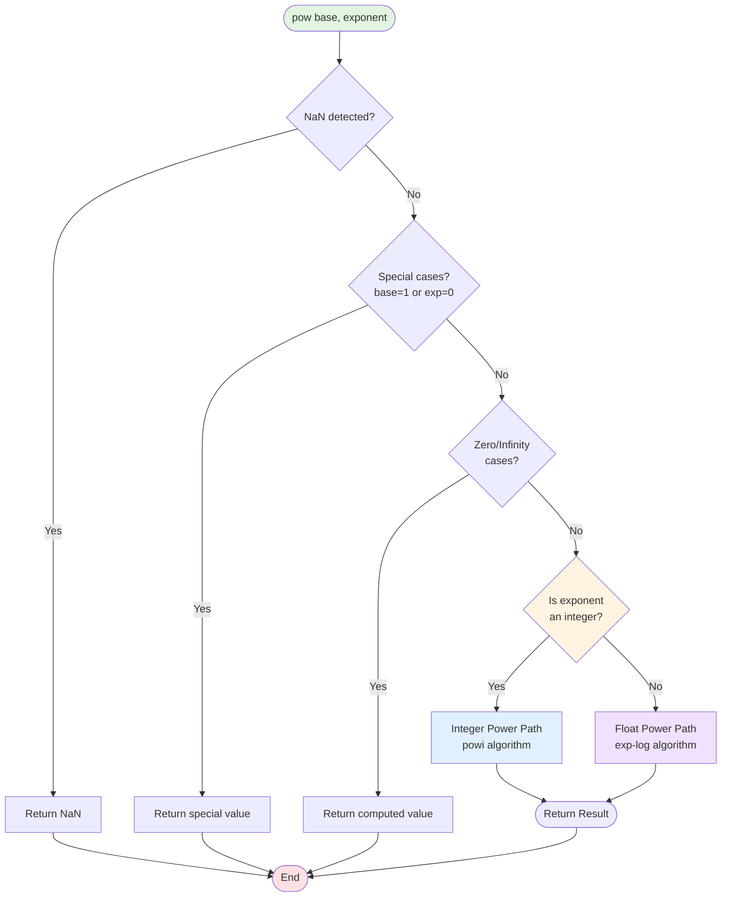
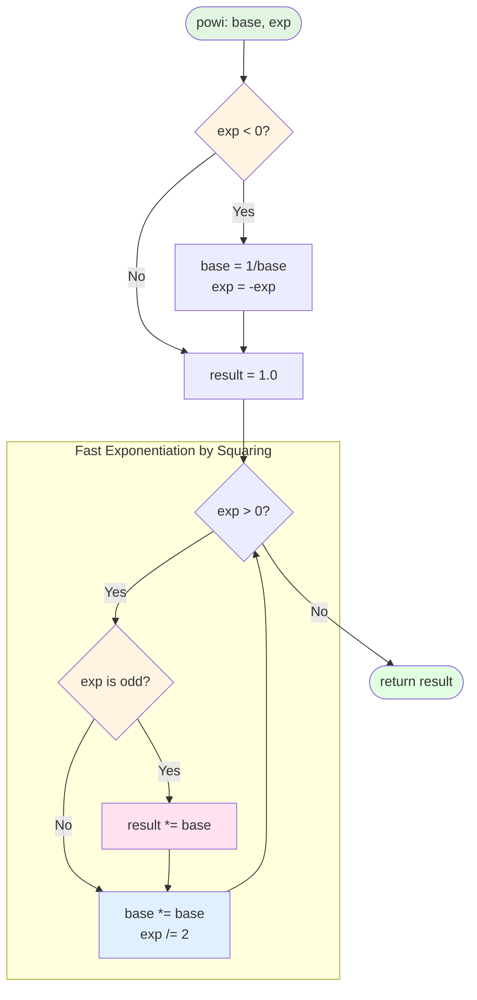
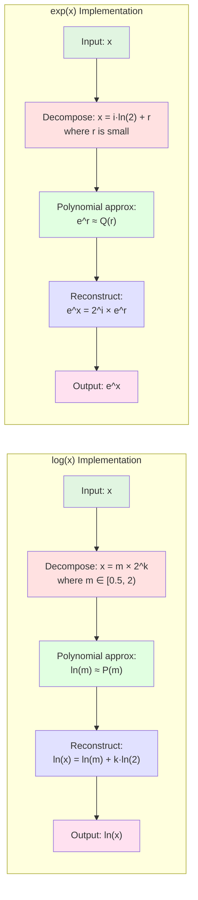
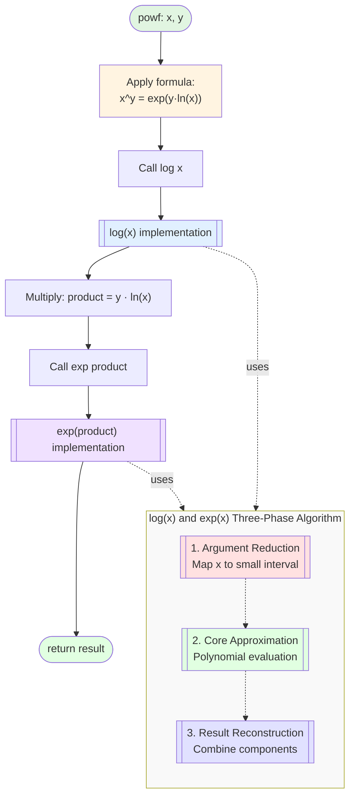
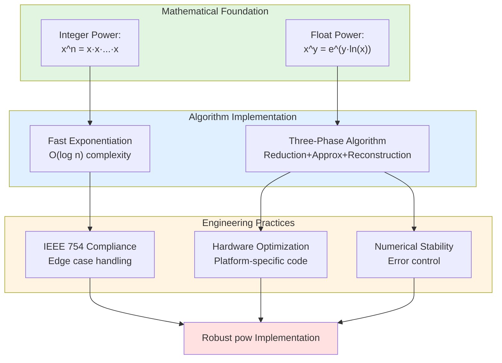

# Power 函数库实现深度解析

## 摘要

`pow(base, exponent)`（或 `base ** exponent`）是几乎所有编程语言和科学计算库中最基础、最核心的数学函数之一。它的作用是计算一个数的幂。然而，其在软件库中的实现远非简单的循环乘法所能概括。一个健壮、精确且高效的`pow`函数实现，必须综合运用多种算法策略，并严谨处理大量的边界条件。本报告将深入剖析`pow`函数的内部实现机制，重点关注其如何根据指数类型选择不同路径，并通过具体示例阐释浮点数幂运算背后的数值逼近技术。

## 1. 核心设计：双路径分派机制

`pow`函数实现的核心思想是 **分而治之**  。它首先通过一个分派器（Dispatcher）对输入参数进行分析，然后根据指数的类型和数值的特性，选择最优的计算路径。这个顶层逻辑是理解`pow`函数的关键。

下面是`pow`函数高级控制流的示意图：

这个流程清晰地展示了：

1.  **前置检查**  ：在执行任何核心计算之前，必须先处理掉那些有确定解的边界情况（如 `pow(x, 0) = 1`）或者无效输入（如 `NaN`）。
2.  **路径选择**  ：最关键的分支是判断指数是否为整数。这两种情况下的计算复杂度和实现方法截然不同。

## 2. 路径一：整数指数的高效实现 (`powi`)

当指数是整数时，问题被简化为"如何用最少的乘法次数完成计算"。

### 2.1 算法：快速幂 (Exponentiation by Squaring)

该算法是处理整数次幂的标准解决方案，其时间复杂度为 $O(\log n)$，远优于朴素循环的 $O(n)$。其核心思想是利用指数的二进制表示。

**示例** ：计算 $3^{10}$。

1. $10$ 的二进制是 `1010`。
2. $10 = 8 \cdot 1 + 4 \cdot 0 + 2 \cdot 1 + 1 \cdot 0$。
3. 因此，$3^{10} = 3^8 \cdot 3^2$。

我们只需要计算出 $3^1, 3^2, 3^4, 3^8, ...$ 序列，然后把指数二进制位为 `1` 所对应的项乘起来即可。

### 2.2 流程图与实现细节

**关键实现注意点** ：

-  **负指数**  ：通过取底数的倒数并将指数转为正数来处理。
-  **数据类型**  ：在处理指数的负数转换时，要小心最小负整数（如 `-2147483648`）取反后溢出的问题，通常会先将其转换为更长的整数类型。

## 3. 路径二：浮点数指数的数值逼近 (`powf`)

当指数是浮点数时（例如 `2.5^3.14`），乘法模型不再适用。此时，实现依赖于一个基础的数学恒等式：

$$x^y = e^{y \cdot \ln(x)}$$

这个公式将幂运算巧妙地转换为了对数 (`log`)、乘法和指数 (`exp`) 三个步骤。因此，`pow(x, y)` 的精度和性能直接取决于其底层 `log` 和 `exp` 函数的实现质量。

### 3.1 `log` 和 `exp` 的实现原理

`log` 和 `exp` 属于超越函数，无法通过有限次加减乘除精确计算。现代数学库采用一套标准的三段式流程来高精度地逼近它们的值。

#### 三阶段算法流程

#### 详细说明

1.  **参数归约 (Argument Reduction)** 
    将任意输入 `x` 映射到一个预定义好的、非常小的区间（例如 `[-ln(2)/2, ln(2)/2]`），因为多项式在这个小区间内的逼近效果最好。

    -  **对于 `log(x)`**  ： 利用 $x = m \cdot 2^k$ 分解，则 $\ln(x) = \ln(m) + k \ln(2)$。我们只需计算 $\ln(m)$。
    -  **对于 `exp(x)`**  ： 利用 $x = i \cdot \ln(2) + r$ 分解，则 $e^x = e^{i \cdot \ln(2) + r} = 2^i \cdot e^r$。我们只需计算 $e^r$。

2.  **核心逼近 (Core Approximation)** 
    在归约后的小区间 `r` 内，使用一个预先计算好的 **多项式** （通常是切比雪夫多项式或雷米兹算法优化的结果）来近似计算函数值。这些多项式的系数是精心选择的，以在给定的浮点精度下（如64位双精度）达到误差最小化。

    $$f(r) \approx C_0 + C_1 r + C_2 r^2 + C_3 r^3 + \dots$$

3.  **结果重构 (Reconstruction)** 
    将多项式逼近的结果与参数归约阶段的"附加项"（如 $k \ln(2)$ 或 $2^i$）组合起来，形成最终的函数返回值。

### 3.2 具体的计算示例：`pow(10, 2.5)`

让我们通过一个具体的例子，一步步模拟 `pow(10, 2.5)` 的计算过程，来理解上述理论。我们知道正确答案是 $10^{2.5} = 100 \cdot \sqrt{10} \approx 316.2277$。

#### 第1步：数学转换

根据公式，计算 `pow(10, 2.5)` 被转换为计算 `exp(2.5 * log(10))`。

#### 第2步：计算 `log(10)`

库函数 `log(10)` 被调用。其内部过程如下（数值为说明性近似）：

1.  **参数归约**  ：将 `10` 分解为 $m \cdot 2^k$ 的形式，其中 `m` 在 `[0.5, 1)` 或 `[1, 2)` 区间内。这里，$10 = 1.25 \times 8 = 1.25 \times 2^3$。因此，$k=3, m=1.25$。
    $$\ln(10) = \ln(1.25 \times 2^3) = \ln(1.25) + 3 \cdot \ln(2)$$
2.  **核心逼近**  ：库中存储了 $\ln(2)$ 的高精度值（约 `0.693147`）。现在只需要计算 $\ln(1.25)$。`1.25` 已经落在一个很小的区间内，适合多项式逼近。比如使用 $\ln(1+x)$ 的泰勒展开式：
    $$\ln(1+0.25) \approx 0.25 - \frac{0.25^2}{2} + \frac{0.25^3}{3} - \dots \approx 0.22314$$
3.  **结果重构**  ：将各部分加总：
    $$\ln(10) \approx 0.22314 + 3 \times 0.693147 \approx 0.22314 + 2.079441 \approx 2.302581$$
    （真实库函数返回的值会更精确，约为 `2.30258509`）。

#### 第3步：乘法

将上一步的结果与指数相乘：
$$2.5 \times 2.302585 = 5.7564625$$

#### 第4步：计算 `exp(5.7564625)`

现在，库函数 `exp(5.7564625)` 被调用。

1.  **参数归约**  ：将 `5.7564625` 分解为 $i \cdot \ln(2) + r$ 的形式，其中 `i` 是整数，`r` 是一个小值。
    $$i = \text{round}(5.7564625 / \ln(2)) = \text{round}(5.7564625 / 0.693147) = \text{round}(8.304) = 8$$
    $$r = 5.7564625 - 8 \times \ln(2) \approx 5.7564625 - 5.545177 \approx 0.211285$$
    所以，$e^{5.7564625} = e^{8 \cdot \ln(2) + 0.211285} = e^{8 \cdot \ln(2)} \cdot e^{0.211285} = 2^8 \cdot e^{0.211285}$。
2.  **核心逼近**  ：现在只需要计算 $e^{0.211285}$。因为 `r` 很小，多项式逼近非常精确。比如使用 $e^x$ 的泰勒展开：
    $$e^{0.211285} \approx 1 + 0.211285 + \frac{0.211285^2}{2!} + \dots \approx 1.2352$$
3.  **结果重构**  ：将各部分相乘：
    $$2^8 \times 1.2352 = 256 \times 1.2352 \approx 316.2112$$

#### 第5步：最终结果

`pow(10, 2.5)` 的计算结果约为 `316.2112`，这与真实值 `316.2277` 非常接近。实际库中使用更高阶、更优化的多项式和更高精度的常数，可以使误差降低到机器精度的水平。

### 3.3 流程图

## 4. 健壮性的基石：全面的边界情况处理

一个工业级`pow`库的价值，很大程度上体现在其对各种"刁钻"输入的处理能力。这些处理逻辑遵循 IEEE 754 浮点数标准，确保在不同平台和语言中行为一致。

| 输入 (base, exponent) | 结果 | 数学原因或标准规定 |
| :--- | :--- | :--- |
| `(x, 0)` | `1` | 任何数的0次幂为1。 |
| `(1, y)` | `1` | 1的任何次幂为1。 |
| `(x, 1)` | `x` | 任何数的1次幂是其自身。 |
| `(NaN, y)` 或 `(x, NaN)` | `NaN` | NaN 参与的运算结果总是 NaN。 |
| `(x, +∞)` for `|x| > 1` | `+∞` | 发散到正无穷。 |
| `(x, -∞)` for `|x| > 1` | `+0` | 收敛到0。 |
| `(x, +∞)` for `|x| < 1` | `+0` | 收敛到0。 |
| `(x, -∞)` for `|x| < 1` | `+∞` | 发散到正无穷。 |
| `(±1, ±∞)` | `NaN` | 结果不确定（振荡或未定义）。 |
| `(±0, y)` for `y > 0` (y为奇整数) | `±0` | 符号由底数和指数共同决定。 |
| `(±0, y)` for `y > 0` (y非奇整数) | `+0` | |
| `(±0, y)` for `y < 0` (y为奇整数) | `±∞` | 除以0，产生无穷大。 |
| `(±0, y)` for `y < 0` (y非奇整数) | `+∞` | |
| `(-ve, non-integer)` | `NaN` |  **定义域错误 (Domain Error)**  。负数在实数域内没有非整数次幂。 |
| `(∞, y)` for `y > 0` | `∞` | |
| `(∞, y)` for `y < 0` | `+0` | |

这些检查通常位于函数入口处，使用一连串的 `if/else` 语句实现，确保在进入核心计算前，所有特殊情况都已被正确处理。

## 5. 结论

`pow` 函数的实现是软件工程中一个典型的例子，它展示了如何在理论（数学恒等式）、算法（快速幂）和工程实践（数值逼近、边界处理）之间取得平衡。

### 架构总览

### 三大支柱

-  **效率 (Efficiency)**  ：通过为整数和浮点数指数设计专门的算法路径，实现了性能最大化。
  - 整数路径：$O(\log n)$ 时间复杂度
  - 浮点路径：基于高度优化的查表和多项式逼近

-  **精度 (Precision)**  ：浮点路径依赖于高度优化的`log`和`exp`函数，它们通过参数归约和多项式逼近，在有限的计算资源下提供了接近机器精度的结果。
  - 参数归约确保在最佳区间内逼近
  - 多项式系数经过精心优化（切比雪夫/雷米兹算法）
  - 结果重构保证数值稳定性

-  **健壮性 (Robustness)**  ：遵循 IEEE 754 标准的详尽边界情况处理，确保了函数在各种输入下的行为都是可预测和正确的。
  - 处理 NaN、无穷大、零等特殊值
  - 负数底数的非整数幂检测
  - 溢出和下溢保护

最终，一个看似简单的 `pow(base, exponent)` 调用，其背后是一个精心设计、层次分明且逻辑严密的系统，是现代计算库智慧的结晶。
