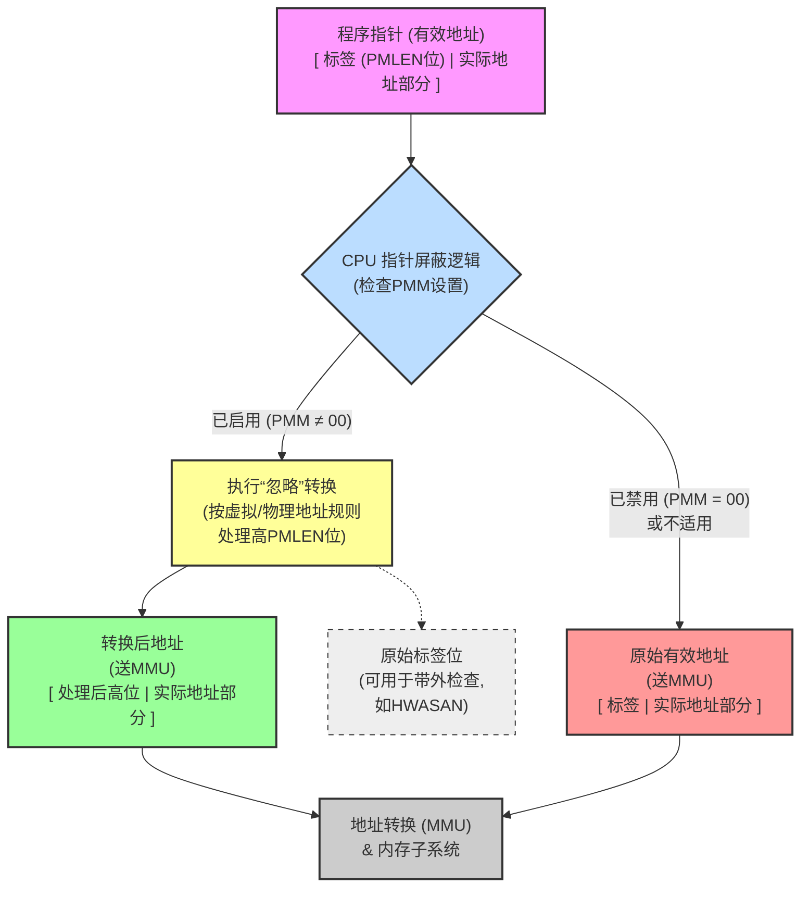

# RISC-V Pointer Masking Extension

## 一、引言：理解指针屏蔽的核心

RISC-V指针屏蔽（Pointer Masking, PM）扩展为CPU提供了一种处理内存地址的新方式。其核心思想是，当指针屏蔽功能启用时，CPU在进行内存访问前，会自动忽略构成指针（内存地址）的若干最高有效位。这些被忽略的位，通常被称为“标签”（tag），允许软件在其中嵌入额外信息，而CPU则使用指针的剩余部分来确定实际的内存位置。

**为什么需要这样的机制呢？**

在现代计算中，我们经常需要在指针本身存储一些额外的信息，而不是仅仅用它来定位内存。例如：

1. **内存安全检查：** 像HWASAN（Hardware-assisted AddressSanitizer）这样的工具，需要在指针中嵌入“标签”，以检测诸如“释放后使用”（use-after-free）或“缓冲区溢出”（buffer overflow）等内存错误。如果没有硬件支持，每次内存访问前，软件都需要手动“擦掉”这些标签，这会带来巨大的性能开销。

2. **托管语言运行时：** Java、Python、Go等语言的运行时系统，可能需要在指针中存储垃圾回收（GC）标记、对象类型信息等元数据。

指针屏蔽扩展通过硬件层面自动“忽略”这些标签位，使得软件可以直接使用带有标签的指针进行常规内存操作，而无需手动清除标签，从而显著提升性能和效率。它仅仅是忽略，标签的检查和比较逻辑可以由软件实现，或者由未来可能出现的硬件扩展来进一步加速。



## 二、核心概念与定义：理解游戏规则

在深入指针屏蔽的细节之前，我们先来明确几个关键术语：

- **有效地址 (Effective Address):** 这是由加载/存储等指令计算出来，发送给内存子系统的原始地址。它不包括像页表遍历这样的隐式内存访问地址。

- **屏蔽位 (Masked Bits) & PMLEN:** 有效地址最上方的 `PMLEN` 位。`PMLEN` (Pointer Masking Length) 是一个可配置的参数，决定了有多少位被用作“标签”并被硬件忽略。

- **“忽略”转换 (“Ignore” Transformation):** 一个核心操作，它根据地址类型（虚拟或物理）和`PMLEN`的值，对有效地址进行转换，生成一个去除了标签影响的地址。

- **转换后地址 (Transformed Address):** 有效地址经过“忽略”转换后得到的地址。这个地址将用于后续的MMU地址翻译（如页表查询）和实际的内存访问。

- **地址有效性 (Address Validity), NVBITS, VBITS (背景知识):**

  - 在RISC-V的虚拟内存系统中（如Sv39, Sv48, Sv57），一个虚拟地址并非所有位都用于寻址。

  - **VBITS (Value Bits):** 虚拟地址中实际参与地址翻译、用于索引页表的部分。

  - **NVBITS (Non-Value Bits):** 虚拟地址中不直接参与寻址，但用于地址有效性检查的高位。例如，在Sv48模式下（64位系统），低48位是VBITS，高16位是NVBITS，这16位必须是第47位的符号扩展，否则地址无效（不符合规范形式 Canonical Form）。

**图示1：通用虚拟地址结构 (以RV64，Sv48模式为例)**

```
MSB (位63)                                (位48)(位47)                                (位0) LSB
+-------------------------------------------+-----------------------------------------+
|                  NVBITS                   |                  VBITS                  |
| (高16位, 必须是bit47的符号扩展)           | (低48位, 用于Sv48地址翻译)              |
+-------------------------------------------+-----------------------------------------+
```

**图示2：有效地址、屏蔽位与转换后地址 (以RV64, PMLEN=8, Sv48模式为例)**

- **有效地址 (软件视角，包含标签):**

    ```
    MSB (位63) (位56) (位55)                      (位48)(位47)                         (位0) LSB
    +-------------+-------------------------------+-------------------------------------+
    |  屏蔽位     |    剩余高位                   |           低位地址部分              |
    | (PMLEN=8)   | (原NVBITS的一部分)            | (原VBITS + 部分原NVBITS)            |
    |   (标签)    | (bit 55 到 bit 48)            | (bit 47 到 bit 0)                   |
    +-------------+-------------------------------+-------------------------------------+
    ```

- 转换后地址 (硬件/MMU视角，标签被“忽略”):

    (对于虚拟地址，最高PMLEN位被替换为bit XLEN-PMLEN-1 的符号扩展。若PMLEN=8, XLEN=64, 则为bit 55的符号扩展)

    ```
    MSB (位63) (位56) (位55)                      (位48)(位47)                         (位0) LSB
    +-------------+-------------------------------+-------------------------------------+
    | SignExt(bit55)|    bit 55 及以下部分        |           (同上)                    |
    | (PMLEN=8)   | (有效地址的bit55到bit0)       |                                     |
    +-------------+-------------------------------+-------------------------------------+
    ```

    这个转换后的地址的bit 47到0将用于Sv48的页表查询，而其高16位（bit 63到48）必须符合Sv48的规范形式（即为转换后地址的bit 47的符号扩展）。

## 三、指针屏蔽如何工作：“忽略”的艺术

指针屏蔽的核心在于“忽略”转换，它由特定的控制状态寄存器（CSRs）中的`PMM` (Pointer Masking Mode) 字段来启用和配置。

- **PMM字段：** 这是一个2位的WARL（Write-Any-Read-Legal）字段，存在于如`menvcfg`（机器模式环境配置）、`senvcfg`（监管者模式环境配置）、`mseccfg`（机器模式安全配置）等CSR中。

- **PMM字段的值 (RV64为例):**

  - `00`: 指针屏蔽禁用 (PMLEN=0)。CPU看到的是完整的原始地址。

  - `01`: 保留值。

  - `10`: 指针屏蔽启用，PMLEN = XLEN - 57。在RV64上，XLEN=64，所以PMLEN = 7。最高的7位被视为标签并忽略。

  - 11: 指针屏蔽启用，PMLEN = XLEN - 48。在RV64上，PMLEN = 16。最高的16位被视为标签并忽略。

        (在RV32系统上，这些PMM字段通常只读0，即禁用指针屏蔽)

**“忽略”转换的规则：**

1. 对于虚拟地址（符号位扩展）：

    转换操作会将有效地址的最高PMLEN位替换为第PMLEN+1个位（即从最高位开始数的第 XLEN-PMLEN-1 位）的符号扩展。

    公式：
    `transformed_address = {{PMLEN{effective_address[XLEN-PMLEN-1]}}, effective_address[XLEN-PMLEN-1:0]}`

    - **示例 (RV64, PMLEN=7, Sv57模式):**

        - 有效地址: `0xABFFFFFF12345678` (二进制高位 `10101011...`)

        - PMLEN=7, `XLEN-PMLEN-1` = `64-7-1` = bit 56。

        - 有效地址的bit 56是 `1`。

        - 因此，最高的7位被替换为7个`1` (即`1111111`b = `0x7F`)。

        - 转换后地址: `0xFFFFFFFF12345678`

    **图示3：“忽略”转换 - 虚拟地址 (PMLEN=N)**

    ```
    有效地址: [ 标签 (N位) | S | 地址其余部分 (XLEN-N-1位) ]
                   ^         ^
                   |         | bit (XLEN-N-1)
                   PMLEN
    
    转换后地址: [ S的符号扩展 (N位) | S | 地址其余部分 ]
    ```

2. 对于物理地址 (包括客户机物理地址，或Bare模式下的地址)：

    转换操作会将有效地址的最高PMLEN位替换为0。

    公式：`transformed_address = {{PMLEN{0}}, effective_address[XLEN-PMLEN-1:0]}`

    - **示例 (RV64, PMLEN=7):**

        - 有效地址: `0xABFFFFFF12345678`

        - 转换后地址: `0x01FFFFFF12345678` (最高7位变为0)

    **图示4：“忽略”转换 - 物理地址 (PMLEN=N)**

    ```
    有效地址: [ 标签 (N位) | 地址其余部分 (XLEN-N位) ]
                   ^
                   |
                   PMLEN
    
    转换后地址: [ 全0 (N位) | 地址其余部分 ]
    ```

何时应用“忽略”转换？

当指针屏蔽启用时，此转换应用于每一次显式的内存访问（如加载、存储、原子操作、浮点加载/存储）。它不应用于隐式访问（如页表遍历）或指令获取。

## 四、ISA扩展详解：一个功能强大的家族

指针屏蔽并非单一扩展，而是一个精心设计的扩展家族，允许不同的RISC-V实现根据自身需求和目标应用场景，选择性地包含或排除其中的特定功能。这些扩展主要通过在现有的控制与状态寄存器（CSRs）中定义新的控制字段来实现，而无需引入大量新的CSR。

**核心控制机制：PMM字段**

所有这些指针屏蔽扩展都围绕着一个核心的控制机制——**PMM (Pointer Masking Mode) 字段**。这是一个2位的WARL（Write-Any-Read-Legal）字段，意味着软件可以尝试写入任何值，但硬件会确保读回的值总是合法的（即硬件支持的模式或禁用状态）。PMM字段通常位于各种环境配置寄存器（`envcfg`系列）或安全配置寄存器（`mseccfg`）的特定位。

**PMM字段的标准化值及其含义 (以RV64为例):**

| **PMM值** | **描述**                              | **PMLEN (RV64)** | **屏蔽位数 (RV64)** |
| -------- | ----------------------------------- | ---------------- | --------------- |
| `00`     | 指针屏蔽**禁用**                          | 0                | 0位              |
| `01`     | **保留** (写入此值可能导致回读为`00`或硬件支持的其他合法值) | -                | -               |
| `10`     | 指针屏蔽启用，模式1 (通常对应Sv57兼容)             | XLEN - 57        | 7位              |
| `11`     | 指针屏蔽启用，模式2 (通常对应Sv48兼容)             | XLEN - 48        | 16位             |

- **注意:**

  - `XLEN` 是处理器的原生字长（RV64中为64）。

  - 在**RV32系统**上，这些PMM字段通常被硬连接为**只读0**，意味着指针屏蔽功能在RV32上标准定义中不被启用。

  - 这些PMLEN值是当前标准定义的，未来的扩展或特定配置文件可能会引入其他PMLEN值或更灵活的配置方式。

**主要的特权态指针屏蔽扩展：**

以下是几个关键的特权态指针屏蔽扩展，它们共同构成了指针屏蔽功能在不同特权级别下的控制框架：

1. **`Ssnpm` (Supervisor-mode an S-mode next-privilege-mode pointer masking)**

    - **控制目标：** 由S模式（监管者模式）控制其**下一个较低特权模式**的指针屏蔽行为。通常，这个较低特权模式是U模式（用户模式）或在虚拟化环境中的VU模式（客户机用户模式）。

    - **CSR字段：** 在`senvcfg`（监管者环境配置寄存器）的 **bits 33:32** 处添加了一个2位的`PMM`字段。通过设置此`senvcfg.PMM`，S模式可以决定当CPU从S模式转换到U模式（或VU模式）时，U模式（或VU模式）的内存访问是否以及如何应用指针屏蔽。

    - **与H扩展（Hypervisor）的深度交互：** 当系统中存在H扩展（支持硬件虚拟化）时，`Ssnpm`的功能会进一步扩展和细化，以适应两级地址转换和多客户机环境：

        - **VS模式的控制：** 在`henvcfg`（Hypervisor环境配置寄存器）的 **bits 33:32** 处也添加了一个2位的`PMM`字段。此字段由HS模式（Hypervisor模式）控制，用于启用或禁用**VS模式（客户机监管者模式）**的指针屏蔽。这意味着Hypervisor可以为每个客户机操作系统配置其监管者模式下的指针屏蔽行为。

        - **U模式下Hypervisor访问指令的特殊处理 (`HLV.*`, `HSV.*`)：**

            - `hstatus.HUPMM`字段：在`hstatus`（Hypervisor状态寄存器）的 **bits 49:48** 处新增了一个2位的WARL字段`HUPMM` (Hypervisor User Pointer Masking Mode)。

            - 当在U模式下执行`HLV.*`（Hypervisor Load Virtual）或`HSV.*`（Hypervisor Store Virtual）这类代表Hypervisor代表用户访问客户机内存的指令时，如果这些指令的显式内存访问被硬件视为**在VU模式下执行**，则它们的指针屏蔽行为由`hstatus.HUPMM`字段根据上表的值来控制。这允许Hypervisor在代表客户机用户执行操作时，遵循客户机用户空间的指针屏蔽策略。

            - **Hypervisor的责任 ()：** 规范建议，在U模式下通过`HLV.*`或`HSV.*`指令访问客户机内存之前，Hypervisor（运行在HS模式）应该将客户机操作系统（运行在VS模式）写入其自身`senvcfg.PMM`的值（即客户机OS为其用户配置的PM模式），复制到`hstatus.HUPMM`字段。这样可以确保Hypervisor代表客户机用户执行内存访问时，遵循客户机用户期望的指针屏蔽设置。

            - **HS/M模式下的特殊情况：** 如果`HLV.*`/`HSV.*`指令在HS模式或M模式下执行，但其内存访问同样被视为在VU模式下执行（例如，Hypervisor或M模式软件直接模拟一个用户级访存），则其指针屏蔽由**`senvcfg.PMM`**（即S模式配置U模式的那个PMM字段，在此上下文中可能指宿主S模式的配置）控制。

            - **VS模式下的访问：** 如果`HLV.*`/`HSV.*`指令的显式内存访问被视为在**VS模式**下执行（例如，Hypervisor访问客户机内核空间），则其指针屏蔽由`henvcfg.PMM`（HS模式配置VS模式的那个PMM字段）控制。

        - **不受指针屏蔽影响的Hypervisor指令：**

            - `HLVX.*` 指令：这类指令设计用于模拟对客户机内存的隐式访问（例如取指），它们所执行的内存访问**不**受指针屏蔽的影响，以方便这种模拟，避免因标签导致模拟复杂化。

            - `MXR` (Make eXecutable Readable) 置位时的访问：出于类似的原因（通常与模拟或特殊内存访问权限相关，允许从可读页执行），当`mstatus.MXR`位被置位时，指针屏蔽也**不**适用。

2. **`Smnpm` (Machine-mode an M-mode next-privilege-mode pointer masking)**

    - **控制目标：** 由M模式（机器模式）控制其**下一个较低特权模式**的指针屏蔽行为。这是最高权限模式对下一级权限模式指针行为的设定。

    - **具体模式：**

        - 如果系统中实现了S模式，则此PMM字段控制S模式（或在虚拟化环境中的HS模式）的指针屏蔽。

        - 如果系统中没有实现S模式（例如，一个简单的M/U双模式系统），则此PMM字段直接控制U模式的指针屏蔽。

    - **CSR字段：** 在`menvcfg`（机器环境配置寄存器）的 **bits 33:32** 处添加了一个2位的`PMM`字段。

    - **地址类型的重要性 ()：** 需要注意的是，指针屏蔽的具体行为（符号扩展还是零扩展高位）取决于被访问地址的类型。例如，即使在虚拟化环境中运行（如VS/VU模式），如果客户机的`vsatp.MODE`被设置为`Bare`（即客户机直接使用物理地址寻址），那么对其内存访问应用的将是**物理地址指针屏蔽规则**（即“忽略”转换会将屏蔽位替换为0）。

3. **`Smmpm` (Machine-mode M-mode pointer masking)**

    - **控制目标：** 由M模式控制其**自身**的内存访问的指针屏蔽行为。这允许M模式代码（如引导加载程序或固件）自身也可以利用指针屏蔽的优势。

    - **CSR字段：** 在`mseccfg`（机器安全配置寄存器）的 **bits 33:32** 处添加了一个2位的`PMM`字段。

    - **`mseccfg`的存在性：** `Smmpm`扩展的一个重要含义是，如果一个实现声称支持`Smmpm`，那么`mseccfg`寄存器**必须存在**于该实现中，即使该寄存器在没有`Smmpm`的情况下可能不存在（例如，如果其他依赖`mseccfg`的安全特性没有被实现）。

用户态指针屏蔽 (Zjpm):

虽然上述扩展主要关注特权态，但Zjpm扩展是J扩展（旨在优化动态语言和JIT编译）的一部分，它定义了用户态应用程序如何利用指针屏蔽。通常，用户态的指针屏蔽行为会受到其上一级特权模式（如S模式通过senvcfg.PMM）的配置影响。Zjpm确保了用户程序可以依赖于指针高位被硬件忽略这一事实，从而安全地在这些位中存储元数据，而无需担心这些元数据会干扰实际的地址寻址。

总结：

RISC-V指针屏蔽的ISA扩展提供了一个分层、细粒度的控制机制。通过在不同特权级的环境配置CSR中设置PMM字段，系统软件（如M模式固件、Hypervisor、操作系统内核）可以精确地管理自身以及其下一级特权模式的指针屏蔽行为。这种设计兼顾了灵活性（支持不同PMLEN）、安全性（WARL字段）以及与现有架构（如H扩展）的兼容性。理解这些扩展及其交互对于开发利用指针屏蔽特性的系统软件和应用程序至关重要。

**图示5：部分相关CSR及其PMM字段 (简化示意)**

```
+-----------------+     +-----------------+     +-----------------+
| menvcfg         |     | senvcfg         |     | mseccfg         |
|-----------------|     |-----------------|     |-----------------|
| ...             |     | ...             |     | ...             |
| PMM (Smnpm) [33:32] | --> | PMM (Ssnpm) [33:32] | --> | PMM (Smmpm) [33:32] |
| (控S/U模式PM)   |     | (控U/VU模式PM)  |     | (控M模式PM)     |
| ...             |     | ...             |     | ...             |
+-----------------+     +-----------------+     +-----------------+

(若有H扩展)
+-----------------+     +-----------------+
| henvcfg         |     | hstatus         |
|-----------------|     |-----------------|
| ...             |     | ...             |
| PMM (Ssnpm) [33:32] |     | HUPMM [49:48]   |
| (控VS模式PM)    |     | (控U态HLV/HSV)  |
| ...             |     | ...             |
+-----------------+     +-----------------+
```

## 五、应用场景与优势：指针的“增值服务”

1. Hardware-assisted AddressSanitizer：

    这是指针屏蔽最直接和重要的应用之一。

    - **原理：**

        1. **分配与打标：** 当分配一块内存时，HWASAN运行时会为该内存块生成一个小的“内存标签”（Memory Tag），并存储在专门的“影子内存”（Shadow Memory）中，该影子内存的地址与实际内存地址相关联。同时，返回给程序的指针的最高`PMLEN`位会被设置为一个匹配的“指针标签”（Pointer Tag）。

        2. **访问检查：** 当程序通过带标签的指针访问内存时：

            - 硬件（通过指针屏蔽）忽略指针标签，使用转换后的地址进行常规内存访问。

            - 同时（可以是软件检查，或未来硬件检查），从指针中提取指针标签，并从影子内存中获取对应内存位置的内存标签。

            - 比较这两个标签。如果它们匹配，则访问被认为是合法的。如果不匹配，则可能发生了内存错误（如越界、释放后使用）。

    - **优势：** 指针屏蔽使得带有标签的指针可以直接用于加载/存储指令，硬件自动处理标签的忽略，大大减少了软件手动移除标签的开销。

    **图示6：HWASAN概念图**

    ```
    程序中的指针:      [ 指针标签 (P_Tag) | 实际地址 A ]
                          |
                          +----（访问内存）
                                    |
                                    V
    实际内存区域 @ 地址 A  <-----> 影子内存 @ f(A) 存储 [ 内存标签 (M_Tag) ]
    
    检查逻辑:  P_Tag == M_Tag ?
                (相等则OK, 不等则可能出错)
    ```

    _例如，检测“释放后使用”：_

    1. 指针 `P = [TagA | AddrX]` 指向有效内存，影子内存中 `AddrX` 对应的标签也是 `TagA`。

    2. 内存 `AddrX` 被释放，HWASAN将影子内存中 `AddrX` 的标签改为 `TagB` (表示无效或不同状态)。

    3. 程序后续若仍使用 `P` 访问 `AddrX`，指针标签 `TagA` 与内存标签 `TagB` 不匹配，错误被检测。

2. **托管语言运行时 (Managed Language Runtimes)：**

    - **垃圾回收 (GC)：** 指针标签可以用来存储GC标记位（如三色标记法中的颜色）。

    - **类型信息：** 可以在指针中嵌入对象的类型信息，加速动态类型检查或虚函数调用。

    - **JIT编译优化：** 存储与JIT编译代码相关的元数据。

3. **其他潜在应用：**

    - **沙箱化 (Sandboxing)：** 限制指针可以访问的内存区域。

    - **控制流完整性 (CFI)：** 用标签标记合法的跳转目标或函数指针。

## 六、关键交互与注意事项

- **与CSR的交互：**

  - **软件读写CSR：** 不应用指针屏蔽。软件可以自由地将带标签的原始地址写入CSR（如`stvec`, `sepc`），或从中读出。

  - **硬件写入CSR：** 应用指针屏蔽。例如，当发生异常，硬件将导致异常的地址写入`stval`时，写入的是**转换后**的地址。

  - **`stvec`（陷阱处理程序地址）：** CPU跳转到`stvec`中的地址时，**不应用**指针屏蔽。

- **与调试的交互：**

  - 当匹配调试地址触发器（如硬件断点）时，指针屏蔽会应用于被比较的内存访问地址。

- **与`SFENCE.VMA`的交互：**

  - 指针屏蔽仅影响有效地址的解释，不改变MMU的页表等数据结构，因此启用/禁用指针屏蔽后**不需要**执行`SFENCE.VMA`。

- **与两阶段地址转换（虚拟化）：**

  - 客户机物理地址（GPA）的处理需要特别注意，尤其是在`vsatp.MODE = Bare`时。GPA中可能被屏蔽的位需要Hypervisor和硬件协同处理（例如，通过`HFENCE.GVMA`进行TLB维护）。

- **屏蔽位数（PMLEN）的选择：**

  - 当前标准定义了PMLEN为7位或16位（RV64）。选择单一的PMLEN值（如16位同时用于Sv39和Sv48）有助于简化某些TLB设计。
